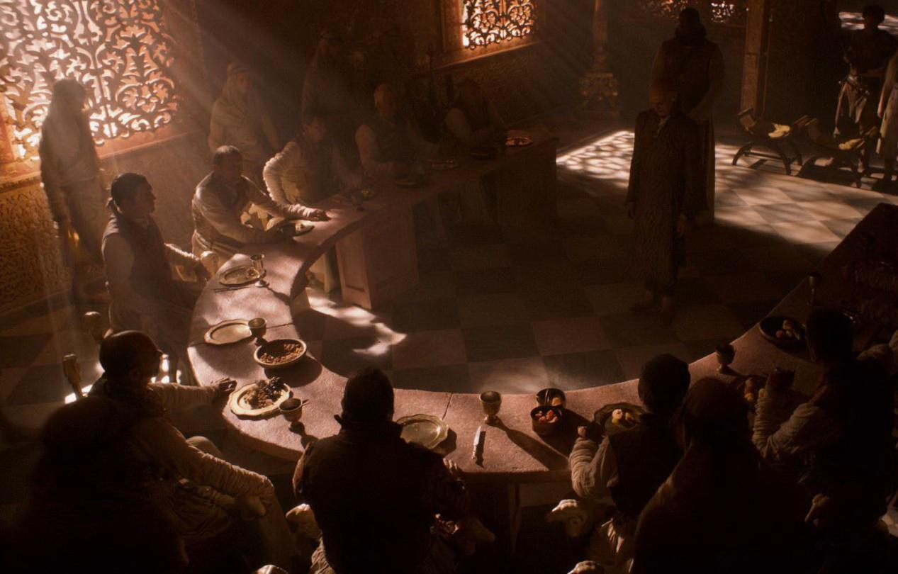
这是美剧《权力的游戏》剧照，多么迷人的投影～可是同样的圆桌会议，如果不好好运用投影，可能就会整成下面这样

所以大家都感受到投影的力量了，那么投影要如何画呢？

我们从四个方面来探讨：

1.投影的轮廓

2.投影的深浅

3.投影的形状

4.投影的色彩
# 投影的轮廓

下面是我自己在家里拍的静物照片

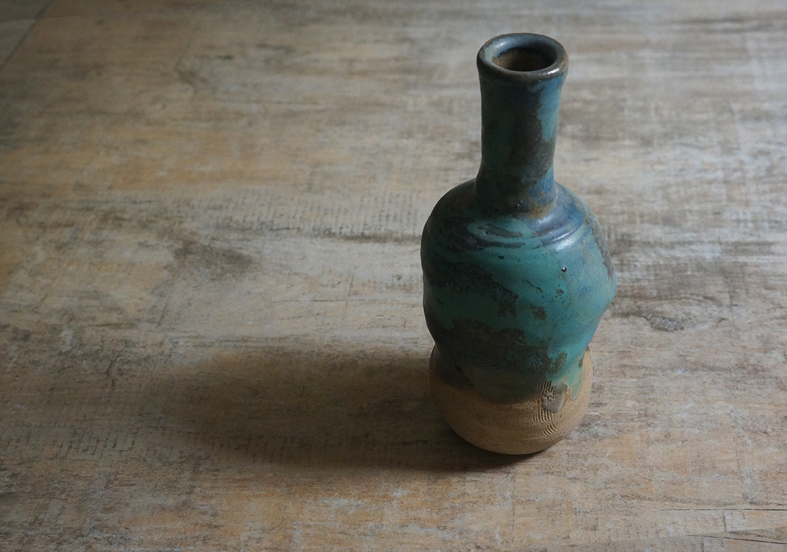
可以看出不同的照片里，瓶子投影的虚实程度不同，而即使在同一张照片中，投影轮廓的虚实程度也并非是同样清晰的，而是有虚实变化，有的地方清晰，有的地方模糊，可别小瞧了这个属性，虚实变化是让画面具有韵律感节奏感的重要表现手法之一。那么什么情况下投影轮廓该虚，什么情况下该实呢？为了说明其物理光学原理，我制作了下面这张图：
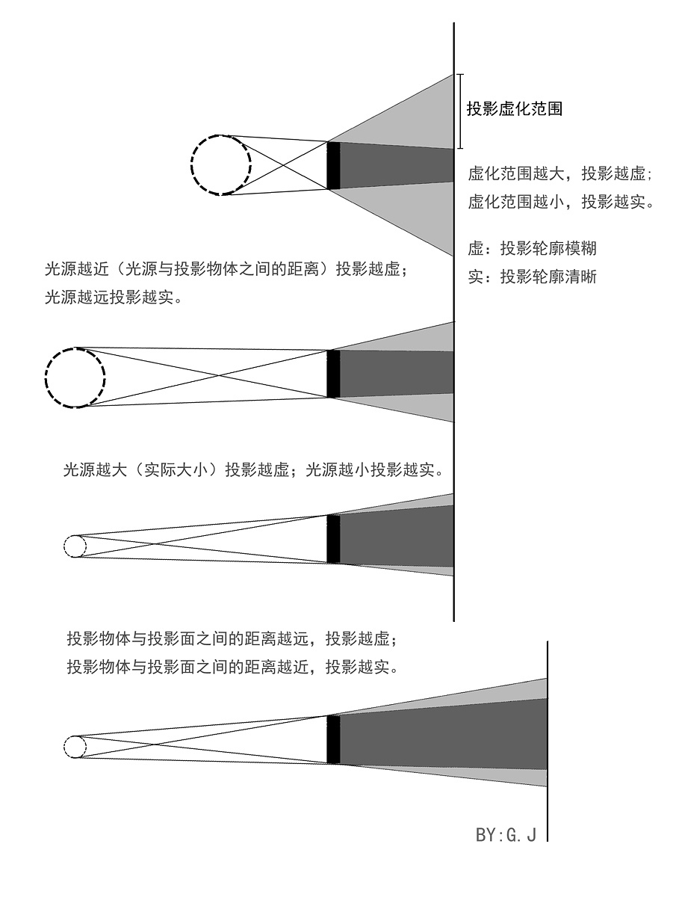
如图所示，投影边缘的虚实与投影的虚化范围有关，虚化范围越大，投影轮廓越模糊，虚化范围越小，投影轮廓越清晰。从光路图可以看出，投影的虚实与三个因素相关：
1.光源与投影物体之间的距离（距离越近投影越虚）

2.光源的实际大小（光源越大投影越虚）

3.投影物体与投影面之间的距离（距离越远投影越虚）

综合这三点来判断投影虚实变化，来看一个例子：
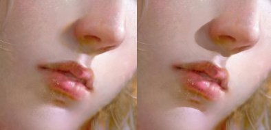
上图是我画的《叶天眉》的局部（左图），这里我设定的是一个阴天的天气，所以投影的边缘轮廓不是像艳阳天一样清晰，这也更容易让我画出轮廓虚实变化。注意鼻子的投影，左侧越远轮廓就越模糊，靠近鼻底的地方投影轮廓较清晰，而再观察仔细一些会发现，人中的起伏也造成了投影的虚实变化，突起的地方距离鼻子较近，投影较清晰，人中中间凹陷的地方距离鼻子较远，投影较模糊。右图是个反面例子，假如投影边缘都画得一样清晰就显得比较生硬了。

值得一提的是，现实生活中常常是看不到这么明显的虚实变化的，特别像五官这种较小的物体的投影的虚实变化一般很难观察出来，往往需要进行人为夸张才能达到好看的效果，这也是来源于生活而高于生活的绘画表达手法。

道理容易理解，可是在画的时候要同时判断三个因素的综合效果其实容易让人犯晕，尤其是光源的大小，有的光源实际大小很大，但距离比较远，综合之下如何判断其投影的清晰度呢？这里我想表达的观点是，我们绘画不是照相，不需要完全让你的大脑如同计算机一样精准判断出投影的虚实程度，我们要画的是对比、是变化，我们需要做的是判断画面中同时出现的两种光源产生的投影，哪个更虚哪个更实。如此一来就容易多了╰(*°▽°*)╯    

因此我们可以把第一条“光源与投影物体之间的距离”与第二条“光源的实际大小”融合成一条：“光源的相对大小”。在上一篇《关于“暗部”》中提到过，太阳实际很大，但它离我们很远，而假设投影物体旁边有另一个墙面大小的光源，它实际比太阳小很多，但它离我们很近。那么这两个光源的相对大小如何判定?

判断的方法其实很简单：你假想你站在投影物体的位置去看光源，是太阳看起来更大呢？还是身边的墙面看起来更大呢？当然是墙面更大，所以墙面是大光源，太阳是小光源，通过墙面反射的光产生的投影会比太阳光的投影更模糊。

这个原理在画暗部反光的二次投影时常常用到，可以用它来制造出丰富多变又合情合理的投影对比关系，如图：
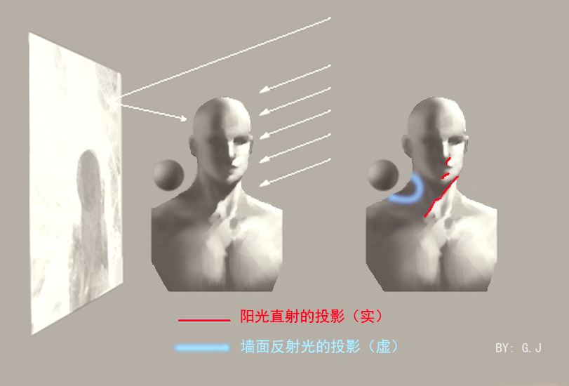
这个光影模型在实际运用中，暗部的小球往往会以头发、突起的肩胛等形式出现，他们遮挡了墙面的反光，形成了二次投影，这种相对大光源的投影边缘轮廓较为柔软，与亮部阳光的清晰投影形成对比。我们画画就是要营造和夸张对比，让画面形成韵律节奏，这是此种审美逻辑在投影中的运用。

看一个例子:
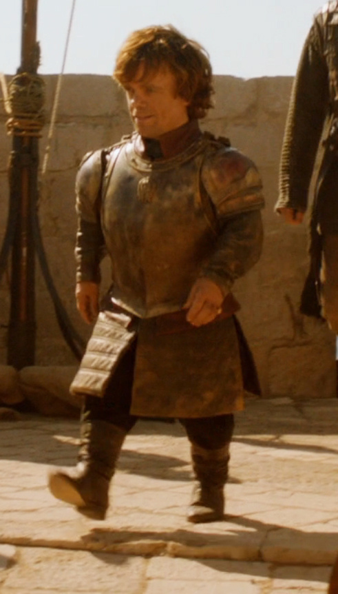
同样是《权力的游戏》剧照，小恶魔脚下的投影是阳光的投影，来源于“小光源”太阳，轮廓清晰，他暗部的左手对于盔甲有一个轮廓模糊的投影，这个投影是来源于地面这个“大光源”的反射光。

# 投影的深浅

投影的深浅跟环境光的强弱和性质有关，如果投影附近有反射物，会将直射光反射进投影区域从而影响投影的亮度深浅，这需要依据具体情况分析，但通常情况下，投影所处的区域越开阔，投影越浅，因为足够的距离让环境光有更多的机会投射进投影区域，而投影面所处的区域越闭塞，投影越深，甚至可以形成很深投影区，我们把这称为光的死角，例如下图中的接近瓶底的投影区域。我们对于极深的颜色的运用要惜墨如金，极深的颜色往往可以用来作为画面素描调子的点缀，不适合大面积出现，因此这种极端区域通常是以点或者线的形式出现，面积很小，但作用很大。如图：

看一个例子：
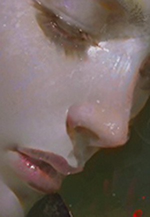
《叹息之刃》局部，我在画她鼻子投影的时候，最深的地方点缀在了鼻翼轮廓的边缘，这是一个相对闭塞的区域，可以用来藏一些较深的颜色。
# 投影的形状
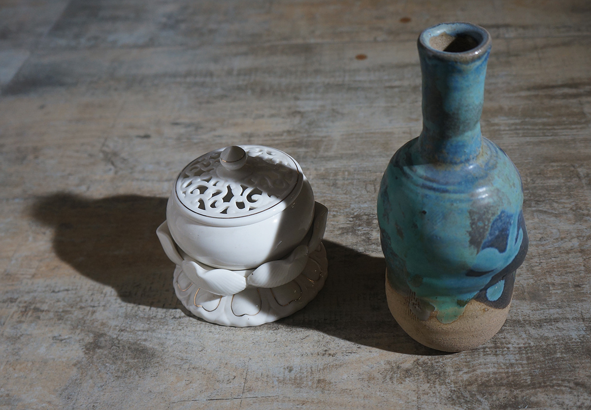
如何把投影画得好看？投影的形状是最需要发挥主观意识的部分了，也就是按照审美需求有意识地布局投影的形状和位置。

这就涉及到一个问题，什么样的投影是符合审美需求的？人喜欢看什么样的投影呢?

答案是：切割与节奏

当影子投射到物体上时，投影轮廓对物体进行切割，切割产生美感，因为同一个物体会因为投影而获得两种不同的光源环境区域，从而使其获得了逻辑统一而形式多样化的光影信息。

看一个例子：
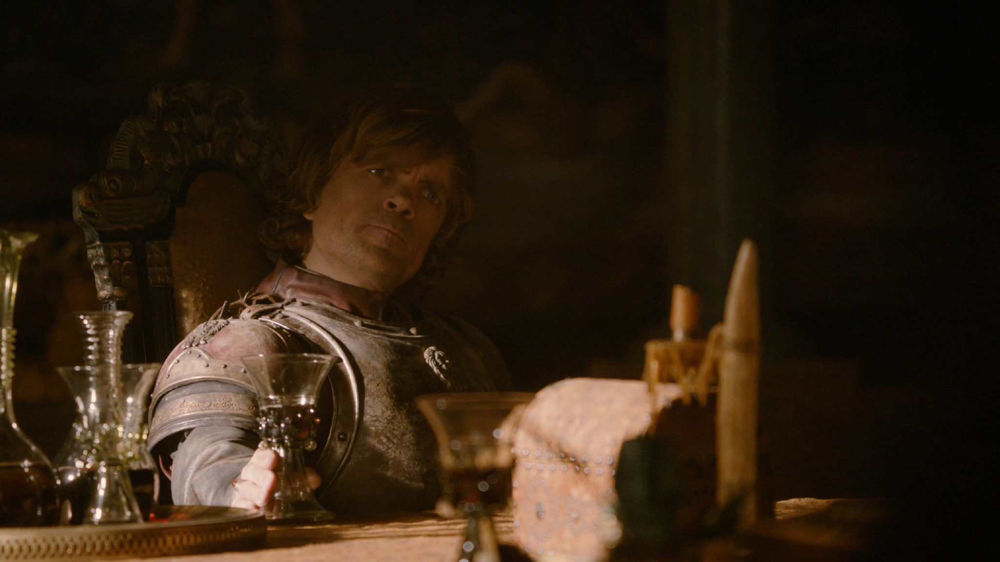
​同样是《权力的游戏》里的小恶魔（投影让你如此美丽<(▰˘◡˘▰)> ）

按照图中从左上方来的光，头部应该是能够被照亮的，然而并没有，导演设置了一个遮挡物让头部处于投影里，于是形成了这么迷人的光影效果：肩部受左上方来的直射光影响，而头部受左下方来的反光影响，这两个区域的主光源方向不同。

注意：切割头部与脖子之间的投影轮廓十分模糊，结合前面的知识点，这应该是一个较远物体的投影，投影面离投影物体越远，投影轮廓越模糊。这也暗示了这间屋子是一个宽敞的大厅。

再看一个例子：
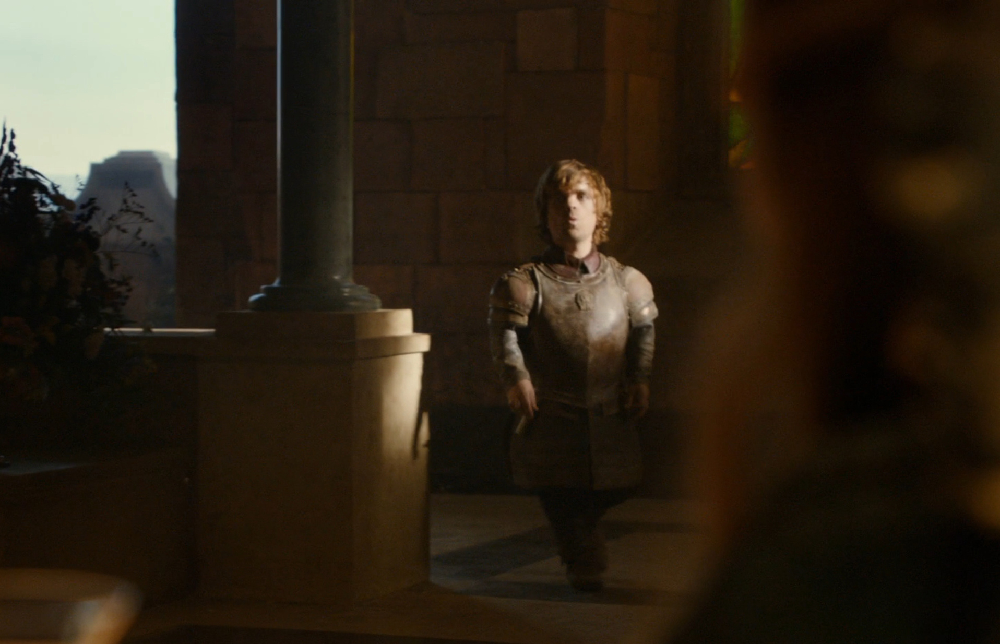
小恶魔下半身隐没在投影里，光影切割美得很魔性(*￣∇￣*)

其实投影的切割不仅仅适用于人物，对于场景来说，投影的切割同样具有迷之魅力。看下图！
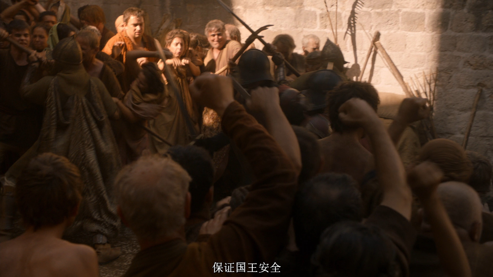
巨大的投影将近处的场景笼罩在暗部，中景被光影切割，很好的起到了视觉引导作用，画面有一种戏剧性的美感。

再看一个例子：
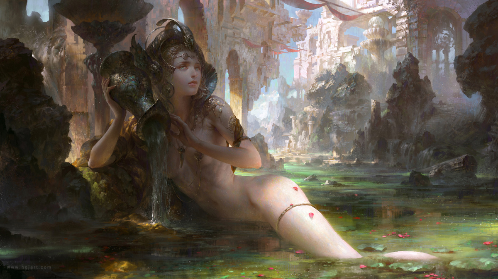
我的作品《水瓶座》，就是运用的投影切割原理，人体的上下半身分别处于不同的光影环境中。投影切割的方式有很多种，产生的视觉效果也不同，大家有兴趣可以多尝试。

所以投影是可以根据你的画面需要进行布局的，特别是对于来自画面外部景物的投影，几乎可以随心所欲安排。我曾经在一次讲座上开玩笑提出一个“板砖理论”：凭什么他身上会有这样一块投影？因为在画面外我没有画出来的地方，悬挂了一块“板砖”：）你是画中世界的造物主，你说了算╮(╯▽╰)╭    

再来看一下投影的节奏：

常常我们的投影并不是一整块，可以是大小不同的穿插，人眼是十分迷恋这种光影斑驳的效果的，如下图：
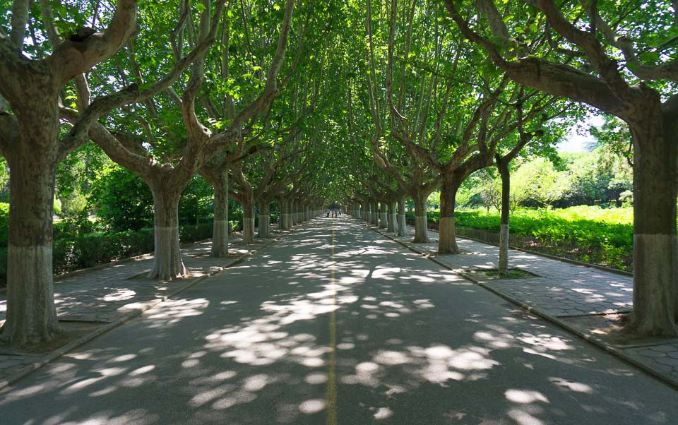
穿插虽美，但散乱无序的切割会让画面显得花和乱，这就需要依据审美需求对其布局，看一个类似效果的运用：
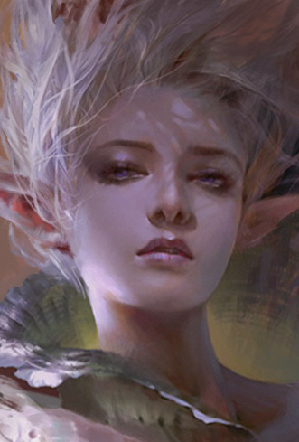
这是我的作品《平行三界》局部。注意头发对脸部的投影，投影的切割主要集中在额头部分，脸部是相对完整的块面，细碎的小块面与完整的大块面形成了节奏对比。这与前面那张树影的照片是否有异曲同工之美呢？

小块面投影的切割是种细节的点缀，能够起到丰富画面的效果，只要注意了大小分布的疏密搭配，常常能让画面效果锦上添花。

我们刚才探讨了很多关于投影形状的运用，但不要忘记了投影形状的光学逻辑合理性，特别是对于出现在画面中的物体的投影，要分析出它应有的投影形状，来讲一个我常常在学生作业里发现的问题类型：
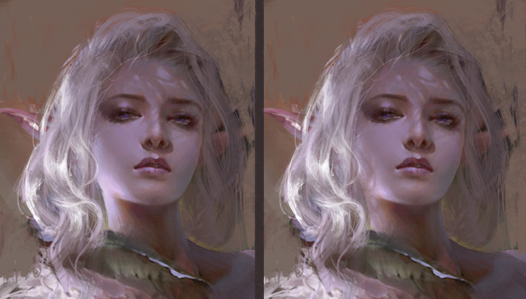
依然拿我的作品《平行三界》局部做例子。很多同学喜欢给脸部边缘打一个轮廓光，用来强调面部轮廓，这是打光技巧中的一种，这很好，但是实际运用上要注意光影逻辑关系，比如上面左图，脸部下方的轮廓光十分好看，但是由于没有考虑到头发对这束光的影响，让下颚的亮部显得有点奇怪，右图将头发的投影表现上去就自然多了。因此要充分考虑画面中存在的物体对于彼此的投影关系。

# 投影的色彩

投影也是属于暗部区域的组成部分，会受到各种环境光的影响，例如朝上的投影面可能会受到冷色天光的影响而呈现偏冷的颜色，具体可以参考上一篇《关于“暗部”》的色彩部分，这里主要想探讨的是投影边缘的色彩分布。

我们常常看到很多美术作品的投影边缘会出现一圈高饱和度的色彩，有时是橙色，有时是黄绿色，有时甚至出现紫色的轮廓，还有些情况投影轮廓是不存在明显色彩的，其实关于色彩的理论十分复杂，尤其是微妙色彩变化，它受很多因素影响，固有色、环境色、光源色、材质透光度等等，其原理涉及到光的衍射、散射、折射等，所以关于投影轮廓的颜色如果要用物理逻辑十分精准地推算出来是很困难的，为了写这一部分的内容我查阅了很多资料，甚至咨询了北大物理系的朋友，其实光学原理的逻辑很简单，但难就难在具体情况的复杂性。

有一种理论说是光谱的色彩连续性形成了投影轮廓的颜色：
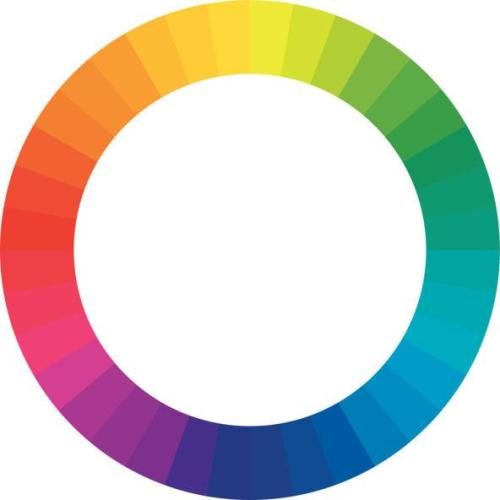
如果投影偏蓝，亮部偏黄，那么蓝色与黄色之间的连接色会是色环左边的紫红橙色区域还是右边的黄绿色区域呢？那么到底应该取黄绿还是紫红呢？看下面一张图：

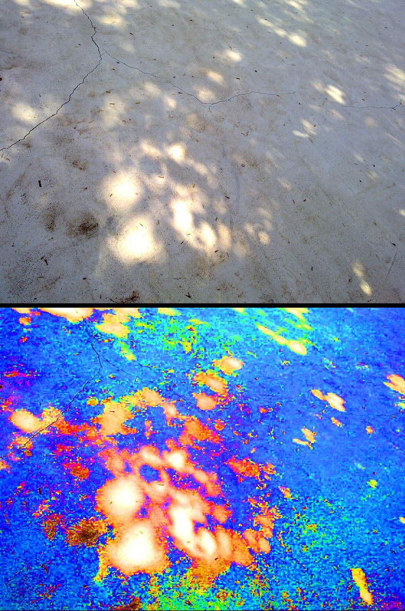
​投影轮廓边缘确实存特殊的色彩，神奇的是，同一张图同一个环境下，有的投影轮廓是橙红紫色系，有的投影轮廓竟然是黄绿色系(/= _ =)/~┴┴ 

再看一张图：
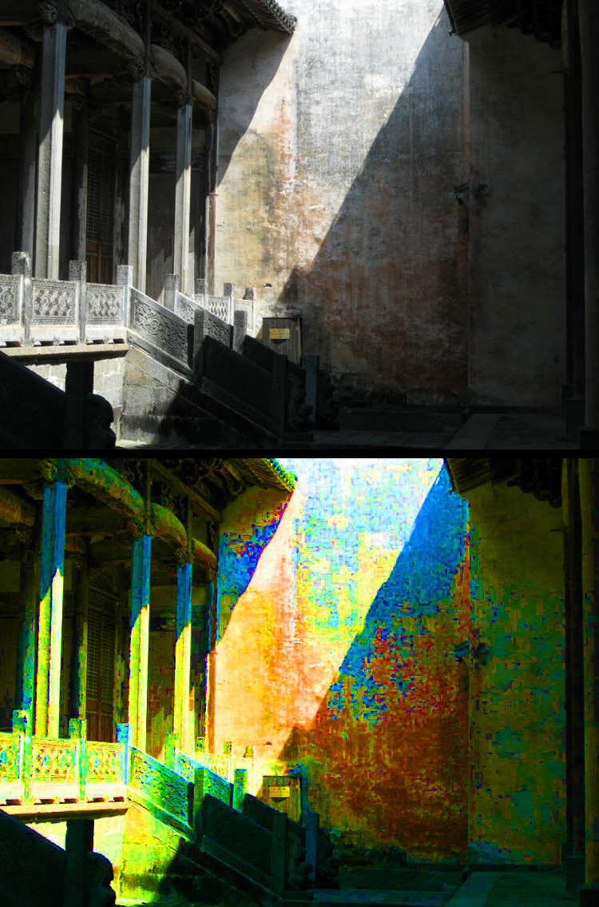
​中景墙壁上的两条投影，左边的投影有明显的紫红色边缘，右边投影没有明显的色彩轮廓边。。。（这个现象我曾用肉眼观察到）这些现象奇特又令人迷惑，因此这里我并不能给出大家绝对的答案，虽然我们画画并非要与客观事物完全一致，但我还是希望了解其中逻辑原理，如果大家有什么好的见解也可以在这片篇贴子下面讨论。

虽然关于投影边缘的色彩问题我们作为一个开放命题供大家探讨，但有一种情况是需要注意的，那就是在人体上的投影。人体皮肤是一个半透明组织，下面充满了毛细血管，流动着鲜红的血液，当光穿透皮肤表层再反射回来时，会被皮下组织反射出偏红的色彩，因此在皮肤上的投影要考虑到皮肤透光这个重要因素，常常皮肤上的投影都是具有暖色轮廓的（特别是当强光照射时）。