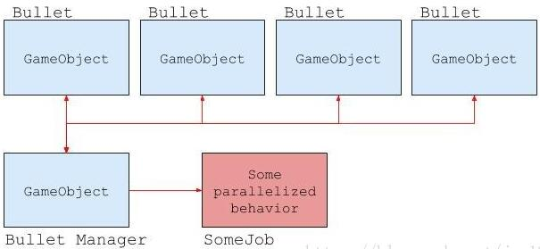

Unity C＃ Job System允许用户编写与Unity其余部分良好交互的多线程代码，并使编写正确的代码变得更加容易。
编写多线程代码可以提供高性能的好处。其中包括显着提高帧速率和延长移动设备的电池寿命。
C＃ Job System的一个重要方面是它与Unity内部使用的集成（Unity的native jobsystem）。用户编写的代码和Unity共享工作线程。这种合作避免了导致争用CPU资源的问题，并且可以创建比CPU核心更多的线程。

# 多线程

在单线程计算机系统中，一次只能进入一条指令，并且只能得出一个结果。加载和完成程序的时间取决于CPU需要完成的工作量。
多线程是一种编程，它利用CPU在多个内核上同时处理多个线程的能力，它不是一个接一个地执行任务或指令，而是同时运行的。
默认情况下，一个线程在程序的开头运行。这是“主线程”。主线程创建新线程来处理任务。这些新线程彼此并行运行，并且通常在完成后将其结果与主线程同步。
如果有一些运行很长时间的任务，这种多线程方法很有效。但是，游戏开发代码通常包含许多一次执行的小指令。如果为每个小指令创建一个线程，最终可能会有许多线程，每个线程的生命周期都很短。这可以推动CPU和操作系统处理能力的极限。
通过拥有一个线程池可以缓解线程生存期的问题。但是，即使使用线程池，也可能同时激活大量线程。线程数多于CPU核心导致线程相互争用CPU资源，导致频繁的上下文切换。上下文切换是通过执行保存线程状态的过程，然后处理另一个线程，然后重新构建第一个线程，以便继续处理它。上下文切换是资源密集型的，因此您应尽可能避免使用它。
大多数使用多线程代码的人都知道编写线程安全代码很难，线程争抢资源可能会发生，但机会非常少，如果程序员没有想到这个问题，可能会导致潜在的严重错误。除此之外，上下文切换的成本很高，因为学习如何平衡工作负载已尽可能高效地运行是很困难的。

# Job System

Job System通过创建Job而不是线程来管理多线程代码。
Job System跨多个核心管理一组工作线程。它通常每个逻辑CPU核心有一个工作线程，以避免上下文切换（尽管它可能为操作系统或其他专用应用程序保留一些核心）。
Job System将Job放入作业队列中用来执行。Job System中的工作线程从作业队列中获取Job并执行它们。作业系统管理依赖关系并确保作业以适当的顺序执行。

我们来看一下简单的子弹运动系统，大多数程序员都会为GameObject编写一个管理器，如Bullet Manager，通常，这些管理器会管理一个GameObjects列表，并每帧更新场景中所有子弹活动的位置。这非常符合使用C# Jobs System的条件，由于子弹运动可以单独处理，因此非常适合并行化，借助C# Jobs System，可以轻松地将此功能拉出来，并行运行不通的数据块，作为开发人员，只需要专注游戏逻辑代码即可。

## Job

Job是完成一项特定任务的一小部分工作。Job接收参数并对数据进行操作，类似于方法调用的行为方式。Job可以是独立的，也可以是依赖的（需要等其他作业完成后，然后才能运行。）

## Job 依赖

在复杂的系统中，如游戏开发所需的系统，每个工作都不可能是独立的。一项工作通常是为下一份工作准备数据。作业了解并支持依赖关系以使其发挥作用。如果jobA对jobB依赖，则Job System确保在完成jobA之前不会开始执行jobB。

# 安全

编写多线程代码时，总是存在竞争条件的风险。当一个操作的输出取决于其控制之外的另一个过程的时间的时候，就会发生竞争条件。
竞争条件并不总是一个bug，但是它不确定行为的来源，当竞争条件导致bug的时候，总是比较难以找到问题的根源。因为它取决于时间，因此你可能极少数情况下会复现问题。调试的时候可能会导致问题消失。因此调试和日志可能会改变bug的发生条件。竞争条件是编写多线程的时候面临的比较大的挑战。

为了更容易编写多线程代码，Job System可以检测所有潜在的竞争条件，并保护你免受可能导致的bug的影响。
例如：如果Job System将主线程中代码中的数据引用发送到Job中，则无法验证作业在写入数据的时候同时读取数据，这种情况就会创建竞争条件。

Job System通过向每个作业发送它需要的操作的数据的副本来解决这个问题，而不是对主线程中的数据的引用，这种拷贝隔离了数据，从而消除了竞争条件。

