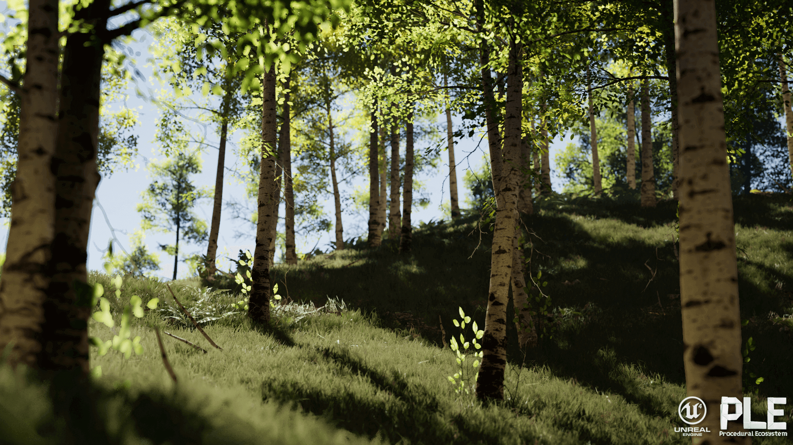
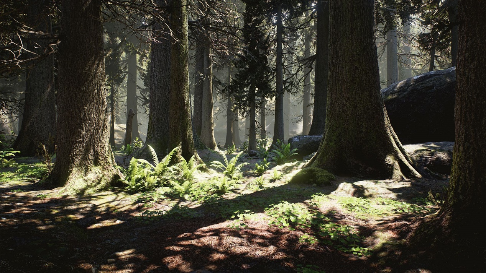
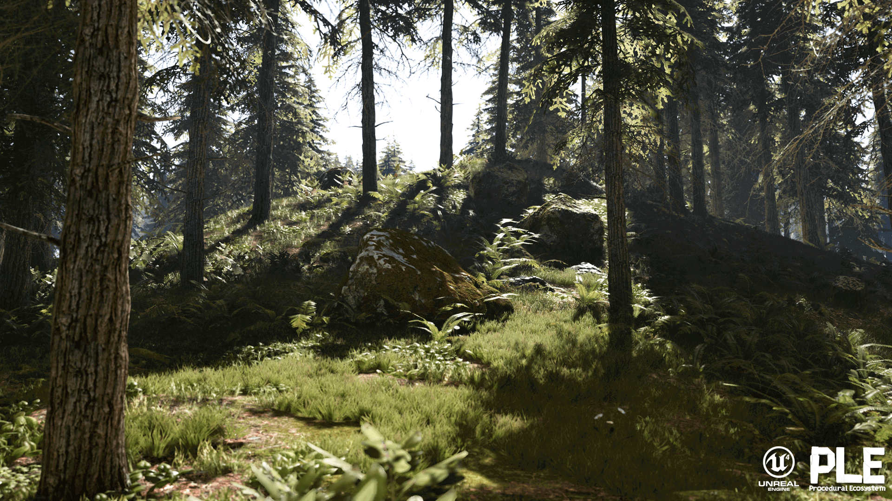
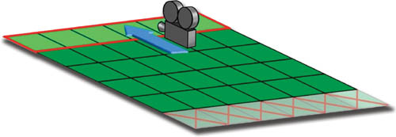

# 前言
《GPU Gems 2》这本书除了丰富的内容之外，还有两个特点。
- 虚幻引擎之父Tim Sweeney为《GPU Gems 2》作序。作为Epic Games的创始人，Unreal Engine早期主要开发者，Tim也在序中展示了《GPU Gems 2》出版伊始（2005年3月）时开发完成的Unreal Engine 3。UE3可谓是开创了一个时代。随后包括《新鬼泣》在内的100+款大作（2005年~2015年），都是基于UE3开发。
- 《GPU Gems 2》的中文版是龚大2005年，但可以不夸张地说，书中介绍的很多方法技巧trick，哪怕是放到现在，依然非常值得学习和借鉴。

ok，篇幅原因，开场话就不多说了，放一张本文的核心内容，真是感植物渲染的图，我们就直接开始正题。

# 实现照片级真实感的虚拟植物（Toward Photorealism in Virtual Botany）
## 内容概览
众所周知，植物的渲染需要很多的视觉深度和细节才能令人信服。

本章即关于渲染逼真自然场景的技术，描述了对实时游戏引擎友好的、用于渲染更真实的自然场景的策略。讲述了在不需要大量CPU或GPU占用的前提下渲染出包含大量植物和树组成的绿色植物场景。

内容安排方面，这章从管理大型户外场景数据这一基础开始描述。然后，提供一些细节，例如关于如何最大化GPU吞吐量，以便可以看到密集的草丛。接下来扩展这些技术，增加地面杂物和大型植物，如树，将阴影和环境影响组合进去。

一些真实感植物渲染的效果图：

## 场景管理（Scene Management）
任何3D游戏引擎都应该有环境相关渲染技术的管理和组织。

游戏引擎必须管理其渲染技术，以适合于它们希望看到的环境范围。以自然场景为主的游戏由上千棵树，灌木和可能上百万片草叶组成。直接分开渲染会出现数据管理问题，只有解决了这一问题才能以交互的帧率实时渲染。

我们的目标是在一个逼真的室外场景中大范围地移动游戏相机，而不需要在任务管理上花费过多的存储器资源。

## 种植栅格（The Planting Grid）

场景管理方面，首先是使用了虚拟栅格的思想。

我们在相机周围建立一个世界空间固定的栅格，来管理每一层的植物和其他自然物体的种植数据。每个栅格单元包含渲染它所在物理空间层的所有数据。特别是，单元数据结构存储了对应的顶点、索引缓冲区和材质信息来再现需要绘制的内容。

对植物的每个层，建立相机到层的距离，层需要用它来产生视觉效果，这决定了虚拟栅格的大小。相机移动，虚拟栅格也随之移动。当一个栅格单元不再在虚拟栅格中时，丢弃它，并在需要维护完成栅格结构的地方添加新的单元。在添加每个单元格时，用一种种植算法把渲染所需的数据填充到层。如下图。

图注：内层有一个世界空间对齐的固定大小的栅格。深绿的单元表现为活动单元。当相机向前移动时，丢弃标记为X的单元，添加新的单元（显示为亮绿色）以维持虚拟栅格的大小，实现过程中有用的改进是使用栅格单元池且循环使用，因为当一个旧单元被丢弃时，总会增加一个新单元。

### 种植策略（Planting Strategy）

对于充满自然物体的每个单元，需要在地面上选择需要放置物体的适当位置。采用试探的方法根据被防止对象对象类型来选择这些点。通常，需要的密度随机选点，然后看地面上的对应点是否适合要种植的东西。而地面多边形的材质决定了一个层是否适用。

