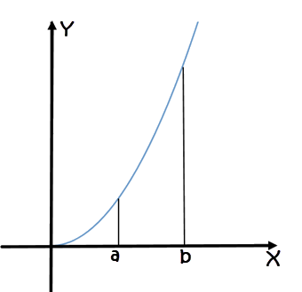

蒙特卡洛法中重要的一点是生成指定概率分布的随机数，“随机数”部分会阐述怎么生成符合指定分布的随机数。蒙特卡洛积分估计的优点在于它很简单，很容易扩展多维的情况，但问题在于收敛速度较慢。而重要性采样和拟蒙特卡洛就是加速估计的收敛速度，直观的结果就是在相同的采样数下误差更小。“重要性采样”解决的是怎么设计最优的概率分布的问题。“拟蒙特卡罗”解决的是如何消除随机数产生聚集问题，以缩减误差。

为了方便读者的理解，本篇文章会统一符号描述，被积函数采用$f(x)$小写形式，被积函数的积分采用$F(x)$大写形式，概率密度函数采用$pdf(x)$，累计概率密度分布函数采用$cdf(x)$，大写的$X,Y$等表示随机变量，小写的$x,y$等表示具体的实数，$n$表示样本数，$N$表示维度。

推荐阅读《Physically based rendering: From theory to implementation》[1], 《概率论与数理统计，浙江大学第4版》[2]，《Advanced global illumination》[7]这三本书，以及网上 [Scratchapixel](https://www.scratchapixel.com/) 2.0 [3]中对蒙特卡洛积分估计部分的内容，很详尽。

# 背景知识

自然界中，有一类现象在一定条件下必然会发生，例如向上抛一石子、同性电荷互相排斥等，这类现象称为确定性现象。还有一类现象在大量重复试验下，呈现出某种规律，例如多次重复抛一枚硬币得到正面朝上大致有一半，等等，这种大量重复实验所呈现出的固有规律性就是我们所说的统计规律性。这种在个别试验中结果呈现不确定性，在大量重复试验中结果有统计规律性的现象，就称之为随机现象。

在随机试验中，尽管在每次试验之前不能预知结果，但试验的所有可能结果组成的集合是已知的，我们将随机试验的所有可能结果组成的集合成为样本空间(Sample Space)，样本空间的元素称为样本点。

一般，我们称试验的样本空间的子集为样本空间的随机事件，简称为事件（Event），例如规定某种灯泡的寿命小于500小时的为次品，那么满足这一条件的样本点组成的子集，就称为事件。当且仅当这一子集中的一个样本点出现时，称为事件发生。

在相同的条件下，进行了n次试验，在这n次试验中，事件A发生的次数$n_A$称为时间A发生的频数，比值$n_A/n$成为事件A发生的频率。

频数和频率是通过试验观察得到的数据，当重复实验的次数n逐渐增大时，频率呈现出稳定性，逐渐稳定于某个参数，这种“频率稳定性”即通常所说的统计规律性，用来表征事件A发生可能性的大小，这就是所谓的概率。

概率的准确定义是：设E是随机试验，S是它的样本空间，对于E的每一件事A赋予一个实数，记为$P(A)$，称为事件A的概率，它是表征事件发生可能性大小。

以抛硬币为例，它的样本空间是{正面，反面}，这样就比较难记录和研究。所以引入一个法则，将随机试验的每一个结果与一个实数对应起来，这就有了随机变量的概念。设随机试验的样本空间为$S={e},X=X(e)$是定义在样本空间S上的实数单值函数，就称X为随机变量。就如抛硬币试验为例，它的随机变量可以定位为，X(正面)=0，X(反面)=1，那么样本空间就可以表示为{0,1}。这里的0和1是随机变量X映射出来的值，注意随机变量$X$本质是函数。

有些随机变量，它全部可能取到的值是有限个或可列无限多个，这种随机变量成为离散随机变量。还有些随机变量，它可能取的值充满一个区间，无法按一定次序一一列举出来，因而它是一个非离散型的随机变量，例如一个设备的寿命概率模型，你无法例举所有的可能性，但是可以限定在一个区间范围内。

设$X$是一个随机变量，$x$是任意实数，函数$cdf(x)=P{X \leq x}, -\propto < x < +\propto $，称为$X$的累计分布函数(Cumulative Distribution Function, CDF)。
如果对于随机变量$X$的累计分布函数$cdf(x)$，存在非负函数$pdf(x)$，使对于任意实数$x$，有

$$cdf(x) = \int_{- \propto}^x pdf(t)dt \tag{1}$$ 

则称$X$为连续型随机变量，其中函数$pdf(x)$成为$X$的概率密度函数，简称概率密度(The Probability Distribution Function, PDF)。概率密度$pdf(x)$具有以下几个性质：

- $pdf(x) \geq 0 $;
- $\int_{-\propto}^{+\propto} pdf(t)dt = 1$;
- 对于任意实数$x_1,x_2(x_1\leq x_2)$，有$P{\{x_1 < X \leq x_2\}} = \int_{x_1}^{x_2} pdf(t)td$;
- 若$pdf(x)$在点$x$处连续，则有$cdf'(x)=pdf(x)$。

有三种重要的连续型随机类型变量：

- 均匀分布；
- 指数分布；
- 正态分布。

由于内容限制，这里只介绍均匀分布，若连续型随机变量$X$具有概率密度：

$$pdf(x) = \begin{cases}
\frac 1 {b-a} \quad a < x < b\\
0 \qquad others\\
\end{cases} \tag{2}$$                                                               

则称$X$在区间(a,b)上服从均匀分布。

对于连续性随机变量$(X,Y)$，设它的概率密度函数为$pdf(x,y)$ $X$是一个连续性随机变量，其概率密度函数表示为：

$$pdf_{X}(x)=\int_{-\propto}^{+\propto}pdf(x,y)dy$$

类似的，$Y$也是一个连续性随机变量，其概率密度函数表示为：

$$pdf_{Y}(y)=\int_{-\propto}^{+\propto}pdf(x,y)dx$$

分别称为$pdf_{X}(x)$，$pdf_{X}(x)$为$(X,Y)$关于$X$与关于$Y$的边缘概率密度函数。

设二维随机变量$(X,Y)$的概率密度函数为$pdf(x)$，$(X,Y)$关于$Y$的边缘概率密度函数为$pdf_{Y}(y)$，若对于固定的$y$，$pdf_{Y}(y) > 0$，则称$pdf(x,y)/pdf_{Y}(y)$为在$Y=y$的条件下$X$的条件概率密度，记为：

$$
pdf(x|y)=\frac{pdf(x,y)}{pdf_{Y}y} \tag{3}
$$

设连续型随机变量$X$的概率密度为$pdf(x)$，若积分$\int_{-\propto}^{+\propto}x \cdot pdf(x)dx$绝对收敛，则称积分$\int_{-\propto}^{+\propto}x\cdot{pdf(x)dx}$的值为随机变量$X$的数学期望，记为$E(X)$，简称为期望，记为：

$$E(X)=\int_{-\propto}^{+\propto}xf(x)dx \tag{4}$$

期望是随机试验下所有那些可能结果的平均值，它有几个重要的性质：

- 设$C$是常数，则有$E(C)=C$;
- 设$X$是一个随机变量，$C$是常数，则有$E(CX)=CE(X)$;
- 设$X,Y$是两个随机变量，则有: $E(X+Y)=E(X)+E(Y)$;
- 设$x,y$是互相独立的随机变量，则有$E(XY)=E(X)E(Y)$;

设$X$是一个随机变量，若$E\{[X-E(X)]^2\}$存在，则称它的值为$X$的方差，记为$D(X)$，即：

$$D(X)=E\{|[X-E(X)]^2\} \tag{5}$$

在应用上还引入量$\sqrt{D(X)}$，记为$\sigma (X)$，称为标准差或均方差。

方差表示的是随机变量与其均值的偏移程度，随机变量$X$的方差可按下列公式计算：

$$D(X)=E(X^2)-[E(X)]^2 \tag{6}$$

方差也有几个重要性质：

- 设$C$是常数，则$D(C) = 0$;
- 设$X$是随机变量，$C$是常数，则有$D(CX)=C^{2}D(X),D(X+C)=D(X)$;
- 设$X,Y$是两个随机变量，则有

$$D(X+Y)=D(X)+D(Y)+2E{(X-E(X))(Y-E(Y))} \tag{7}$$

特别，若$X,Y$互相独立，则$D(X+Y)=D(X)+D(Y)$。

设随机变量$X$具有数学期望$E(X)=\mu$，方差$D(X)=\sigma^2$，则对于任意正数$\epsilon$，不等式

$$P\{|X-\mu|\geq\epsilon\}\leq \frac{\sigma^2}{\epsilon^2} \tag{8}$$

成立。这一不等式成为切比雪夫（Chebyshev）不等式。

辛钦大数定理：设$X_1,X_2,...$是相互独立，服从同一分布随机变量序列，且具有数学期望$E(X_k)=\mu (k=1,2,...)$，作前n个变量的算术平均$\frac{1}{n}\sum_{k=1}^{n}X_k$，则对于任意$\epsilon > 0$，
有：
$\lim \limits_{n \to \propto}P\{|\frac{1}{n}\sum_{k=1}^{n}X_k-\mu| \prec \epsilon \}=1 \tag{10}$

伯努利大数定理：设$f_A$是n次独立重复试验中事件A发生的次数，p是事件A在每次试验中发生的概率，则对于任意正数$\epsilon > 0$，有：

$$\lim \limits_{n \to \infty}P{|\frac{f_A}{n}-P| \prec \epsilon} = 1 \tag{10}$$

这两个数学表达式很能体现数学之美，简洁明了。辛钦大数定理解释了：在大量重复试验下，样本的平均值约等于总体的平均值。伯努利大数定理解释了：在大量重复试验下，样本的频率收敛于其概率。

设$X_1,X_2,...,X_n$是随机变量$X$的一组样本，$\theta$是包含在总体变量$X$分布中的待估参数，若估计量$\hat{\theta}=\hat{\theta}(X_1,X_2,...,X_n)$的数学期望$E(\hat{\theta})$存在，且对于任意$\theta$有：
$E(\hat{\theta})$
则称$\hat{\theta}$是$\theta$的无偏估计量。
对于待估参数，不同的样本值就会得到不同的估计值。这样，要确定一个估计量的好坏，就不能仅仅依据某次抽样的结果来衡量，而必须由大量抽样的结果来衡量。对此，一个自然而基本的衡量标准是要求估计量无系统偏差。也就是说，尽管再一次抽样中得到的估计值不一定恰好等于待估参数的真值，但在大量重复抽样时，所得到的估计值平均起来应与待估参数的真值相同，换句话说，希望估计量的数学期望应等于待估参数的真值。
# 算法初识
引用俄罗斯的数学家Sobol的一句话[3]:
> The Monte Carlo method is a numerical method of solving mathematical problems by random sampling (or by the simulation of random variables).

蒙特卡洛方法是一类通过随机采样来求解问题的算法的统称，要求解的问题是某随机事件的概率或某随机变量的期望。通过随机抽样的方法，以随机事件出现的频率估计其概率，并将其作为问题的解。本篇文章主要介绍蒙特卡洛方法在积分计算上的应用。
![图1.蒙特卡洛法估计不规则图形面积[3]](1.png)
蒙特卡洛的基本做法是通过大量重复试验，通过统计频率，来估计概率，从而得到问题的求解。举个例子，如图1所示，一个矩形内有一个不规则图案，要求解不规则图形的面积。显然，矩形的面积可以简单计算为$A = ab \dot ac$，点位于不规则形状内的概率为$p=A_{shape}/A$。现在重复往矩形范围内随机的投射点，样本点有一定概率会落在不规则图形内，若复杂n次试验，落到不规则图形内的次数为k，频率为k/n，若样本数量较大，则有
$p=\frac{A_{shape}}{A}\approx \frac{k}{n}$
根据伯努利大数定理得到的结论就是：随着样本数增加，频率k/n会收敛于概率p，使得该等式成立。
因此，我们可以估计出不规则图形的面积为$\frac{kA}{n}$。假设矩形面积为1，投射了1000次，有200点位于不规则形状内，则可以推算出不规则图形的面积为0.2，投射的次数越大，计算出来的面积越精确。
这样的一个例子说明蒙特卡洛方法的基本思路，它并不是“缘分”求解法，而是有严格的数学基础作为依托，前面介绍的大数定理是它重要的理论基础。但是，蒙特卡洛方法的求解的结果是有误差的，重复的试验越多误差就会越低。

# 积分估计

举个简单的例子，设一个函数$f(x)=3x^2$，计算其在区间[a,b]上的积分值，如图2所示，容易得到：

$$F(x)=\int_{a}^{b}f(x)=x^3|_{a}^{b}$$



假定要求的积分区间是[1,3]，那么积分结果为$3^3-1^3=26$。

若采用蒙特卡洛方法来计算函数积分，这里只给出一般的定义，设$X_1$,$X_2$,...$X_n$是相互独立的样本且服从同一分布，概率密度函数表示为$pdf(x)$，则函数的积分可以表示为：

$$F_n(X)=\frac{1}{n}\sum_{k=1}^{n}\frac{f(X_k)}{pdf(X_k)} \tag{11}$$

这就是蒙特卡洛积分的一般灯饰，不要问为什么要除以概率密度函数，可以理解为是对样本进行的统计处理，我们要做的是验证这个做法是正确的。

还是回到前面的特殊情况，函数$f(x)$是区间[a,b]上的均匀分布，均匀分布参见等式（2），则任意一个样本点的概率密度函数是$pdf(x)={1}/({b-a})$，代入等式（11）可知：

$$F_n(X)=\frac{b-a}{n}\sum_{k=1}^{n}f(X_k) \tag{12}$$

那么，若样本是{2}，则$F_1(x)=24$；若样本是{1,2,3}，则$F_3(x)=28$；若样本是{1.0,1.25,1.5,1.75,2,2.25,2.5,2.75,3.0}，则&F_9(x)=26.5$。以这个趋势，不断在逼近的积分结果是26.若随机采样10K个均匀的随机采样点，那么它的结果一定是逼近26的，这是代码片段，跑的结果min_sum=25.9683,max_sum=26.1315。
```c
#include <random>
#include <time.h>
#include <iostream>

float f(float x) {
    return 3 * x * x;
}

int main() {
    int run_times = 1000;
    float min_sum = 10000.0f, max_sum = -10000.0f;
    std:default_random_engine seed(time(NULL));
    while (run_times--) {
        int num_samples = 10000;
        float a = 1.0f, b = 3.0f, sum = 0.0f;
        std:uniform_real_distribution<float> random(a, b);
        for (int i = 0; i < num_samples; i++) {
            float sample = random(seed);
            sum += (b - a) * f(sample);
        }
        sum /= num_samples;
        min_sum = min_sum > sum ? sum : min_sum;
        max_sum = max_sum < sum ? sum : max_sum;
    }
    std:cout << min << " " << max_sum << std::endl;
    return 0;
}
```
最后，我们来证明蒙特卡洛法的积分估计量的正确性：

$$
\begin{aligned}
& E{F_n(X)} \\
& = E[\frac{1}{n}\sum_{k=1}^{n}\frac{f(X_k)}{pdf(X_k)}] \\
& = \frac{1}{n}\sum_{k=1}^{n}\int\frac{f(x)}{pdf(x)}\dot pdf(x)dx  \\
& = \frac{1}{n}\sum_{k=1}^{n}\int f(x)dx \\
& = \int f(x)dx
\end{aligned}
$$


蒙特卡洛的积分估计量是数学期望等于被积函数的积分真值，证明$F_n(X)$是无偏估计量（无偏估计量的概念参见前面的介绍）。
估计量的方差，代表了它与被估真值之间的偏移，设蒙特卡洛估计量的标准差为$\sigma$，由于$X_1,X_2,...X_n$是相互独立的样本且服从同一分布，可知：

$$
\begin{aligned}
& \sigma^2[F_n(X)] \\
& = \sigma^2[\frac{1}{n}\sum_{k=1}^{n}\frac{f(X_k)}{p_(X_k)}] \\
& = \frac{1}{n^2}\int(\frac{f(x)}{pdf(x)}-E(F_n(X)))^2\dot{pdf(x)dx} \\
& = \frac{1}{n}[\int(\frac{f(x)}{pdf(x)})^2\dot{pdf(x)dx}-E(F_n(X))^2] \\
& = \frac{1}{n}[\int\frac{f(x)^2}{pdf(x)}\dot{dx}-E(F_n(X))^2]    
\end{aligned}
$$


从式子中可知，标准差与$\frac{1}{\sqrt{n}}$正相关，可以表示为：

$$
\sigma \propto \frac{1}{\sqrt{n}} \tag{13}
$$

由式子（13）可以得出积分估计量的收敛与被积函数的维度等都无关，只跟样本数有关。

蒙特卡洛法进行积分估计，是非常简单的，无偏的。但是它的收敛速度比较慢，如何想要将误差降低1/2，需要提高4倍的采样数，不容易精确的计算方差，这就代表无法精确计算误差值。

前面介绍的切比雪夫不等、中心大数定理也保证了在大样本条件下，蒙特卡洛法估计出来的积分值是正确的，但是我们更希望在较小的采样数的条件下也可以控制误差范围。方差表示随机变量与其均值的偏移程度，蒙特卡洛的估计值与积分真值存在差异，这个差异就是用方差表示，方差的大小也就代表了误差的大小，常提到的方差缩减，目的就是降低误差。方差缩减的研究课题是如何能做到不提高采样数，达到缩减误差的目的。本篇文章后面介绍的重要性采样和拟蒙特卡洛就是方差缩减中的两种策略。
# 随机数
随便变量X通常表示某种概率分布，随机数通常指生成某种概率分布的生成器，也就是随机变量X的生成器。如何生成符合指定概率分布特点的随机数是本小节要解决的问题。
设X是一个随机变量，它的概率密度函数为$pdf(x)$，它的累计分布函数可以表示为：

$$
cdf(x)=\int_{-\infty}^{x}pdf(t)dt \tag{14}
$$

那么，计算符合该概率分布的随机数方法如下所示：
- 对于概率密度函数$pdf(x)$，计算它的分布函数$cdf(x)$，如等式（14）所示；
- 计算$cdf(x)$的反函数$cdf^{-1}(x)$;
- 对于一个均匀分布的随机数$\xi$，则$X=cdf^-1(\xi)$，就是符合该概率分布的随机数。

举个例子，区间[0,1]之间的概率密度函数

$$
pdf(x)=cx^n,x \in [0,1]
$$

其中，c和n是一个常熟，由于概率密度函数要求$\int_0^1pdf(x)=1$，易知

$$
\int_0^1cx^n=c\dot{\frac{x^{n+1}}{n+1}}|_0^1=\frac{c}{n+1}=1
$$

得到$c=n+1$，首先计算累计分布函数

$$
cdf(x)=\int_0^{x}(n+1)t^ndt=x_{n+1}
$$

其反函数为

$$
cdf^{-1}(x)=\sqrt[n+1]{x}
$$

符合该概率分布的随机数为


$$
 X=\sqrt[n+1]{\xi}
$$

C++实现的代码也简单:
```C++
float a = 0, b = 1.0f, n = 10.0f;
std::default_random_engine seed(time(NULL));
std::uniform_real_distribution<float> random(a,b);
float uniform_random = random(seed);
// generate the specified random.
float r = pow(uniform_random, 1 / (n + 1));
```

# 分布变换
现在考虑一个随机变量的概率分布是从另外一个概率分布变换而来，这种情况怎么生成随机数呢？

设X是随机变量，它的概率密度函数为$pdf_x(X)$。$Y$是另外一个随机变量，它的概率密度函数是$pdf_Y(pdf_X(x))$,如何计算随机变量Y的概率密度呢，设$y=pdf_X(x)$，则$Y$的概率密度函数为$pdf_y(x)$。

由概率密度函数的性质，容易得出结论x与$pdf_Y(y)$必需是一一对应的关系，一直

$$
 cdf_Y(y)=cdf_X(x)
$$

分别两次求导，得

$$
 pdf_Y(y)\dot{\frac{dy}{dx}} = pdf_X(x)
$$
