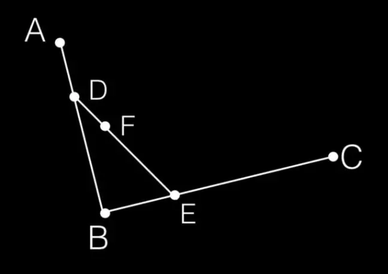
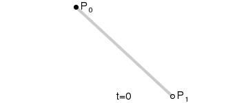

# 二阶贝塞尔曲线
在平面内选3个不同线的点并且依次用线段连接。


在AB和BC线段上找出点D和点E，使得AD/AB=BE/BC


连接DE，在DE上寻找点F，F点需要满足：DF/DE=AD/AB=BE/BC



根据DE线段和计算公式找出所有的F点，然后将这些点连起来。


$B(t)=(1-t)^2P_0+2t(1-t)P_1+t^2P_2,t\in[0,1]$
# 三阶贝塞尔与N阶贝塞尔曲线
在平面内选4个不同线的点并且依次用线段连接。


在线段上找对应的点(E,F,G)，对应的点符合AE/AB=BF/BC=CG/CD；找到对应的点以后接着连接EF,FG；接着在EF、FG线段上继续找点H、I，对应的点依旧符合等比计算规则，也就是EH/EF=FI/FG；最后连接H、I线段，在HI线段上继续找J，点J符合：EH/EF=FI/FG=HJ/HI


重复步骤二的动作，找到所有的J点，依次将J点连接起来


$B(t)=(1-t)^3P_0+3t(1-t)^2P_1+3t^2(1-t)P_2+t^3P_3,t\in[0,1]$
```c
template<class T>
inline void EvaluateCache (const typename AnimationCurveTpl<T>::Cache& cache, float curveT, T& output)
{
//  DebugAssertIf (curveT < cache.time - kCurveTimeEpsilon || curveT > cache.timeEnd + kCurveTimeEpsilon);
    float t = curveT - cache.time;
    output = (t * (t * (t * cache.coeff[0] + cache.coeff[1]) + cache.coeff[2])) + cache.coeff[3];
    DebugAssertIf (!IsFinite(output));
}
```
Unity中的AnimationCurve正是使用的3阶贝塞尔曲线。
四阶贝塞尔如下：


一阶贝塞尔(线性插值)：



$B(t)=P_0+(P_1-P_0)t=(1-t)P_0+tP_1,t\in[0,1]$