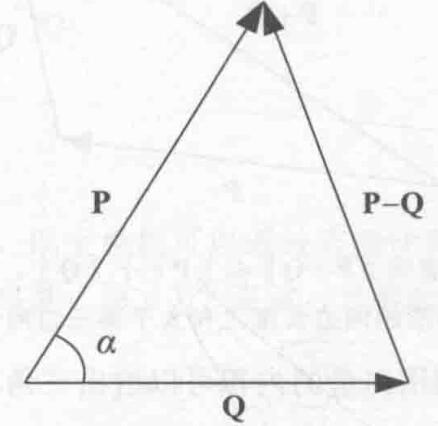
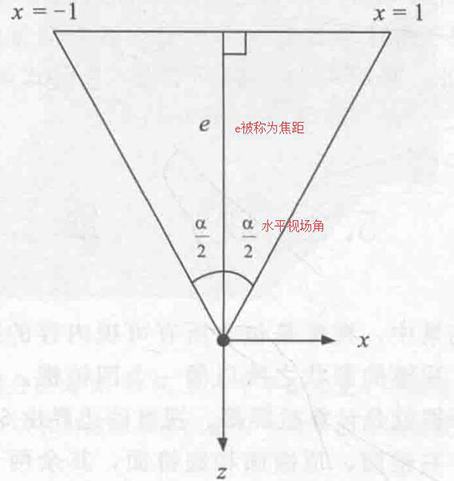
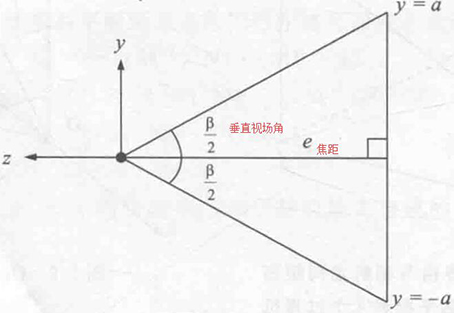
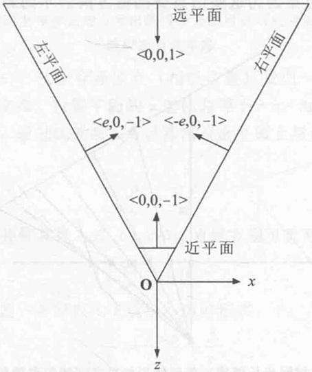

通过像素包含测试、裁剪测试、Alpha测试、模版测试和深度测试，段数据的最终颜色值被混合到图像缓冲区。图像缓冲区的新颜色值通过将端数据的最终颜色值与图像缓冲区对应位置的颜色值进行混合操作而获得。段数据的Alpha值和保存在图像缓冲区中的Alpha值也可用来决定视见区中显示的最终颜色值。最简单的混合操作就是用段数据的最终颜色值替换图像缓冲区中的颜色值。混合操作也可用来产生透明一类的特殊视觉效果。
## 内积
两个向量的内积也被称为向量的点积或者标量积，是3D图形学忠应用最多的概念之一。内积可用来计算两个向量的方向差。
**定义2.3** 两个n维向量$P$和$Q$的内积可以表示$P\cdot Q$，是一个标量，可以按以下公式计算：
$\vec P\cdot \vec Q=\sum_{i=1}^nP_iQ_i$
从该定义可以看出，两个向量的内积是每个分量乘积的和，对于三维向量，其内积可以表示为
$\vec P\cdot \vec Q=P_xQ_x+P_yQ_y+P_zQ_z$
接下来的定理2.4将揭示向量内积被广泛应用的原因。
**定理2.4** 给定任意两个n维向量$\vec P$和$\vec Q$，内积$\vec P \cdot \vec Q$满足以下等式。
$\vec P \cdot \vec Q = ||P||\ ||Q||cos\alpha$
其中$\alpha$是坐标原点分别与向量$\vec P$和$\vec Q$对应的点之间连线的平面夹角。
**证明：** 如图2.2所示，令其中$\alpha$为向量$\vec P$和向量$\vec Q$之间的夹角，根据余弦定义可知。

图 2.2 等式$\vec P \cdot \vec Q = ||P||\ ||Q||cos\alpha$将两个向量的内积与它们的夹角联系在一起
# 曲线与曲面
现代图形硬件已经具备对由大量顶点和平面组成的各类光滑曲面进行有效渲染的能力，因此弯曲几何体的表示与处理已经成为3D图形引擎的必备功能之一。另外，在几何造型系统中，曲线可以表示某个对象的运动轨迹。本章将介绍多种三维的三次曲线，并进一步介绍如何用这些曲线生成双三次参数曲面。
## 三次曲线
三次多项式定义的曲线在操作灵活性和计算简单性方面比较均衡，因此在计算机图形学中被广泛应用。下面将介绍几种不同类型的三次曲线并比较它们之间的性质。
三次曲线的基本形式可用以下参数表达式表示。
$Q(t)=\vec a+\vec bt+\vec ct^2+\vec dt^3$
其中，a，b，c和d为常向量，Q(t)为曲线上与参数t对应的点。Q(t)的分部表达式为
$Q_x(t)=\vec a_x+\vec b_xt+\vec c_xt^2+\vec d_xt^3$
$Q_y(t)=\vec a_y+\vec b_yt+\vec c_yt^2+\vec d_yt^3$
$Q_z(t)=\vec a_z+\vec b_zt+\vec c_zt^2+\vec d_zt^3$
上式可以容易地写成矩阵乘积的形式：
$Q(t)=\begin{bmatrix}a_x&b_x&c_x&d_x\\\\a_y&b_y&c_y&d_y\\\\a_z&b_z&c_z&d_z\end{bmatrix}\begin{bmatrix}1\\\\t\\\\t^2\\\\t^3\end{bmatrix}$
写成更紧凑的形式，如下所示：
$Q(t)=CT(t)$
其中，C为系数矩阵，$T(t)=(1,t,t^2,t^3)$，Q(t)的导数为曲线在t的切线方向，由于矩阵C为常数矩阵，可以很容易地计算出Q(t)的导数，如下式所示。
$Q^'(t)=Cd/dtT(t)=C$
### 4.4.3 坐标w的几何意义
在利用$4\times 4$矩阵进行的变换中，四维向量的w坐标起了重要作用，除了这个作用外，w坐标还有重要的几何意义。前面，通过给三维点扩展一个等于1的w坐标，变成四维空间中的一个点。这里研究一下相反的情况，假设有一个4D点向量$\vec p = (x,y,z,w)$，其中w不为0.令向量$P'$为向量$P$在w=1的三维空间中的映射，如下式所示：
$P'=({x\over w},{y\over w},{z\over w})$
### 4.6.2 四元数旋转
三维空间的旋转可以看成函数$\varphi$在三维向量空间$R^3$内的映射变换。由于函数$\varphi$表示一个旋转变换，它必须保持长度、角度和偏手性不变。
如图4.5所示，图中为了方便省略了z轴，3D点向量$P'$为点$P$与坐标系原点的连线与w=1的三维空间的交点，因此，给4D向量P
### 5.3.1 视场
如图5.10所示，投影平面是一个与相机指向垂直的平面，该平面与相机的距离为e，左锥面与右锥面分别与该平面在x=-1和x=1处相交。距离e有时也被称为相机的焦距，与左锥面和右锥面之间的夹角$\alpha$有关，夹角$\alpha$被称为水平视场角。

图5.10 相机到投影平面的距离e与水平视场角$\alpha$有关

对于给定的水平视场角$\alpha$，到投影平面的距离e可由以下三角关系表达式给出。
$e = {1\over tan( \alpha / 2)}$

焦距越短，则视场越大。视场角逐渐缩小，相机则进行放大成像，而焦距越大。
显示屏幕的宽高比等于显示屏幕的高度除以宽度，例如，像素分辨率为$640\times 480$的显示器的宽高比为0.75。由于大多数显示器不是正方形而是长方形，所以垂直视场不等于水平视场。低锥平面和顶锥平面与投影平面在$y=\pm a$处相交，a为显示器的宽高比，这可构成图5.11所示的三角形，则垂直视场角$\beta$的表达式如下：
$\beta=2tan^{-1}(a/e)$

图5.11 垂直视场角$\beta$与高宽比a有关

视锥的4个边平面在从投影平面切出一个长方形，该长方形与相机距离为e，它的四条边分别位于$x=\pm 1$和$y=\pm a$处。
### 5.3.2 锥平面
6个视锥平面在相机空间的法向量如图5.12所示，其中4个边锥平面的法向量向内，指向视锥内部，可以通过将边平面中的边的方向向里旋转90°获得。由于每个边锥平面都经过坐标系原点，其平面四锥表达式中的D=0。近锥平面与原点距离为n，与原点的相对方向与其法向量相同，所以D=-n。远锥平面与原点距离为f，与原点的相对方向与其法向量相反，所以D=f。表5.1总结了视锥的6个锥平面的四维平面表示向量。在表5.1中，4个边锥平面的法向量已经规范化成长度为单位长度的向量。

图5.12 在OpenGL的相机空间中的视锥平面的法向量方向
**表5.1 在OpenGL的相机空间中的视锥平面向量**

## 深度值偏移
在很多游戏中，经常遇到渲染一些特殊效果的情况，如墙上的火烧痕迹和地面上的脚印，这些内容都不是原始场景的一部分，而是在游戏过程中产生的，在9.2节中将介绍这些特效的方法。这些修饰性的对象通常被贴到当前的物体表面上，因此这些对象包含的多边形与场景中的插值深度值，很少会等于与共面的另一多边形某一部分对应的渲染像素的插值深度值，这将导致一个不想要的渲染结果，即原始表面的多边形会透过贴上去的多边形而显示出来。
为了解决上述问题，需要寻找一个方法可以将多边形在场景中的深度适当偏移而不改变它的投影屏幕坐标或者调整多边形的纹理映射透视处理方法。多数3D图形系统包含一些多边形偏移函数，借用这些函数可实现处理目标。然而，这些办法缺少灵活的控制方法，常会导致逐顶点的复杂运算。本节将介绍一个通过修改投影矩阵而获得深度偏移效果的方法。
### 投影矩阵调整
首先分析标准的OpenGL透视投影矩阵对观察空间一点$P = (P_x,P_y,P_z,1)$的变换结果。