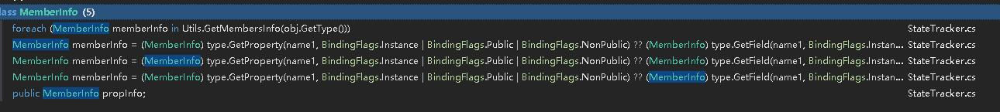

git仓库：https://github.com/zentia/TrueSync
优点：
1. 支持回滚
2. 支持UDP
3. 完整的解决方案

缺点：
1. lockstep模式，目前不太需要
2. 不适合扩展ECS模型
3. 代码整体性能应该不是最优，不过可以调整
4. 封装的比较完整，但是要适配到项目中，可能会对项目改的东西比较多。
5. 反射和Lambda使用的情况比较多

```CSharp
public enum ConnectionProtocol : byte
{
    Udp = 0,
    Tcp = 1,
    WebSocket = 4,
    WebSocketSecure = 5,
}
```
貌似都支持，但是我们不需要这么多。或者说我们PVP部分和大厅部分都走一套。目前不考虑大厅的设计。
## TrueSyncConfig
帧同步配置
## TrueSyncManager

```CSharp
管理、驱动帧同步 

//同步全局配置
static TrueSyncConfig TrueSyncGlobalConfig;
// 配置
static TrueSyncConfig Config;
TrueSyncConfig ActiveConfig;
// 锁帧
private AbstractLockstep lockstep;
// 协程调度
CoroutineScheduler scheduler;


// 玩家预设列表
GameObject[] playerPrefabs;
// 
 private Dictionary<int, List<GameObject>> gameOjectsSafeMap = new Dictionary<int, List<GameObject>>();


// 非哪个玩家拥有的行为，叫做普通行为
List<TrueSyncManagedBehaviour> generalBehaviours = new List<TrueSyncManagedBehaviour>();

// 对应玩家所拥有的行为
Dictionary<byte, List<TrueSyncManagedBehaviour>> behaviorsByPlayer;

// 一个临时缓存池，用在后面注册行为的时候占存。在帧更新的时候OnStepUpdate调用CheckQueuedBehaviours。分配玩家拥有者和调OnSyncedStart。然后就清理该列表
List<TrueSyncManagedBehaviour> queuedBehaviours = new List<TrueSyncManagedBehaviour>();

// 保存了所有行为的字典
Dictionary<ITrueSyncBehaviour, TrueSyncManagedBehaviour> mapBehaviorToManagedBehavior = new Dictionary<ITrueSyncBehaviour, TrueSyncManagedBehaviour>();

// 时间
FP time = 0;
static FP Time;

// 帧时间
static FP DeltaTime;

// 帧
static int Ticks;
static int LastSafeTick;

// 重力
static TSVector Gravity;

// 玩家列表
static List<TSPlayerInfo> Players；

// 本地玩家
static TSPlayerInfo LocalPlayer；

// 启动状态, 在Update决定什么时候运行lockstep.RunSimulation(true);
private enum StartState { BEHAVIOR_INITIALIZED, FIRST_UPDATE, STARTED };
private StartState startState;
void Awake() 
{
    TrueSyncConfig currentConfig = ActiveConfig;
    lockedTimeStep = currentConfig.lockedTimeStep;

    // 初始化状态跟踪
    StateTracker.Init(currentConfig.rollbackWindow);
    // 初始化随机数
    TSRandom.Init();

    // 初始化物理管理器
    if (currentConfig.physics2DEnabled || currentConfig.physics3DEnabled) {
        PhysicsManager.New(currentConfig);
        PhysicsManager.instance.LockedTimeStep = lockedTimeStep;
        PhysicsManager.instance.Init();
    }
    // 跟踪 时间
    StateTracker.AddTracking(this, "time");
}

void Start() 做了什么?
设置instance = this;
设置Application.runInBackground = true;
初始化通信PhotonTrueSyncCommunicator 
创建lockstep
检测是否是录像模式, 如果是就加载录像
如果配置了显示TrueSyncStats，那就初始化
创建协程调度 scheduler = new CoroutineScheduler(lockstep);
非录像模式下 初始化帧的玩家列表
初始化场景中现有的帧同步行为 TrueSyncBehaviour
实例化玩家预设playerPrefabs和同步其行为的拥有者 initBehaviors
初始化行为拥有者，并分配给对于玩家。没有继承TrueSyncBehaviour的就继续放到普通行为列表。initGeneralBehaviors
添加物理对象移除监听 PhysicsManager.instance.OnRemoveBody(OnRemovedRigidBody);
设置启动状态 startState = StartState.BEHAVIOR_INITIALIZED;

// 创建ITrueSyncBehaviour的TrueSyncManagedBehaviour，是对ITrueSyncBehaviour的一层包装
private TrueSyncManagedBehaviour NewManagedBehavior(ITrueSyncBehaviour trueSyncBehavior)

// 初始化玩家预设和他们的同步行为。行为设置拥有者，并其添加到对应玩家的行为字典里behaviorsByPlayer
private void initBehaviors()

// 对行为列表分配拥有者， 在Start(), CheckQueuedBehaviours()里调用
private void initGeneralBehaviors(IEnumerable<TrueSyncManagedBehaviour> behaviours, bool realOwnerId)

// 将注册行为占存列表列queuedBehaviours的行为调initGeneralBehaviors分配拥有者。调SetGameInfo和OnSyncedStart两个方法
private void CheckQueuedBehaviours()

// 只做一件事，检测启动状态，如果是第一次启动就调lockstep.RunSimulation(true);
void Update()


// 在帧同步调暂停后 恢复继续运行。instance.lockstep.RunSimulation(false);
public static void RunSimulation()

// 暂停游戏 调instance.lockstep.PauseSimulation();
public static void PauseSimulation() 

// 结束游戏 调instance.lockstep.EndSimulation();
public static void EndSimulation()

// 更新一次协程， 主要是物理里调用了。默认的协程更新在 帧更新里OnStepUpdate
public static void UpdateCoroutines()

// 添加一个协程
public static void SyncedStartCoroutine(IEnumerator coroutine)

// 实例化一个预设
// 先势力化一个GameObject
// 非录像模式将该对象添加到帧记录里。AddGameObjectOnSafeMap(go);
// 将该对象的帧行为添加到queuedBehaviours，等待帧更新的时候分配拥有者和调度初始化方法
// 调该对象上组件的初始化方法（ICollider注册到物理管理器里PhysicsManager, TSTransform, TSTransform2D）。InitializeGameObject
public static GameObject SyncedInstantiate(GameObject prefab)
public static GameObject SyncedInstantiate(GameObject prefab, TSVector position, TSQuaternion rotation)
public static GameObject SyncedInstantiate(GameObject prefab, TSVector2 position, TSQuaternion rotation)

// 将势力化的GameObject添加到当前的帧+1列表里
private static void AddGameObjectOnSafeMap(GameObject go)

// 在帧更新OnStepUpdate的时候掉, 清理销毁掉当前 Ticks + 1里的GameObject。猜测估计是帧回滚的时候把预处理的对象销毁
private static void CheckGameObjectsSafeMap()

// 调该对象上组件的初始化方法（ICollider注册到物理管理器里PhysicsManager, TSTransform, TSTransform2D）
private static void InitializeGameObject(GameObject go, TSVector position, TSQuaternion rotation)

// 销毁GameObject
// 第一步调SyncedDisableBehaviour, 停止更新该对象上的ITrueSyncBehaviour
// 第二步调 TSCollider和TSCollider2D 调 DestroyTSRigidBody
public static void SyncedDestroy(GameObject gameObject)

// 将GameObject的ITrueSyncBehaviour的disabled设置为true, 停止对他调帧更新方法 OnSyncedInput，OnSyncUpdate。
public static void SyncedDisableBehaviour(GameObject gameObject)

// 设置 tsColliderGO.gameObject.SetActive(false);
// 将物理对象从lockstep销毁 instance.lockstep.Destroy(body);
private static void DestroyTSRigidBody(GameObject tsColliderGO, IBody body)

// 注册ITrueSyncBehaviour, 将他添加到queuedBehaviours。在下次CheckQueuedBehaviours的时候，也就是在下次帧更新的时候OnStepUpdate，对他分配拥有者，调SetGameInfo和OnSyncedStart两个方法
public static void RegisterITrueSyncBehaviour(ITrueSyncBehaviour trueSyncBehaviour)

// 注册游戏是否继续的委托。 调委托会返回一个bool值。 true游戏可以继续运行。lockstep里会调该方法检测是否可以继续CheckGameIsReady（）
public static void RegisterIsReadyChecker(TrueSyncIsReady IsReadyChecker)

// 移除玩家
// 第一步将该玩家的 行为全部禁止帧更新behaviorsByPlayer[(byte)playerId],disabled = true;
// 第二步将这些行为的GameObject上拥有TSCollider、TSCollider2D的物理全部掉DestroyTSRigidBody
public static void RemovePlayer(int playerId)


// 检测帧更新时间，时间到就调instance.scheduler.UpdateAllCoroutines();和lockstep.Update();
// lockedTimeStep，帧同步一帧的时间
// JitterTimeFactor, 为了避免浮动点数比较造成误差。if (tsDeltaTime >= (lockedTimeStep - JitterTimeFactor))
// tsDeltaTime, 用的时间还是用Unity的 tsDeltaTime += UnityEngine.Time.deltaTime;
void FixedUpdate()

// 里面创建一个输入数据结构 return new InputData();  是在lockstep创建的时候传这个方法给他
InputDataBase ProvideInputData()

// 这个方法会调本地玩家所有帧行为的OnSyncedInput方法
// 这这个方法生命周期内 TrueSyncInput.CurrentInputData = playerInputData
// 是在lockstep创建的时候传这个方法给他
void GetLocalData(InputDataBase playerInputData)

// 帧更新
// 添加当前时间 time += lockedTimeStep;
// 非录像模式， 检测GameObject CheckGameObjectsSafeMap();
// 遍历generalBehaviours普通行为列表，调行为的OnPreSyncedUpdate()。还会调协程更新instance.scheduler.UpdateAllCoroutines();
// 遍历allInputData,和对应玩家的行为列表behaviorsByPlayer。 调行为的OnPreSyncedUpdate()。还会调协程更新instance.scheduler.UpdateAllCoroutines();
// 遍历generalBehaviours普通行为列表，调行为的OnSyncedUpdate()。还会调协程更新instance.scheduler.UpdateAllCoroutines();
// 遍历allInputData,和对应玩家的行为列表behaviorsByPlayer。 调行为的OnSyncedUpdate()。还会调协程更新instance.scheduler.UpdateAllCoroutines();
// 检测占存行为列表CheckQueuedBehaviours（）。给他们分配拥有者和调同步开始方法
// 是在lockstep创建的时候传这个方法给他
void OnStepUpdate(List<InputDataBase> allInputData)


// 玩家离线消息处理
// 调TrueSyncManagedBehaviour.OnPlayerDisconnection(generalBehaviours, behaviorsByPlayer, playerId);
// 是在lockstep创建的时候传这个方法给他
 void OnPlayerDisconnection(byte playerId)


// 游戏开始消息处理
// 是在lockstep创建的时候传这个方法给他
        void OnGameStarted() {
            TrueSyncManagedBehaviour.OnGameStarted(generalBehaviours, behaviorsByPlayer);
            instance.scheduler.UpdateAllCoroutines();

            CheckQueuedBehaviours();
        }


// 游戏暂停消息处理
// 是在lockstep创建的时候传这个方法给他
        void OnGamePaused() {
            TrueSyncManagedBehaviour.OnGamePaused(generalBehaviours, behaviorsByPlayer);
            instance.scheduler.UpdateAllCoroutines();
        }

// 游戏继续消息处理
        void OnGameUnPaused() {
            TrueSyncManagedBehaviour.OnGameUnPaused(generalBehaviours, behaviorsByPlayer);
            instance.scheduler.UpdateAllCoroutines();
        }

// 游戏结束消息处理
        void OnGameEnded() {
            TrueSyncManagedBehaviour.OnGameEnded(generalBehaviours, behaviorsByPlayer);
            instance.scheduler.UpdateAllCoroutines();
        }


// 移除物理对象事件处理
// 会移除该对象的GameObject上所有同步行为 调RemoveFromTSMBList
// PhysicsManager.instance.OnRemoveBody(OnRemovedRigidBody); 在这里注册
private void OnRemovedRigidBody(IBody body) 

// 从tsmbList列表中，移除behaviours
private void RemoveFromTSMBList(List<TrueSyncManagedBehaviour> tsmbList, List<TrueSyncBehaviour> behaviours)

// 清理
// 清理对象池 ResourcePool.CleanUpAll();
// 清理状态跟踪 StateTracker.CleanUp();
// 去除实例变量引用 instance = null;
public static void CleanUp()


// Unity的消息。退出应用
        void OnApplicationQuit() {
            EndSimulation();
        }

```
支持lockstep模式，但是目前我们是不会用到这个的。并且不是可配置的，改造起来可能会比较麻烦一些。
## ICommunicator

```CSharp
public interface ICommunicator
{
    //  通信器，在TrueSync管理器中创建
    // 往返时间
    int RoundTripTime();
    // 操作时间
    void OpRaiseEvent(byte eventCode, object message, bool reliable, int[] toPlayers);
    // 添加监听
    void AddEventListener(OnEventReceived onEventReceived);    
}
```
## PhotonTrueSyncCommunicator

```CSharp
帧同步 通信器， 实现ICommunicator接口
// 往返时间
int RoundTripTime();

// 操作时间
void OpRaiseEvent(byte eventCode, object message, bool reliable, int[] toPlayers);

// 添加监听
void AddEventListener(OnEventReceived onEventReceived);
```
## OnEventReceived

```CSharp
代理事件， 接收消息

// byte eventCode 消息编号
// object content 消息内容
private void OnEventDataReceived(byte eventCode, object content)
{
    if (eventCode == 0xc7)
    {
        byte[] data = content as byte[];
        SyncedData[] dataArray = SyncedData.Decode(data);
        if (dataArray.Length > 0)
        {
            TSPlayer player = this.players[dataArray[0].inputData.ownerID];
            if (!player.dropped)
            {
                this.OnSyncedDataReceived(player, dataArray);
                if ((dataArray[0].dropPlayer && (player.ID != localPlayer.ID)) && !this.players[dataArray[0].dropFromPlayerId].dropped)
                {
                    player.dropCount++;
                }
            }
        }
    }
    else if (eventCode == 0xc6)
    {
        byte[] infoBytes = content as byte[];
        OnChecksumReceived(SyncedInfo.Decode(infoBytes));
    }
    else if (eventCode == 0xc5)
    {
        byte[] buffer3 = content as byte[];
        if (buffer3.Length > 0)
        {
            if (buffer3[0] == 0)
            {
                this.Pause();
            }
            else if (buffer3[0] == 1)
            {
                this.Run();
            }
            else if (buffer3[0] == 3)
            {
                this.End();
            }
        }
    }
    else if (eventCode == 0xc4)
    {
        byte[] buffer4 = content as byte[];
        SyncedInfo info = SyncedInfo.Decode(buffer4);
        players[info.playerId].sentSyncedStart = true;
    }
}
```
接口的实现有一次GC，并未实测
## TrueSyncBehaviour

```CSharp
帧同步行为，继承自 MonoBehaviour, 实现接口 ITrueSyncBehaviourGamePlay, ITrueSyncBehaviourCallbacks

// 该行为的拥有者玩家
public TSPlayerInfo owner;

// 本地玩家，相当于快捷访问本地玩家，此处会被序列化，放到项目中应该要去掉
public TSPlayerInfo localOwner;

// 快捷访问
TSTransform tsTransform
TSTransform2D tsTransform2D
TSRigidBody tsRigidBody
TSRigidBody2D tsRigidBody2D
TSCollider tsCollider
TSCollider2D tsCollider2D

// 基本上就是上面这些属性，实现的接口都是空的没有写业务逻辑，在Mono上层封装了一层，基于多组件的方式，不利于ECS扩展
```

## TrueSyncManagedBehaviour

```CSharp
帧同步行为管理器，实现接口 ITrueSyncBehaviourGamePlay, ITrueSyncBehaviour, ITrueSyncBehaviourCallbacks
主要是包装了TrueSyncBehaviour/ITrueSyncBehaviour, 实现的接口方法直接掉TrueSyncBehaviour的放方法，TrueSyncBehaviour的OnSyncedStartLocalPlayer 方法该行为是本地用户时才调

// 有一个属性, true是，不会参与帧更新
    [AddTracking]
    public bool disabled;


后面就是一些全局静态方法，用管理处理列表的事件
管理主要是管理这个的。
```

## CoroutineScheduler

```CSharp
协程调用
在TrueSyncManager.SyncedStartCoroutine 调 StartCoroutine(IEnumerator coroutine) 启动一个协程
在TrueSyncManager驱动UpdateAllCorutines()
内部协程使用链表来维护，但是链表操作会有GC，比如Remove的时候直接舍弃了，并没有使用池处理
```

## ITrueSyncBehaviour

```CSharp
接口 帧同步行为
就只有一个方法
// 设置游戏信息 (本地玩家， 玩家数量)
void SetGameInfo(TSPlayerInfo localOwner, int numberOfPlayers);
```

## ITrueSyncBehaviourGamePlay

```CSharp
接口 玩家操作帧同步行为, 继承自ITrueSyncBehaviour，Mono上层的封装接口

// 同步 玩家输入操作
void OnSyncedInput();

// 同步 读取玩家操作
void OnSyncedUpdate();

void OnPreSyncedUpdate();
```

## ITrueSyncBehaviourCallbacks

```CSharp
接口 回调同步行为, 继承自ITrueSyncBehaviour
TrueSyncBehaviour实现：表示在连接到游戏的每台机器上模拟的每个玩家的行为。
// 开始
void OnSyncedStart();

// 开始 -- 只调本地玩家的
void OnSyncedStartLocalPlayer();

// 游戏暂停
void OnGamePaused();

// 游戏继续
void OnGameUnPaused();

// 游戏结束的时候调用
void OnGameEnded();

// 有玩家离线时调用
void OnPlayerDisconnection(int playerId);
```

## TSRandom

```CSharp
随机数
http://www.codeproject.com/Articles/164087/Random-Number-Generation
https://github.com/ihaiucom/learn.PhotonTrueSync/blob/master/PhotonGame/Assets/TrueSync/Engine/Math/TSRandom.cs

原理是，传一个因素进去，然后里面生成N数量的数组。每个数有一个公式计算来生成。所以传相同的因素生成的结果是一样的。
获取随机数的时候根据当前索引mti依次读取数组里面的数。当mti大于N时，内部重新生成默认因素是5489U
```

<a href="https://www.codeproject.com/Articles/164087/Random-Number-Generation">Random-Number-Generation</a>
<a href="https://github.com/ihaiucom/learn.PhotonTrueSync/blob/master/PhotonGame/Assets/TrueSync/Engine/Math/TSRandom.cs">TrueSync/Engine/Math/TSRandom.cs</a>
## StateTracker.TrackedInfo

```CSharp
状态跟踪信息， 用来保存对象引用，和对象的成员属性信息MemberInfo
internal class TrackedInfo
{
    public object relatedObj;   // 保存对象
    public MemberInfo propInfo; // 对象的成员属性信息
}
```

效率略低

## StateTracker.State
```CSharp
// 状态跟踪信息， 持有TrackedInfo跟踪信息
internal class State
{
  private StateTracker.TrackedInfo trackedInfo;
  private object value;

  public void SetInfo(StateTracker.TrackedInfo trackedInfo)
  {
    this.trackedInfo = trackedInfo;
    this.SaveValue();
  }
    // 保存值到value变量
  public void SaveValue()
  {
    object obj = this.trackedInfo.propInfo.GetValue(this.trackedInfo.relatedObj);
    if (obj != null)
    {
      if (obj.GetType().IsArray)
      {
        this.value = (object) Array.CreateInstance(obj.GetType().GetElementType(), ((Array) obj).Length);
        Array.Copy((Array) obj, (Array) this.value, ((Array) obj).Length);
      }
      else
        this.value = obj;
    }
    else
      this.value = (object) null;
  }
    // 将保存的值用反射赋值给对象
  public void RestoreValue()
  {
    if (this.trackedInfo.relatedObj == null)
      return;
    if (this.value is Array)
    {
      Array instance = Array.CreateInstance(this.value.GetType().GetElementType(), ((Array) this.value).Length);
      Array.Copy((Array) this.value, instance, ((Array) this.value).Length);
      this.trackedInfo.propInfo.SetValue(this.trackedInfo.relatedObj, (object) instance);
    }
    else
      this.trackedInfo.propInfo.SetValue(this.trackedInfo.relatedObj, this.value);
  }
}
```
## StateTracker
```CSharp
// 状态跟踪
// TSRandom 用到
StateTracker.AddTracking(r, "mt"); // 字符串拼接
StateTracker.AddTracking(r, "mti");

//TrueSyncManager 用到
StateTracker.AddTracking(this, "time");

//TSTransform 用到 配合 [AddTracking] Attribute 使用, StateTracker.AddTracking(object obj)通过反射获取obj的成员变量
StateTracker.AddTracking(this);

// TrueSyncManagedBehaviour 用到
StateTracker.AddTracking(this);
StateTracker.AddTracking(trueSyncBehavior);

// 这个是核心了， 里面保存了 rollbackWindow 数量的列表，AddTracking的时候回把StateTracker.State 添加到所有列表里
// SaveState 的时候就保存GenericBufferWindow当前列表的, 保存完后就GenericBufferWindow的索引移动下一个
// RestoreState 从GenericBufferWindow当前的列表把值恢复
StateTracker.instance.states = new GenericBufferWindow<List<StateTracker.State>>(rollbackWindow);
```

## GenericBufferWindow
```CSharp
// 通用缓存窗口，和list相比多了一个前驱，需要自己调用Resize(会有GC消耗)，是一个泛型数据结构
// StateTracker 用到
StateTracker.instance.states = new GenericBufferWindow<List<StateTracker.State>>(rollbackWindow);
// CompoundStats 用到
this.bufferStats = new GenericBufferWindow<Stats>(10);
// AbstractLockstep 用到  
this.bufferSyncedInfo = new GenericBufferWindow<SyncedInfo>(3);
// 构造方法： 会创建一个T[size] 的数组buffer，并且实例化T 
```

## ResourcePool 对象池
```CSharp
//ResourcePool 内部使用Stack实现
//是一个抽象对象池,他有一个静态对象池列表。他管理所有对象池的清理CleanUpAll();

ResourcePool<T> 是ResourcePool派生类。里面有一个对象栈存储空闲的对象。

// 还回对象
GiveBack(T obj)

// 获取对象, 如果T是ResourcePoolItem的派生类就会调对象的CleanUp()方法
T GetNew()

// 实例化对象
T NewInstance()
ResourcePoolItem 是对象池对象接口，实现该接口的对象在获取对象时会调CleanUp()方法
【使用】
internal class ResourcePoolListSyncedData : ResourcePool<List<SyncedData>>
internal class ResourcePoolStateTrackerState : ResourcePool<StateTracker.State>
internal class ResourcePoolSyncedData : ResourcePool<SyncedData>
```

## SerializableDictionary
```CSharp
public class SerializableDictionary<TKey, TValue> : Dictionary<TKey, TValue>, ISerializationCallbackReceiver

其实就是一个Dictionary, 然后实现了Unity的接口ISerializationCallbackReceiver。OnBeforeSerialize、OnAfterDeserialize

派生类
public class SerializableDictionaryByteByte : SerializableDictionary<byte, byte>
public class SerializableDictionaryByteByteArray : SerializableDictionary<byte, byte[]>
public class SerializableDictionaryByteInt : SerializableDictionary<byte, int>
public class SerializableDictionaryBytePlayer : SerializableDictionary<byte, TSPlayer>
public class SerializableDictionaryByteString : SerializableDictionary<byte, string>
public class SerializableDictionaryIntSyncedData : SerializableDictionary<int, SyncedData>
```

## InputData
```CSharp
拥有各个基本类型序列化字典

序列化和解析都是对这些解绑类型字典
每个值的序列化:key, valueType, value
数组的: key, valueType, length, value[]
字符串的用char[] 也就是数组


然后有各个类型的AddXX和GetXX
```

## SyncedInfo
```CSharp
同步信息，保存了3个属性

  
    // 玩家ID
    public byte playerId;

    // 帧
    public int tick;

    // 校验码
    public string checksum;

2 个方法

// 序列化
public static byte[] Encode(SyncedInfo info)

// 解析
public static SyncedInfo Decode(byte[] infoBytes)
```
## SyncedData
```CSharp
// 同步数据

// 主要就序列化下面两个方法的数据

public void GetEncodedHeader(List bytes)
{
    // 帧
    Utils.GetBytes(this.tick, bytes);
    // 拥有者玩家ID
    bytes.Add(this.inputData.ownerID);
    // 从哪个玩家掉线
    bytes.Add(this.dropFromPlayerId);
    // 是否掉线
    bytes.Add(this.dropPlayer ? 1 : 0);
}

public void GetEncodedActions(List bytes)
{
  this.inputData.Serialize(bytes);
}
```

## TSPlayerInfo
```CSharp
//玩家信息,保存2个属性

// 玩家ID
[SerializeField]
internal byte id;

// 玩家名称
[SerializeField]
internal string name;
```
## TSPlayer
```CSharp
// 玩家

// 玩家信息
[SerializeField]
public TSPlayerInfo playerInfo;

// 掉线次数
[NonSerialized]
public int dropCount;

//是否掉线
[NonSerialized]
public bool dropped;

// 开始发送同步数据
[NonSerialized]
public bool sentSyncedStart;

// 保存玩家整个战斗的操作同步数据, 他是一个字典SerializableDictionary<int, SyncedData>
[SerializeField]
internal SerializableDictionaryIntSyncedData controls;

// 最后一次 同步操作数据的帧, AddData(SyncedData data)
private int lastTick;

internal TSPlayer(byte id, string name)
{
    // 创建玩家信息
    playerInfo = new TSPlayerInfo(id, name);
    dropCount = 0;
    dropped = false;
    // 创建玩家操作字典存储器
    controls = new SerializableDictionaryIntSyncedData();
}

// 获取某帧是否有真实同步操作数据
public bool IsDataReady(int tick)
{
    return controls.ContainsKey(tick) && !controls[tick].fake;
}

// 获取某帧是否有模拟同步操作数据, 客户端先行，是客户端预测的操作, 回滚添加的。
public bool IsDataDirty(int tick)
{
    bool flag = this.controls.ContainsKey(tick);
    return flag && this.controls[tick].dirty;
}

// 获取该帧的同步操作数据
public SyncedData GetData(int tick)
{
    if (!controls.ContainsKey(tick))
    {
        // 如果不存在，就查找上一帧是否存在
        SyncedData data = null;
        if (controls.ContainsKey(tick - 1))
        {
            // 如果存在上一帧，就克隆上一帧的同步数据
            data = controls[tick - 1].clone();
            data.tick = tick;
        }
        else
        {
            // 否则就新建一个同步数据
            data = new SyncedData(ID, tick);
        }
        // 设置为伪造的
        data.fake = true;
        // 保存到帧字典
        this.controls[tick] = data;
        return data;
    }
    // 如果存在该,就返回该帧数据
    return controls[tick];
}

// 添加存在帧同步数据
public void AddData(SyncedData data)
{
  int tick = data.tick;
  bool flag = this.controls.ContainsKey(tick);
  if (flag)
  {
    // 如果已经存在，就还给对象池
    SyncedData.pool.GiveBack(data);
  }
  else
  {
    // 否则 添加到存储里
    this.controls[tick] = data;
    // 设置最后存储的帧
    this.lastTick = tick;
  }
}
ReplayRecord

录像

负责记录游戏是所有玩家的SynceData

序列化: 各个玩家的所有操作
AbstractLockstep.SimulationState

帧同步模拟器状态
private enum SimulationState
{
 // 没启动
  NOT_STARTED,
  // 等待玩家
  WAITING_PLAYERS,
  // 运行中
  RUNNING,
  // 暂停
  PAUSED,
  // 结束
  ENDED
}

AbstractLockstep

帧同步抽象基类

// 玩家初始容量
  private const int INITIAL_PLAYERS_CAPACITY = 4;

// 同步游戏开始编码
    private const byte SYNCED_GAME_START_CODE = 196;

// 模拟器编码 (0 暂停, 1 第一次启动, 3 End)
    private const byte SIMULATION_CODE = 197;

// 验证码编码
    private const byte CHECKSUM_CODE = 198;

// 发送编码
    private const byte SEND_CODE = 199;

// 模拟器时间--暂停
    private const byte SIMULATION_EVENT_PAUSE = 0;

// 模拟器时间--运行
    private const byte SIMULATION_EVENT_RUN = 1;

// 模拟器时间--结束
    private const byte SIMULATION_EVENT_END = 3;

// 游戏结束前 最大等待所有玩家输入的帧
    private const int MAX_PANIC_BEFORE_END_GAME = 5;

// 同步信息 缓存窗口
    private const int SYNCED_INFO_BUFFER_WINDOW = 3;
// 添加玩家
// internal Dictionary<byte, TSPlayer> players;
// internal List activePlayers;
// this.localPlayer = tSPlayer;
public void AddPlayer(byte playerId, string playerName, bool isLocal)

// 更新在线的其他玩家ID列表
internal void UpdateActivePlayers()

// 运行模拟器
// TrueSyncStats的Update里检测调 lockstep.RunSimulation(true);
// CheckGameStart() 里调 RunSimulation(false);
public void RunSimulation(bool firstRun)

// 更新设置simulationState模拟器状态, 和调对应的回调(OnGameStarted, OnGameUnPaused)
// RunSimulation() 里调
// private void OnEventDataReceived(byte eventCode, object content) 里调
private void Run()

// 发送操作
// 调通信器 this.communicator.OpRaiseEvent(eventCode, message, reliable, toPlayers);
private void RaiseEvent(byte eventCode, object message)
private void RaiseEvent(byte eventCode, object message, bool reliable, int[] toPlayers)

```
## ThreadManager
```CSharp
using System;
using System.Collections.Generic;
using System.Threading;

namespace EventSource
{
    public class ThreadManager
    {
        private static ThreadManager instance;
        private volatile List<Action<object>> tasks = new List<Action<object>>();
        private volatile List<object> parameters = new List<object>();
        private ManualResetEvent waitHandleA;
        private ManualResetEvent waitHandleB;
        private ManualResetEvent currentWaitHandle;
        private Thread[] threads;
        private int currentTaskIndex;
        private int waitingThreadCount;
        internal int threadCount;

        public int ThreadCount
        {
            private set { threadCount = value; }
            get { return threadCount; }
        }

        public static ThreadManager Instance
        {
            get
            {
                if (instance == null)
                {
                    instance = new ThreadManager();
                    instance.Initialize();
                }
                return instance;
            }
        }

        private ThreadManager()
        {
            
        }
        // 下面这种写法感觉没有切换时间的概念呀，该进程内部不会发送切换时间片呀
        private void Initialize()
        {
            threadCount = Environment.ProcessorCount;
            threads = new Thread[threadCount];
            waitHandleA = new ManualResetEvent(false);
            waitHandleB = new ManualResetEvent(false);
            currentWaitHandle = waitHandleA;
            var initWaitHandle = new AutoResetEvent(false);
            for (var index = 1; index < threads.Length; index++)
            {
                threads[index] = new Thread(() =>
                {
                    initWaitHandle.Set();
                    ThreadProc();
                })
                {
                    IsBackground = true
                };
                threads[index].Start();
                initWaitHandle.WaitOne();
            }
        }

        public void Execute()
        {
            currentTaskIndex = 0;
            waitingThreadCount = 0;
            currentWaitHandle.Set();
            PumpTasks();
            while (waitingThreadCount < threads.Length - 1)
            {
                Thread.Sleep(0);
            }
            currentWaitHandle.Reset();
            currentWaitHandle = currentWaitHandle == waitHandleA ? waitHandleB : waitHandleA;
            tasks.Clear();
            parameters.Clear();
        }

        public void AddTask(Action<object> task, object param)
        {
            tasks.Add(task);
            parameters.Add(param);
        }

        private void ThreadProc()
        {
            while (true)
            {
                Interlocked.Increment(ref waitingThreadCount);
                waitHandleA.WaitOne();
                PumpTasks();
                Interlocked.Increment(ref waitingThreadCount);
                waitHandleB.WaitOne();
                PumpTasks();
            }
        }

        private void PumpTasks()
        {
            var count = tasks.Count;
            while (currentTaskIndex < count)
            {
                var curTaskIndex = currentTaskIndex;
                if (curTaskIndex == Interlocked.CompareExchange(ref currentTaskIndex, curTaskIndex + 1, curTaskIndex) && currentTaskIndex < count)
                    tasks[currentTaskIndex](parameters[currentTaskIndex]);
            }
        }
    }
}
```