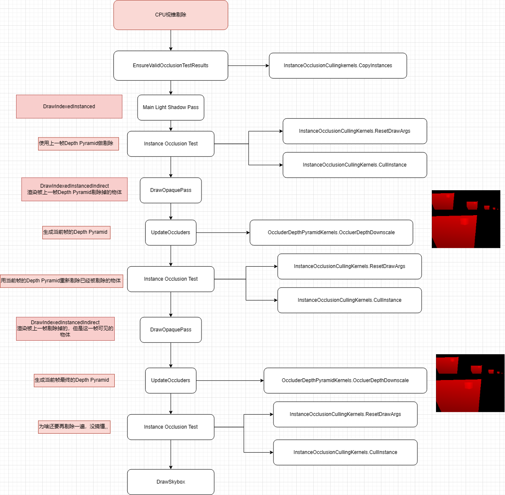

核心：有价值的

探索方向：Unity我们没有使用到的特性

https://unity.cn/solutions/console-and-pc-games

# VFX
PC走Computer Shader
Mobile走CPU

Shader Graph

PSO caching - Achieve smoother rendering with API-level disk-based caching for DX12 Pipeline State Objects (PSOs) across application runs, across all compatible devices.

Variable Rate Shading - Improve GPU performance with minimal impact to visuals. Set the shading rate of custom passes within URP and generate Shading Rate Images (SRIs) from textures and shaders.

# GPU Resident Drawer

GPU Resident Drawer是Batch Render Group API的上层封装
1. 把Mesh Renderer的数据组成成BRG Batch
2. 上传Renderer数据到GPU
3. 对Renderer进行裁剪
4. 提交draw call

限制：

1. 不支持OpenGL ES、OpenGL
2. 必须要使用SRP管线+SRP Batch（BRG需要）
3. 不支持MeshRenderer使用Material Proeprty Block
4. 目前只对Mesh Renderer生效，不支持skinned mesh renderers， VFX Graphcs，Particle System or similar effects renderers

# GPU Driven Pipeline

