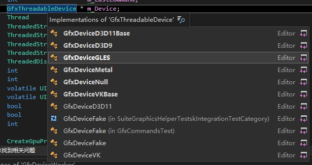
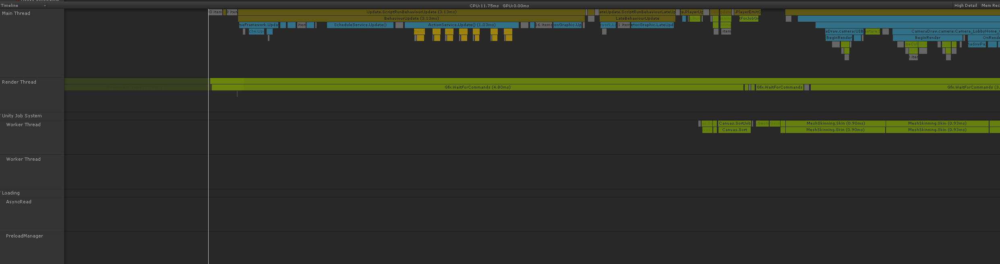

# 背景
## 线程优先级
操作系统的任务调度出了具有时间片轮转的特点外，还有优先级调度（Priority Schedule)的特点。优先级调度决定了线程按照什么顺序轮流执行，在具有优先级调度的系统中，线程拥有各自的线程优先级（Thread Priority）。具有高优先级的线程会更早地执行，而低优先级的线程通常要等没有更高优先级的可执行线程时才会被执行。
线程的优先级可以由用户手动设置，此外系统也会根据不同情形调整优先级。通常情况下，频繁地进入等待状态（进入等待状态会放弃之前仍可占用的时间份额）的线程（如IO线程），比频繁进行大量计算以至于每次都把所有时间片全部用尽的线程更受操作系统的欢迎。因为频繁进入等待的线程只会占用更少的时间，这样操作系统可以处理更多的任务。我们把频繁等待的线程称之为IO密集型线程（IO Bound Thread），而把很少等待的线程称之为CPU密集型线程（CPU Bound Thread）。IO密集型线程总是比CPU密集型线程更容易得到优先级的提升。

## 线程调度
关于线程调度，目前的基本策略是识别线程池中的关键线程（影响游戏帧率的线程），并且把线程的优先级设置为仅次于实时线程的优先级，从而确保线程可以被及时调用。

### Unity引擎游戏频繁唤醒增加大量负载
Unity引擎会根据小核的数量生成相应数量的worker thread，但有时会误识别，生成了六个以上的worker thread。并且worker thread多由UnityMain线程fork出来的，继承了UnityMain绑中大核的亲核性。最后，六个workerthread绑在大核行，每次运行的时间很短，但会被UnityMain频繁唤醒，美珍(16.6ms)高达七、八百次。每次唤醒调用了kernel中的try_to_wake_up函数，增加了大量额外的开销。
在改为4个小核，最后整机功耗优化了20%以上，且极限性能大幅提升。

修改建议
```
Unity引擎游戏要限制worker thread的数量为小核的数量（多为四个），且worker thread不要绑中大核，降低频繁唤醒workerThread造成的额外负载
```
### 单个逻辑线程负载过重
游戏在战斗场景中存在大量的逻辑运算，且只有一个逻辑线程，逻辑线程负载过重，单大核能力无法满足导致掉帧。
修改建议
```
目前高端手机中核和大核能力均较好，游戏的逻辑线程和渲染线程要尽量君和；如果逻辑线程负载特别重，尽量拆分两个线程，避免只运行大核，中核空闲的情况。
```

## 线程饿死

在优先级调度下，容易出现一种线程饿死的现象。一个线程饿死是说它的优先级较低，在它执行之前总有比它优先级更高的线程等待执行，因此这个低优先级的线程始终得不到执行。当CPU密集型的线程优先级较高时，其他低优先级的线程很可能出现饿死的情况；当IO密集型线程优先级较高时，其他线程相对不容易造成饿死，因为IO线程又大量等待的时间。为了避免线程饿死，调度系统通常会逐步提升那些等待了很久而得不到执行的线程的优先级。这样，一个线程只要等待了足够长的时间，其优先级总会被提升到让它执行的程序，也就是说这种情况下线程始终得到执行，只是时间的问题。

在优先级调度环境下，线程优先级的改变有三种方式：
1. 用户指定优先级
2. 根据进入等待状态的频繁程度提升或降低优先级（由操作系统完成）；
3. 长时间得不到执行而被提升优先级；


## CPU处理器


1. IOS A系列处理器基本都是6核心（2个性能，4个效能）
2. 高通骁龙采用1+3+4的超独特设计，Prime超大核、3个Kryo Gold核心和4个Kryo Silver核心。其中0-3是Silver核心，4-6是Gold核心，7是Prime超大核。
3. 麒麟：CPU采用1个大核+3个中核+4个小核三档能效架构
4. 联发科：4x大核 4x能效核心

## 核心数和线程数


1. 线程数可以模拟出不同的CPU核心数
CPU的核心数指的是硬件上存在着几个核心，而线程数可以模拟出多个核心数的功能。线程数越多，越有利于同时运行多个程序，因为线程数等同于某个瞬时CPU能同时并行处理的任务数。
2. 对于一个CPU，线程数总是大于或等于核心数的。
一个核心最少对应一个线程，但通过超线程技术，一个核心可以对应两个线程，也就是说它可以同时运行两个线程。

# Unity线程使用情况

## Engine

Engine的线程优先级分为4档
```C++
enum ThreadPriority
{
    kLowPriority = 0,           // THREAD_PRIORITY_LOWEST
    kBelowNormalPriority = 1,   // THREAD_PRIORITY_BELOW_NORMAL
    kNormalPriority = 2,        // THREAD_PRIORITY_NORMAL
    hHighPriority = 4           // THREAD_PRIORITY_HIGHEST
};
```
### `BackgroundJobQueue`

`BackgroundJobQueue`只在引擎中`WebRequestProto`使用。

### `PreloadManager`

1. 优先级在`kHighPriority`和`kBelowNormalPriority`之间切换，在任务空闲的时候处于`kBelowNormalPriority`当有任务时设置成`hHighPriority`。
2. 主要负责资源加载，比如AssetBundle，Resource。

### `GfxDeviceWorker`

#### `GfxThreadableDevice`


与平台对接设备，
### `BatchDeleManager`
1. `kBelowNormalPriority`

### `BuildJobSystem`
-  优先级：`kNormalPriority`
### `JobManager`
- 优先级为：`kBelowNormalPriority`
- 主要成员`static JobQueue* ms_JobQueue`
- 共有32个Job，通过`JobAndStatus m_Jobs[kMaxNumJobs]`
```C++
enum {kMaxNumJobs = 32};
```
来定义。
- 每个Job对应一个类型，在下面枚举中定义
```C++
enum QueueJobType
{
    kCreateEnlightenGeometry = 0,
    kTrimGIDiskCache,
    kGenerateSystems,
    kCreateEnlightenSystem,
    kCreateSystemAtlas,
    kCreateEnlightenClustering,
    kCreateEnlightenVisibility,
    kCreateEnlightenLightTransport,
    kCreateEnlightenProbeSet,
    kCreateEnlightenCubeMap,
    kDeduplicateAndTetrahedralizeProbes,
    kGenerateAtlassing,
    kCreateEnlightenBakeSystem,
    kCreateEnlightenBakeResource,
    kBakeEnlightenAO,
    kBakeInputLighting,
    kExportBakeTexture,
    kCreateEnlightenBakeVisibilityBuffer,
    kBakeEnlightenDirect,
    kBakeEnlightenAlbedoAndEmissive,
    kCreateEnlightenBakeSolvedRuntime,
    kCreateVisibilityUpsamplingData,
    kBakeEnlightenIndirect,
    kBakeEnlightenFinalGather,
    kBakeEnlightenProbeSet,
    kCompositeOutputs,

    kBakeReflectionProbe,
    kRealtimeReflectionProbe,
    kBakeAmbientProbe,

    kPVRGenerateAtlassing,
    kPVRGBuffer,
    kPVRCompositeLightmap,
    kPVRCullLightmap,

    kInvalidJobType,
    kJobTypeCount
};
```

## GameCore

GameCore的线程优先级分为6档
```C++
enum EThreadPriority
{
    TPri_Normal,                // THREAD_PRIORITY_NORMAL
    TPri_AboveNormal,           // THREAD_PRIORITY_ABOVE_NORMAL
    TPri_BelowNormal,           // THREAD_PRIORITY_BELOW_NORMAL
    TPri_Highest,               // THREAD_PRIORITY_HIGHTEST
    TPri_Lowest,                // THREAD_PRIORITY_LOWEST
    TPri_SlightlyBelowNormal,   // THREAD_PRIORITY_NORMAL - 1
};
```
默认使用`TPri_Normal`。
GameCore在以下地方使用线程
```C++
// CSRecoverSys.cpp
void SGCore::CSRecoverSys::RebootGameCore()
{
    SGThread::FRunnableThread::Create(new RebootGameCoreThread(), "RebootGameCoreThread", 256 * 1024);
}

// MainLoop.cpp
bool GameCoreInit()
{
    g_CoreThread = SGThread::FRunableThread::Create(new CoreThread(), "CoreThread", 256 * 1024);
}

// Mono.cpp
static bool Initial()
{
    s_Thread = SGThread::FRunableThread::Create(new CPUUsageThread(), "CPUUsageThread", 64 * 1024);
}
```

## CSharp

C#在以下地方使用线程

```CSharp
// CUrlMultiUpdater.cs
public void ManualStart()
{
    multiThreadTask = new Thread(()=>
    {
        
    });
}
// LuaService.cs
public static void LoadAsync(this LuaEnv env, Action callback)
{
    ThreadService.ThreadService.GetInstance().StartThread((_thread, _state) =>
    {
        LuaCustomEnv.cmluasource_load((IntPtr)_state);
        callback();
    }, LuaCustomEnv.cmlua_getstate(env.rawL));
}
// AVProView/StreamParser.cs
public void ParseStream()
{
    Thread loadThread = new Thread(new ThreadStart(LoadFile));
    loadThread.Start();
}
// LuaProfiler
public static void ConnectServer(string host, int port)
{
    m_sendThread = new Thread(new ThreadStart(DoSendMessage));
    m_receiveThread = new Thread(new ThreadStart(DoRecieveMessage));
}
// 以下是plugin
// DebugHelper OpenLoger
// SnakeTrackPanel
// 以下是Plugin.Editor
// messy-light 
public void StartBaking()
{}

// 暂无论证的地方
// GCloud
```

# 分析

如上是在红米K40可以统计到的线程，Job的工作线程只有两个，资源加载线程也有两个，而且大部分处于空闲，不过这时候的优先级是belowNormal。
- TTY 与进程关联的终端（tty）
- WCHAN    进程正在睡眠的内核函数名称；该函数的名称是从/root/system.map文件中获得的。
- NI    优先级(Nice)
- PRI    进程优先级编号(Priority)
## Linux中的进程优先级`ni``pri`
每个进程都有两个影响其调度的值：
第一个是动态值，内核经常更改这个值，也就是ps -l命令里的pri值
第二个是静态值，只是偶尔被用户手动更改，即ps -l里的ni值。对任何进程而言，ni这个值可以从-20到19不等，其中数值越小优先级越高，数值越大优先级越低。
-20的优先级最高，19的优先级最低，需要注意的是普通用户只能在0~19之间调整应用程序的优先权值，只有超级用户有权调整更高的优先权值（从-20~19）。
PRI即进程的优先级，此值越小进程的优先级越高。而NI，也就是我们要说的nice值（通过nice命令设置），其表示进程可以被执行的优先级的修正值。如前面所说，PRI值越小越快被执行，那么加入nice值后，将会使得PRI变为：`PRI(new)=PRI(old)+nice`。
所以，nice命令设置的优先级不是程序最终的优先级，而只是优先级的修正数值。
```
alioth:/ $ ps -p 14721 -T -l --sort=-NI
F S   UID   PID   TID  PPID C PRI  NI BIT    SZ WCHAN  TTY          TIME CMD
1 S 10574 14721 14829   863 3   9  10   - 2251971 0    ?        00:00:06 Thread-37
1 S 10574 14721 14822   863 0   9  10   - 2251971 0    ?        00:00:00 ent.File.Tracer
1 S 10574 14721 14733   863 0  10   9   - 2251971 0    ?        00:00:00 Jit thread pool
1 S 10574 14721 14746   863 0  10   9   - 2251971 0    ?        00:00:00 Profile Saver
1 S 10574 14721 14736   863 0  15   4   - 2251971 0    ?        00:00:00 FinalizerDaemon
1 S 10574 14721 14734   863 0  15   4   - 2251971 0    ?        00:00:00 HeapTaskDaemon
1 S 10574 14721 14735   863 0  15   4   - 2251971 0    ?        00:00:00 ReferenceQueueD
1 S 10574 14721 14737   863 0  15   4   - 2251971 0    ?        00:00:00 FinalizerWatchd
1 S 10574 14721 15116   863 1  19   0   - 2251971 0    ?        00:00:01 GThreadManager
1 S 10574 14721 14738   863 0  19   0   - 2251971 0    ?        00:00:00 Binder:14721_1
1 S 10574 14721 14739   863 0  19   0   - 2251971 0    ?        00:00:00 Binder:14721_2
1 S 10574 14721 14741   863 0  19   0   - 2251971 0    ?        00:00:00 Binder:14721_3
1 S 10574 14721 14743   863 1  19   0   - 2251971 0    ?        00:00:01 Binder:14721_4
1 S 10574 14721 14744   863 0  19   0   - 2251971 0    ?        00:00:00 14721-ScoutStat
1 S 10574 14721 15019   863 0  19   0   - 2251971 0    ?        00:00:00 BackgroundWorke
1 S 10574 14721 15020   863 0  19   0   - 2251971 0    ?        00:00:00 BackgroundWorke
1 S 10574 14721 15024   863 0  19   0   - 2251971 0    ?        00:00:00 UnityPreload
1 S 10574 14721 15025   863 0  19   0   - 2251971 0    ?        00:00:00 UnityGfx
1 S 10574 14721 15026   863 0  19   0   - 2251971 0    ?        00:00:00 UnityGfx
1 S 10574 14721 15027   863 0  19   0   - 2251971 0    ?        00:00:00 UnityGfx
1 S 10574 14721 15028   863 0  19   0   - 2251971 0    ?        00:00:00 UnityGfx
1 S 10574 14721 15033   863 0  19   0   - 2251971 0    ?        00:00:00 tgpa_mainhandle
1 S 10574 14721 15039   863 0  19   0   - 2251971 0    ?        00:00:00 APM-RoutineThre
1 S 10574 14721 15040   863 0  19   0   - 2251971 0    ?        00:00:00 UnityMain
1 S 10574 14721 15041   863 0  19   0   - 2251971 0    ?        00:00:00 APM-TickThread
1 S 10574 14721 15042   863 0  19   0   - 2251971 0    ?        00:00:00 gem-work
1 S 10574 14721 15044   863 0  19   0   - 2251971 0    ?        00:00:00 CoreThread
1 S 10574 14721 15045   863 0  19   0   - 2251971 0    ?        00:00:00 pool-2-thread-1
1 S 10574 14721 15051   863 0  19   0   - 2251971 0    ?        00:00:00 UnityMain
1 S 10574 14721 15052   863 0  19   0   - 2251971 0    ?        00:00:00 tgpa_subhandler
1 S 10574 14721 15084   863 0  19   0   - 2251971 0    ?        00:00:00 UnityMain
1 S 10574 14721 15085   863 0  19   0   - 2251971 0    ?        00:00:00 UnityMain
1 S 10574 14721 15086   863 0  19   0   - 2251971 0    ?        00:00:00 UnityMain
1 S 10574 14721 15087   863 5  19   0   - 2251971 0    ?        00:00:11 NativeThread
1 S 10574 14721 15088   863 0  19   0   - 2251971 0    ?        00:00:00 UnityMain
1 S 10574 14721 15100   863 0  19   0   - 2251971 0    ?        00:00:00 MSDKV5-Work-4
1 S 10574 14721 15107   863 0  19   0   - 2251971 0    ?        00:00:00 OkHttp Connecti
1 S 10574 14721 15111   863 0  19   0   - 2251971 0    ?        00:00:00 Okio Watchdog
1 S 10574 14721 15114   863 0  19   0   - 2251971 0    ?        00:00:00 GThreadProcess
1 S 10574 14721 15115   863 0  19   0   - 2251971 0    ?        00:00:00 GThreadProcess
1 S 10574 14721 14754   863 0  19   0   - 2251971 0    ?        00:00:00 XgStat
1 S 10574 14721 14755   863 0  19   0   - 2251971 0    ?        00:00:00 .baseapi.thread
1 S 10574 14721 14788   863 0  19   0   - 2251971 0    ?        00:00:00 ConnectivityThr
1 S 10574 14721 14800   863 0  19   0   - 2251971 0    ?        00:00:00 BuglyThread-1
1 S 10574 14721 14801   863 0  19   0   - 2251971 0    ?        00:00:00 BuglyThread-2
1 S 10574 14721 14802   863 0  19   0   - 2251971 0    ?        00:00:00 BuglyThread-3
1 S 10574 14721 14803   863 0  19   0   - 2251971 0    ?        00:00:00 Bugly-ThreadMon
1 S 10574 14721 14805   863 0  19   0   - 2251971 0    ?        00:00:00 FileObserver
1 S 10574 14721 14814   863 0  19   0   - 2251971 0    ?        00:00:00 specialhttpdns-
1 S 10574 14721 14835   863 2  19   0   - 2251971 0    ?        00:00:32 UnityMain
1 S 10574 14721 14843   863 0  19   0   - 2251971 0    ?        00:00:00 qimei-thread-1
1 S 10574 14721 14844   863 0  19   0   - 2251971 0    ?        00:00:00 qimei-thread-2
1 S 10574 14721 14845   863 0  19   0   - 2251971 0    ?        00:00:00 qimei-thread-3
1 S 10574 14721 14882   863 0  19   0   - 2251971 0    ?        00:00:00 InsetsAnimation
1 S 10574 14721 14887   863 0  19   0   - 2251971 0    ?        00:00:00 Binder:14721_5
1 S 10574 14721 14888   863 1  19   0   - 2251971 0    ?        00:00:01 Binder:14721_6
1 S 10574 14721 14891   863 0  19   0   - 2251971 0    ?        00:00:00 AudioPortEventH
1 S 10574 14721 14901   863 0  19   0   - 2251971 0    ?        00:00:00 UnityMain
1 S 10574 14721 15000   863 0  19   0   - 2251971 0    ?        00:00:00 BatchDeleteObje
1 S 10574 14721 15001   863 0  19   0   - 2251971 0    ?        00:00:00 AsyncReadManage
1 S 10574 14721 15002   863 7  19   0   - 2251971 0    ?        00:00:17 UnityGfx
1 S 10574 14721 15003   863 0  19   0   - 2251971 0    ?        00:00:01 Worker Thread
1 S 10574 14721 15004   863 0  19   0   - 2251971 0    ?        00:00:01 Worker Thread
1 S 10574 14721 15005   863 0  19   0   - 2251971 0    ?        00:00:00 BackgroundWorke
1 S 10574 14721 15006   863 0  19   0   - 2251971 0    ?        00:00:00 BackgroundWorke
1 S 10574 14721 15007   863 0  19   0   - 2251971 0    ?        00:00:00 BackgroundWorke
1 S 10574 14721 15008   863 0  19   0   - 2251971 0    ?        00:00:00 BackgroundWorke
1 S 10574 14721 15009   863 0  19   0   - 2251971 0    ?        00:00:00 BackgroundWorke
1 S 10574 14721 15010   863 0  19   0   - 2251971 0    ?        00:00:00 BackgroundWorke
1 S 10574 14721 15011   863 0  19   0   - 2251971 0    ?        00:00:00 BackgroundWorke
1 S 10574 14721 15012   863 0  19   0   - 2251971 0    ?        00:00:00 BackgroundWorke
1 S 10574 14721 15013   863 0  19   0   - 2251971 0    ?        00:00:00 BackgroundWorke
1 S 10574 14721 15014   863 0  19   0   - 2251971 0    ?        00:00:00 BackgroundWorke
1 S 10574 14721 15015   863 0  19   0   - 2251971 0    ?        00:00:00 BackgroundWorke
1 S 10574 14721 15016   863 0  19   0   - 2251971 0    ?        00:00:00 BackgroundWorke
1 S 10574 14721 15017   863 0  19   0   - 2251971 0    ?        00:00:00 BackgroundWorke
1 S 10574 14721 15018   863 0  19   0   - 2251971 0    ?        00:00:00 BackgroundWorke
1 S 10574 14721 14811   863 0  21  -2   - 2251971 0    ?        00:00:00 queued-work-loo
1 S 10574 14721 14870   863 0  21  -2   - 2251971 0    ?        00:00:00 hwuiTask1
1 S 10574 14721 14869   863 0  21  -2   - 2251971 0    ?        00:00:00 hwuiTask0
1 S 10574 14721 14784   863 0  23  -4   - 2251971 0    ?        00:00:00 Binder:intercep
1 S 10574 14721 14830   863 0  27  -8   - 2251971 0    ?        00:00:00 Okio Watchdog
1 S 10574 14721 14846   863 0  27  -8   - 2251971 0    ?        00:00:00 TuringFdCore_66
1 S 10574 14721 14823   863 0  27  -8   - 2251971 0    ?        00:00:00 OkHttp Connecti
1 S 10574 14721 14790   863 0  29 -10   - 2251971 0    ?        00:00:00 TDM-report-2
1 S 10574 14721 14826   863 0  29 -10   - 2251971 0    ?        00:00:00 Thread-41
1 S 10574 14721 14855   863 0  29 -10   - 2251971 0    ?        00:00:00 Thread-69
1 S 10574 14721 14764   863 0  29 -10   - 2251971 0    ?        00:00:00 RenderThread
1 S 10574 14721 14825   863 0  29 -10   - 2251971 0    ?        00:00:00 ent.tmgp.osgame
5 S 10574 14721 14721   863 0  29 -10   - 2251971 0    ?        00:00:00 ent.tmgp.osgame
1 S 10574 14721 14795   863 0  29 -10   - 2251971 0    ?        00:00:00 XLogThread
1 S 10574 14721 14810   863 0  29 -10   - 2251971 0    ?        00:00:00 Thread-33
1 S 10574 14721 14832   863 0  29 -10   - 2251971 0    ?        00:00:00 CThreadBase
1 S 10574 14721 14831   863 0  29 -10   - 2251971 0    ?        00:00:00 asyncProcessor
1 S 10574 14721 14827   863 0  29 -10   - 2251971 0    ?        00:00:00 ent.tmgp.osgame
1 S 10574 14721 15023   863 0  35 -16   - 2251971 0    ?        00:00:00 FMOD stream thr
1 S 10574 14721 15097   863 3  42 -16   - 2251971 0    ?        00:00:07 AudioTrack
1 S 10574 14721 15021   863 2  42 -16   - 2251971 0    ?        00:00:04 AudioTrack
1 S 10574 14721 15022   863 0  38 -19   - 2251971 0    ?        00:00:01 FMOD mixer thre
1 S 10574 14721 14730   863 0  39 -20   - 2251971 0    ?        00:00:00 Signal Catcher
1 S 10574 14721 14731   863 0  39 -20   - 2251971 0    ?        00:00:00 perfetto_hprof_
1 S 10574 14721 14890   863 0  39 -20   - 2251971 0    ?        00:00:00 Binder:14721_4
1 S 10574 14721 14732   863 0  39 -20   - 2251971 0    ?        00:00:00 ADB-JDWP Connec
```
通过AndroidStudio可以看到实际再跑的线程有`FMOD` `Native Thread` `Thread-36` `UnityGfx` `UnityMain` `Worker Thread` `Jit thread pool` `BuglyThread-1` `Core Thread` `t.tmgp.osgamece` `BatchDeleteObje` `UnityPreload`
1. `Core Thread` GameCore线程
2. `UnityMain` 引擎的主线程，`PlatformDependent/AndroidPlayer/Source/Java/com/unity3d/player/UnityPlayer.java`

## Jit thread pool
Singal Catcher
用来接收、处理进程收到的SIGQUIT、SIGUSR1信号。当收到SIGQUIT即signal 3时， signalcatcher会调用 Handle Signal Quit函数来进行一些Dump。如果是native层代码crash ,Signal Catcher则捕获不到，需要
JDWP
java平台调试体系结构的缩写，通过JPDA提供的API，开发人员可以方便灵活的搭建JAVA调试应用程序
## Binder线程
Binder:14721_1
Binder:14721_2
Binder:14721_3
Binder:14721_4
在android系统中，每个app进程在启动之后会创建一个binder线程池，用于响应ipc客户端的请求。例如：app与AMS等服务之间可以通过IPC双向通信，当app作为服务端的时候，就需要通过binder线程响应来自AMS的请求。一个Server进程有一个最大Binder线程数限制，默认为16个binder线程。
## App业务线程
1. 主线程：应用启动时，系统会为应用创建一个名为“主线程”的执行线程。此线程非常重要，因为它负责将事件分派给相应的界面用户小部件，其中包括绘图时间。此外，它也是应用与Android UI工具包进行交互的线程。因此，主线程有时也称为UI线程。
2. RenderThread渲染线程
    Android5.0之后新增加的一个线程，用来协助UI线程进行图形绘制。所有的GL命令执行都放到这个线程上。渲染线程在RenderNode中存有渲染帧的所有信息，并监听VSync信息，因此可以独立做一些动画，这样即便主线程block也可以保证动画流畅。
3. hwuiTask1
    Android3.0以前，图形绘制是由Skia完成，Skia是一个向量绘图库，使用CPU来进行计算；从Android3.0开始，Google用hwui取代了Skia，由于Opengl的支持不完全，有少量图形api仍由Skia完成，多数view的绘制通过HWUI模块使用openGL的函数来实现。

## GC的守护线程：
1. ReferenceQueueDaemon：引用队列守护线程。我们知道，在创建引用对象的时候，可以关联一个队列。当被引用对象引用的对象GC回收的时候，被引用对象就会被加入到其创建是关联的队列去。这个加入队列的操作就是由 ReferenceQueueDaemon守护进程来完成的。这样应用程序就可以知道被引用对象引用的对象已经被回收了。
2. FinalizerDaemon：析构守护线程。对于重写了成员函数finalize的对象，它们被GC决定回收时，并没有马上回收，而是被放入到一个队列中，等待FinalizerDaemon守护线程去调用他们的成员函数finalize，然后再被回收。
3. FinalizerWatchdogDaemon：析构监护守护线程。用来监护 FinalizerDaemon线程的执行。一旦检测哪些重定了成员函数finalize的对象在执行成员函数超出一定的时候，那么就退出VM。
4. HeapTaskDaemon：堆裁剪守护线程。用来执行堆裁剪的操作，也就是用来将哪些空闲的堆内存归还给系统。

## OKHtttp
OKHttp是一套处理HTTP网络请求的依赖库，由Square公司设计研发并开源，目前可以在Java和Kotlin中使用。对于Android App来说，OkHttp现在几乎已经占据了所有的网络请求操作。

## APM(Application Performance Management)
https://en.wikipedia.org/wiki/Application_performance_management

## Signal Catcher线程

Signal Catcher线程接受到kernel系统底层的消息进行dump当前虚拟机的信息并且设置每个线程的标志位(check_point)和请求线程状态为挂起，当线程运行过程中进行上下文切换时会检查该标记。等到线程都挂起后，开始遍历Dump每个线程的对战和线程数据后在唤醒线程。
在Android里面只能通过pthread_create去创建一个线程，Thread只是Android Runtime里面的一个类，一个Thread对象创建之后就会被保存在线程的TLS区域，所以一个Linux线程都对应一个Thread对象，可以通过Thread的Current()函数来获取当前线程关联的Thread对象，通过这个Thread对象就可以获取一些重要信息。

## AudioTrack
Android系统声音线程

## BackgroundWorke

## queued-work-looper

## qimei-thread-1
灯塔

## FileObserver
>android.os.FileObserver
>Monitors files(using inotify) to fire an event after files are accessed or changed by any process on the device (including this one).

Android sdk的官方文档说的是监视一个目录，则该目录下所有的文件和子目录的改变都会触发监听的事件。

## InsetsAnimation
android原生动画

## pool-2-thread-1
Java线程池

## AudioPortEventH
Andoird音频线程

## FMOD stream thread
FMOD线程，引擎中AudioManager在使用，由于我们使用的WWise，可以考虑不启用这个线程。

# 线程绑定到特定CPU核上去运行
1. UnityMain绑到1
2. GameCore绑到2
3. Gfx绑定3
4. worker thread绑到小核

调整核心
```C++
// ThreadToCoreMappings.h
// 默认是设置成大核
#define ANDROID_UNITY_ANY_BIG_CORE              (android::systeminfo::IsBigLittleProcessor() ? android::systeminfo::GetBigProcessorMask() : 0u)
#define ANDROID_UNITY_MAIN_THREAD_AFFINITY      ANDROID_UNITY_ANY_BIG_CORE
#define JOB_SCHEDULER_THREAD_AFFINITY_MASK      ANDROID_UNITY_ANY_BIG_CORE
#define LOADING_THREAD_WORKER_PROCESSOR         ANDROID_UNITY_ANY_BIG_CORE

// 改为小核
#define ANDROID_UNITY_ANY_LITTLE_CORE           (android::systeminfo::IsBigLittleProcessor() ? android::systeminfo::GetLittleProcessorMask() : 0u)
#define ANDROID_UNITY_MAIN_THREAD_AFFINITY      ANDROID_UNITY_ANY_LITTLE_CORE
#define JOB_SCHEDULER_THREAD_AFFINITY_MASK      ANDROID_UNITY_ANY_LITTLE_CORE
#define LOADING_THREAD_WORKER_PROCESSOR         ANDROID_UNITY_ANY_LITTLE_CORE

// 把GFX也改为小核
#define GFX_DEVICE_WORKER_PROCESSOR             ANDROID_UNITY_ANY_LITTLE_CORE
```

# 参考

- [1] [手游性能原理篇](https://zhuanlan.zhihu.com/p/543466481?utm_campaign=shareopn&utm_medium=social&utm_oi=986753658477936640&utm_psn=1537470910411464704&utm_source=wechat_session)
- [2] [Android 高通骁龙CPU线程与CPU核的绑定](https://icode.best/i/46631047094618)