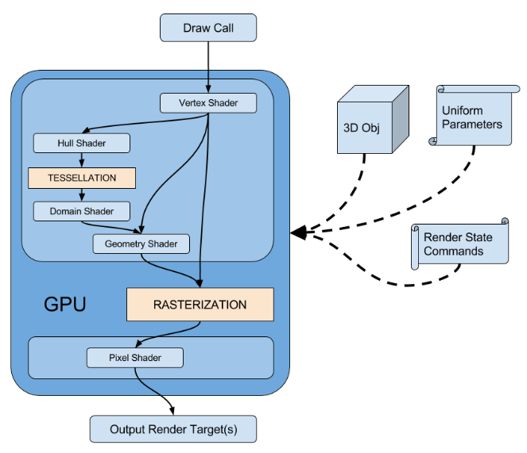
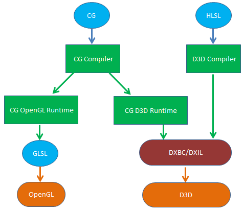

# 渲染管线
图形渲染管线（Graphics Pipeline）：将三维模型渲染到二维屏幕上的过程。为了满足实时性，管线在GPU硬件上进行实现，其与CPU流水线一样，各个步骤都会以并行的形式运行。
固定管线（Fixed-Function Pipeline）：通常是指在较旧的GPU上实现的渲染流水线，通过DX、OpenGL等图形接口函数，开发者来对渲染流水线进行配置，控制权十分有限。
可编程管线（Programmable Pipeline）：随着人们对画面品质和GPU硬件能力的提升，在原有固定管线流程中插入了Vertex Shader、Geometry Shader（非必需）、Fragment (Pixel) Shader等可编程的阶段，让开发者对管线拥有更大的控制权
例如：Vertex Shader修改顶点属性（如顶点空间变换、逐顶点光照、uv变换）以及通过自定义属性向管线传入一些数据，Geometry Shader可增删和修改图元，Fragment (Pixel) Shader来进行逐像素的渲染。

# 管线资源
材质（Material）：用于描述光与物体的交互方式的程序（即shader）、贴图以及其他属性的集合。
在执行光照计算时，需要用到一些材质属性才能得到表面的最终颜色。
常见的几种属性有Diffuse（漫反射）、Emissive（自发光）、Specular（高光）、Normal（法线）等。
着色器（Shader）：是执行在GPU上可编程的图形管线的代码片段，用于告诉图形硬件如何绘制物体。包括：Vertex Shader、Fragment (Pixel) Shader、Geometry Shader。
Shader在早期是用汇编来写的，后面出现更高级的着色语言，如DirectX的HLSL（High Level Shading Language）、OpenGL的GLSL（OpenGL Shading Language）以及Nvidia的CG(C for Graphic)。

GLSL具有跨平台性，其在被OpenGL使用前不需要进行额外编译，而是由显卡驱动直接编译成GPU使用的机器指令。
HLSL仅能在windows平台上使用，需预先编译成与硬件无关的DX中间字节码(DXBC/DXIL)才能被D3D使用。
CG语法上与HLSL高度相似，具有真正意义上的跨平台：在不同的平台上实现了shader的编译器，并通过CG OpenGL Runtime和CG D3D Runtime来讲CG转换成GLSL和DX中间字节码。
纹理（Texture）：可以理解为运行时的贴图，可以通过UV坐标映射到模型的表面。另外，其拥有一些渲染相关的属性，如：纹理地址模型（ADDRESSU、ADDRESSV），纹理过滤方法（MAGFILTER、MINFILTER、MIPFILTER）等

# 图形API概念
DrawCall：为CPU向GPU发起的一个命令（如：OpenGL中的glDrawElements函数、D3D9中的DrawIndexPrimitive函数、D3D11中的Draw、DrawIndexed函数）。
这个命令仅仅会指向一个需要被渲染的图元（primitives）列表（IBO，Index Buffer Object）。发起DrawCall时，GPU就会根据渲染状态和输入的顶点数据（VBO，Vertex Buffer Object）来计算，最终输出成屏幕上显示的像素。
渲染状态（RenderState）：这些状态定义了场景中Mesh是怎样被渲染的。如：使用哪个vs、哪个fs、光源属性、纹理、材质等。
颜色缓冲区（Color Buffer）：即帧缓冲区（Frame Buffer，Back Buffer），用于存放渲染出来的图像。D3D存放在一个RTV（RenderTargetView）中。
深度缓冲区（Depth Buffer）：用于存放深度的图像。D3D存在在一个DSV（DepthStencilView）中。
模板缓冲区（Stencil Buffer）：用于获取某种特定效果的离屏缓存。分辨率与颜色缓冲区及深度缓冲区一致，因此模板缓冲区中的像素与颜色缓冲区及深度缓冲区是一一对应的。
其功能与模板类似，允许动态地、有针对性地决定是否将某个像素写入后台缓冲中。
D3D中，与深度缓冲区一起存放在一个DSV（DepthStencilView）中。
表面（Surface）：D3D在显存中用于存储2D图像数据的一个像素矩阵。D3D9中对应的COM接口为IDirect3DSurface9。
Render Target（RT，渲染目标）：对应显卡中一个内存块，D3D中概念（OpenGL中叫做FBO，FrameBuffer Object），常用于是离屏渲染。
渲染管线默认使用后备缓冲区（BackBuffer）RT来存放渲染结果，可通过调用CreateRenderTarget或RTT来创建多个额外的RT来进行离屏渲染，最后将它们组装到后备缓冲区（BackBuffer）中以产生最终的渲染画面。
注1：调用Device->CreateRenderTarget创建RT成功后，会返回`IDirect3DSurface9* pRTSurface`；然后调用`Device->SetRenderTarget(0,pRTSurface)`绑定`pRTSurface`到指定的RT索引。
在执行`SetRenderTarget`前可调用`Device->GetRenderTarget(0,pOriginRTSurface)`，以便在完成RT绘制后还原回`pOriginRTSurface`所指向RT的Surface
对于不支持MRT的显卡，只会有一个索引为0的RT；对于支持MRT（N个）的显卡，索引可以为0,1,...N-1，可同时绑定N个Surface到N个RT的索引上。
注2：成功绑定RT后：对于不支持MRT的显卡，在Pixel Shader中通过标识COLOR0来写入内容索引为0的RT中；对于支持MRT(N个)的显卡，在Pixel Shader中通过标识COLOR0，COLOR1，...COLOR(N-1)来写入内容到对应的RT中
注3：可以调用`Device->StretchRect`来讲RT的Surface拷贝到后备缓冲区

# MobileSceneRender
## InitViews
## ShadowDepths
## ClearRenderTargetView
## ClearDepthStencilView
## MobileBasePass
## MobileBasePass_PostAO
## TranslucencyPreDepthPass
## ShadowProjectionOnOpaque
## Translucency
## PostProcessing
## RenderFinish

# 参考

- [1][UE4 性能 - (四) 性能分析：Render Passes(1)](https://zhuanlan.zhihu.com/p/449850501)
- [2][UE4 性能 - (五) 性能分析：Render Passes(2)](https://zhuanlan.zhihu.com/p/455253476)

1.2 Scene Draw Order

- Z-PrePass: 场景中的opaque和mask材质写一遍深度。
- Compute light grid: 场景中的灯光按照屏幕空间分成相应的grid，仅限点光源聚光灯。
- Build HZB: 生成场景的Hierarchical Z。
- Shadow Depth Pass: 根据不同灯光类型渲染出2DShadowmap或cubemapshadowmap，供后面lightingmass使用。
- BasePass: 渲染出GBuffer, customdepth/stencil，还有velocity buffer用于后面的motion blur和TAA。
- PreLightingPass: 计算DeferredDecal和SSAO。
- LightingPass: 计算直接光照阴影和间接光照阴影。
- Reflections: 计算SSR（屏幕空间反射）或光追反射。
- Additional: 各种无效，半透明。
- Post Process: Temproal AA、EyeAdaption、Motion Blur、Bloom、Tone Mapping、PP Material等。

https://interplayoflight.wordpress.com/2017/10/25/how-unreal-renders-a-frame/

