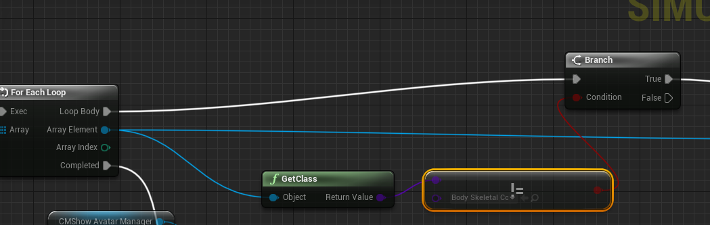

导出的模块名比如`XXX_API`，XXX一定是大写的。

# Typescript
## 调试真机
DevTool地址: devtools://devtools/bundled/inspector.html?v8only=true&ws=127.0.0.1:8080
<a href="devtools://devtools/bundled/inspector.html?v8only=true&ws=127.0.0.1:8080" target="_blank" title="DevTool地址">DevTool地址</a>
```
adb forward tcp:8080 tcp:8080 #安卓
iproxy 8080:8080 #iOS
```

### 如何开启IOS文件共享
在`UE4/Build/IOS/Resources/FramewordkWrapper/FrameworkWrapper/Info.plist`中，添加`Application supports iTunes file sharing`设置为 YES。
### 如何安装iproxy
`brew install usbmuxd`

### iOS/OS X特有的目录
`./Applications/`

# mobileHDR
`MobileBasePassRendering.h`
`ShouldCacheShaderByPlatformAndOutputFormat`将它改为true。这样烘培出来的`material.uasset`就同时含有LDR和HDR了。
`r.MobileHDR`


### shaderbytecode
增量包是全量的。

# Use Full Precision

开启高精度float格式，默认是half。

# 蓝图类型判断


# 占据屏幕越多的会越耗


# 如何获得FString的长度

https://answers.unrealengine.com/questions/741711/how-to-get-fstring-size.html

# STATSLOW
STAT SLOW 用来找到性能波动问题
它可以通过报告运行一帧中特定时间段（默认10毫秒）来逐步定位帧停顿的位置。
