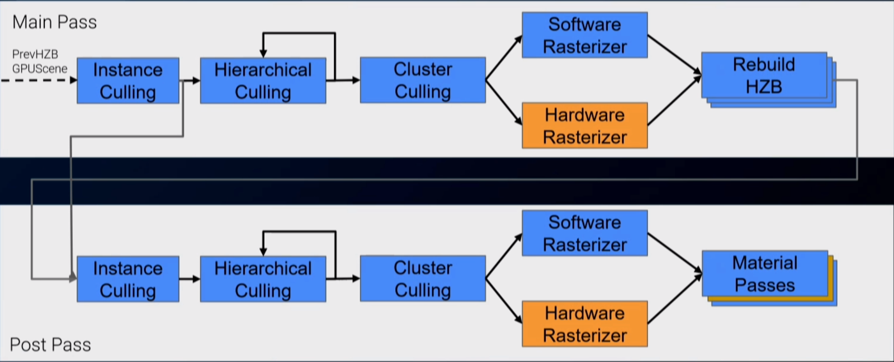
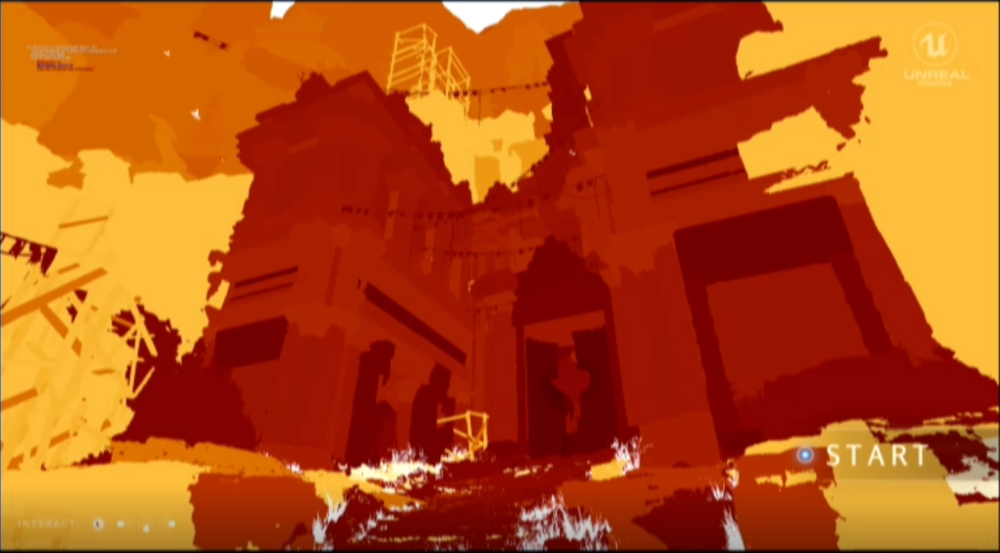
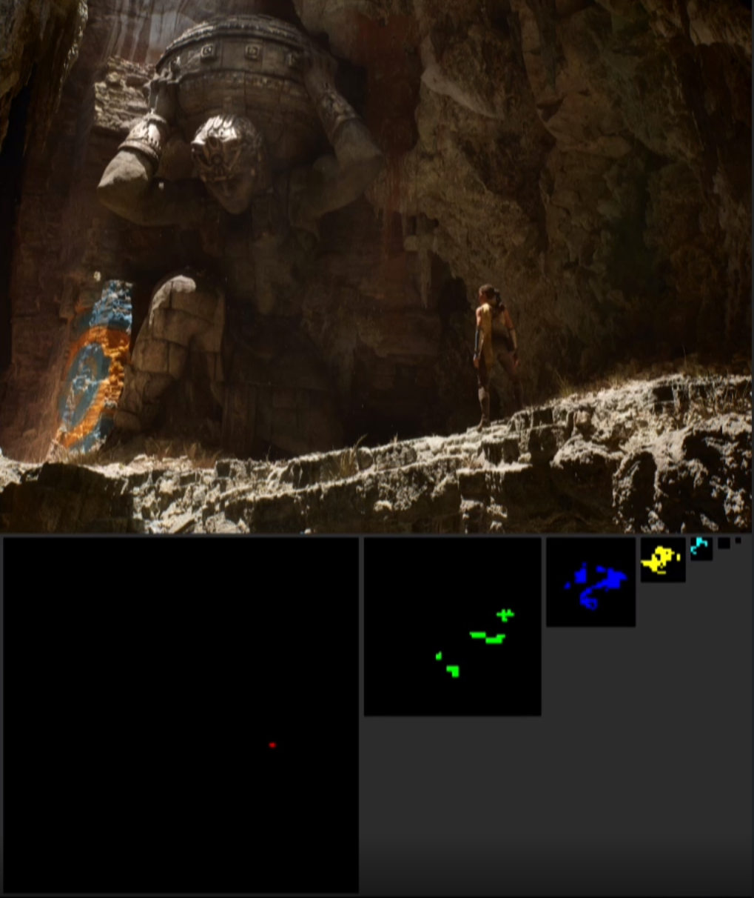

# 次世代渲染技术：Nanite + Lumen
## Nanite
- PC,PS5,XBox Series X/S
- 相比去年的在品质和效率做了提升
- 磁盘存储的压缩和转码
- 支持Lightmap/Lightmass 2
- 支持破碎物（Geometry Collection）
- 可生成减面后的高质量代替mesh
- Ray Tracing和物理用
- Cluster生成
  - 原始mesh lod0数据做graph partition
  - 一均匀面积和最少边界等条件group
  - 锁边见面到group原始的一半
  - 在group内重新划分新的cluster
  - 依次直至只有一个cluster
  - 每个cluster存自己减面后的error及group error
  - 保证cluster在DAG中的error是单调降序的，这时候cluster数量已生成完了。cluster总数是包括每一节LOD。效率低（但是人家牛逼）
  - 对所有lod的cluster分别生成bvh
  - 把每一级lod的bvh挂到总的bvh root下。（每个mesh只有一个bvh，源码在nanite include里？）
    
下面的是展望：
- 支持更多的材质类型
- 内存、性能和质量的进一步完善
- VSM改进

## Nanite-裁剪流程

- 裁剪和LOD选择
  - 开足够多的Persistent线程做culling(多生产者多消费者，这里不要和[这个文章](https://zhuanlan.zhihu.com/p/367807315) 搞混了)
  - MPMC的task队列
  - 利用BVH结构做基于group的粗culling
  - 对剩下的叶子group中的cluster做实际的culling
  - Culling条件和LOD选择条件一致 每一级Cluster其实是下一级的Group
- 光栅化
  - Visibility Buffer: 64位 Depth30:InstanceID37:TriangleID7
  - 一个Draw画完所有的opaque对象
  - 后续的材质pass输出到GBuffer
  - 像素大小的三角面光栅化
  - 以Cluster为粒度决定软件光栅VS硬件光栅（大的网格走的硬件）小的用compute shader
  并行处理，利用64位的原子操作，主机硬件都支持的，PC啥也支持的。
  

- Nanite-材质
  - 每个cluster32位
  - 两种编码共享，支持最多64种材质
  - MaterialID表
  - 材质深度
  - 基于屏幕Tile的InstancedDraw绘制每种可见的MaterialID 一个屏幕能看到的材质就这几种，做材质深度的写入
  深度用24位存储。画不到的地方会在vs干掉。
  

- 串流
  - Culling算法不感知
  - 始终在gpu保留culling的层级结构，只streaming纯几何数据，这里防止过好多帧才可以请求到数据
  - 以cluster group为streaming粒度
  - 以page对齐，为了减少内存或者显存的碎片，以cluster group为page。cluster root 放到page 0。
  - 加载完page后修复数据，分割条件其实是以cluster group为单位的，但是存储是按照page存储的。
  

- Nanite-压缩
  - 通用压缩很难有成倍的改善
  - 利用通用的硬件压缩，调整特定数据优势
  - 内存格式
  - 存储格式
  首先硬件的压缩是免费的。首先让数据尽可能的重复高，哈夫曼算法。有点ecs那味了。相同类型排在一块。
- 未来
  - virtual shadow map (SDF不是未来了嘛)
  - TSR
  - Nanite的未来计划
  

# Lumen

- 间接光/天光阴影
- 自发光材质
- 多次反弹的GI
- 反射
- 反射中带有Diffuse GI （Diffuse不是常量吗，这个是啥意思）
- 可选的硬件光锥
- PC,PS5,Xbox Series X/S
- 简化集中的用户设置
- EA版本主机30HZ

下面的是展望
- 开放大世界的支持-超远距离的GI，地形的GI

# Platforms

主机

- 正在完善中的Turnkey工作流
- 完整的PS5/XSX支持（4.25plus、4.26中就有）
- 改用GDK for Windows & XBox 1/X
- 清理了DX和PC上的DX12的不统一
- 大量内存优化（尤其是DX12的）
- 改善了每帧中间显存资源的复用
- TSR针对主机硬件的优化
- 对主机光追的支持（5.0将会有Production Ready的完善支持）
- 全新的加载模块：IoStore/Zen Loader已经在EA版本的主机上默认开启

- 次世代的美术管线能达到production ready
- 通过堡垒之夜和demo在主机上做足够的验证
- 主机gpu的内存可视化工具(Insights)
- 主机的Timing Insights(context切换)
- 默认打开ioStore/Zen Loader

Cooking / 主机工作流 日哦

# Mobile

- 初始的Turnkey工作流支持
  - Android on Windows
  - iOS on Mac
  
- 移动的延迟渲染进入beta阶段
- iOS工具链的可靠性有了很好的改进，

移动端跑nanite和lumen哈哈。

# 构建大世界的工具集
- World Partition
  - Data Layers 纵向帮你做切分
  - 支持Nanite的HLOD生成
- Level Instance 把Actor看成一个actor。
- One File Per Actor 减少每次操作锁的粒度。美术操作友好？
- 辅助工具
  - 对于小地图不引入大世界流程
  - 自动转换UE4关卡到World Partition
  
- Production ready
- 支撑烘焙日哦

# 支撑大世界、大量对象书。大量资产的性能

# 编辑器和用户体验的改进

我不想记录了，自己看把。。。

# 动画技术

- 脚本话可扩展的动画编辑器
- Blendspace 2.0
- Motion Warping(Contextual Animations)
- Slope Warping + FBIK
- Control Rig - 封装，函数，PBIK
- Pose库，Tweening工具(Animation In Engine)

- MotionMatching
- 数据驱动的Pose Warping
- Contextual Animation编辑器
- FBIK目标系统
- IK Rig资源和配套的编辑器
- 骨架映射
- 日哦

# Chaos/网络同步的物理系统

MetaSounds - WIP
- 全新引入的高效的音频系统。
- MetaSounds提供音效参数
- MetaSounds对比以前的SoundCues系统极大的改善了性能，
Other Features
  - Quartz - 可交互的音乐系统
  - Synesthesia-全新的实时音频分析API
  - 音频。。。
  
Chaos物理
- 从EA版本开始作为默认的物理引擎
- 之后的某个版本将会完全去掉PhysX的支持
- 从去年2月就已经作为默认物理引擎在堡垒之夜和所有内部项目中使用
- 正在积极修复bug和改善性能

- 对物理模拟网络同步的支持
- 异步的物理模拟
- 体积场+RBAN
日哦

# Insights

- 提供了全新的Memory Insights，能做完善的内存profiling，泄露检查。

# AncientGame

# Meta Human Creator

- MHC是通过云平台帮助你快速简单创建出高质量数字角色工具

# Audio

Metasounds
- 所有功能都达到Production ready状态
- 实现资源实例化和metasound组合
- 提供全新工具

# 更新全新的模板和示例项目

- 全新的mannequins（男性女性各有一个）
- 更新或全新的Start日哦
4.27主要是为了非游戏用户。主要改善是path tracing。
