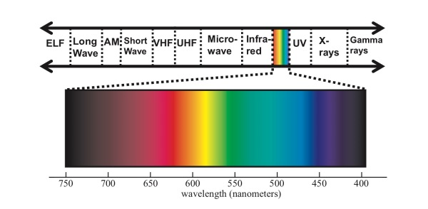
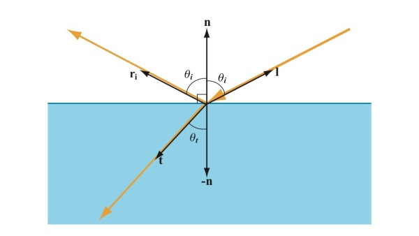

在计算机图形学领域，着色（Shading）是指根据表面或者多边形相对光源和相机的角度和距离来计算它的颜色的过程。不同的用户可以使用不同的着色算法，CAD等追求相应速度的交互式图形领域可以使用简单快速的着色算法，卡通油画等艺术效果使用非真实感（Nonphotorealistic）着色算法，而追求真实感的CG电影或游戏则可以使用基于物理建模的着色算法。
本文关注基于物理着色的BRDF模型，希望能将BRDF的来龙去脉将清楚，并分析Cook-TorranceBRDF公式的推倒过程。
要模拟真实光照，我们先要弄清楚光照的现象。

## 光照现象

光由光子组成，光子即具有粒子的特性，又表现出波的特性。从波的角度看，光是电磁波的一种，不同频率（波长）的光波能量不同，频率越高（波长越短），能量越高，频率越低（波长越长），能量越低，其中波长在380nm-780nm范围内的光波能被认类的视网膜感知到，这个范围的光波成为可见光，不同频率的可见光被人感知为不同的颜色，频率越高的光偏蓝，频率较低的光则偏红。

光学根据研究的尺度可以分为波动光学（Wave Optics）和几何光学（Geometric Optics），波动光学比几何光学复杂，而由于图形学领域光柱的尺度远大于可见光的波长（380nm - 780nm），也很少涉及光的偏振、干涉和衍射等波动光学才能解释的现象，所以我们一般用几何光学建立光照的模型。

## 光学平面边界上的散射

平面边界两边物质的折射率（Refractive Index）不同，当一束光线从一种物质照射到平面边界上时，其中一部分在平面边界被反射回这种物质，反射方向为入射方向关于平面法线的对称向量：
$r_i = 2(n \cdot l)n - l$  

>其中$r_i$是反射向量，l是光线入射向量，n是平面发现
>向量间的$\cdot$表示向量的点积，两个单位向量的点积等于它们夹角的余弦。

另一部分光穿过平面边界折射进入另一种物质，折射方向可由Snell法则（<a href="https://zentia.github.io/2019/05/12/snell/">Snell's Law</a>）计算得出：
 ${sin\theta_i \over sin\theta_t}={v_i\over v_t}={\lambda_i\over \lambda_t}={n_t\over n_i}$ 
>其中下标i表示入射介质，下标t表示折射介质，$\theta$表示光线相对于边界法线的角度，v表示介质中的光速，$\lambda$表示介质中的波长，n表示介质的折射率。
反射和折射的比例由菲涅尔方程(Fresnel Equations)给出，菲涅尔方程比较复杂，图形学里一般使用近似公式计算。