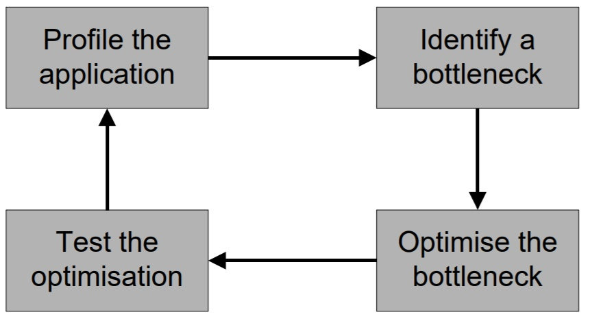
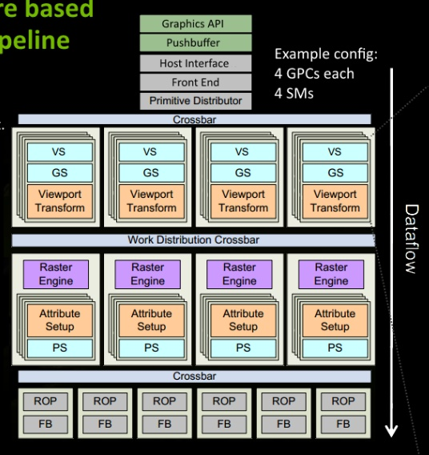
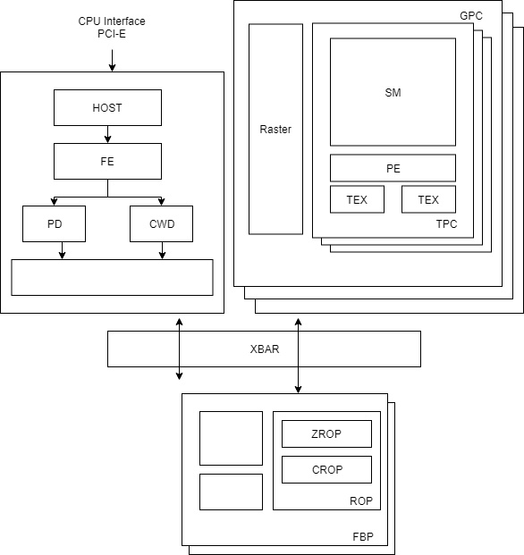

过去几年里，我经历过大约几十场面试，几乎在每次面试的时候，面试官都会提问一个问题：“你在渲染性能优化方面有什么经验？”这个时候我就会开始揣测面试官的意图，试着去回忆他之前提的问题，看看面试官到底想听什么样的回答，往往这种尝试都是失败的，结果就是不知道从何说起，因为没有具体的情景，最后只能说“整个渲染流程中很多地方都可能出现瓶颈，只能case by case的去查看，找到项目的具体瓶颈，然后针对性的去解决，”几乎所有听到这个问题回答的面试官都会对我意味深长地一小，不置可否，一旦看到这种消融，我就知道糟了，之后的面试反馈中，很多人对我评价就是“对渲染算法比较熟悉，但是在优化方面经验欠缺”。

总得来说我觉得这不是一个好问题，因为太过宽泛而没有针对性。我并不想泛泛地说：“减少模型数量，减少/合并draw call，缩减贴图尺寸，压缩贴图，使用LOD”，因为这就是所谓“正确但无用的话”，所有游戏不都是这么优化的吗？此外，对于一个项目来讲，模型的面数，贴图尺寸，LOD的级别这些信息往往是在DEMO阶段就已经由TA主导确定的。对于引擎程序员来讲，需要你提出优化方案的，通常是在项目的开发过程中产生的新瓶颈（当然你首先需要定位它）。但反过来，我的回答其实也是废话，所有性能优化流程不都是这样吗？

所以，当我们谈论性能优化的时候，我们究竟在谈些什么呢？

我试着理解了这个问题的意图，如果我们换一种问法，比如“渲染常见的性能瓶颈有哪些？具体可能出现在什么样的情境下？为什么这些情景会造成对应的性能瓶颈？”会不会是一个更好的问题？所以这篇文章，是在试着回答这个新问题。不同于以往的文章，优化本身确实是一个比较宽泛的主题，所以本文的组织也比较松散，很多内容可能是我想到哪里就写到哪里。其中有些概念基于我对硬件的理解，如有错误之处，欢迎指正。

# 说说GPU架构

核弹厂有一篇关于自己GPU架构和逻辑管线的非常好的文章<a href="https://developer.nvidia.com/content/life-triangle-nvidias-logical-pipeline" target="_blank" title="life is triangle">[1]</a>，如果你想要对GPU的结构有一个完整系统的认识，请一定不要错过。比较可惜的是，这边文章只更新到Maxwell这代架构，没有较新的Pascal架构（GTX10x0系列）和Turing架构（RTX20x0）的技术细节，不过总体来说，现代GPU的设计架构已经趋于稳定，一般只是针对某些单元做优化，或者增加feature，所以文章中的大部分内容仍然是有效的，这是文中的一张图：

这张图是基于数据的流向，对GPU的硬件单元进行了大致的划分，实际上GPU中，最核心的部分可以被分为三大块，我画了图中示意他们大致的协作模式：

通常来说，GPU会有三个比较重要的部分，分别是控制模块，计算模块（图中GPC）和输出模块（图中的FBP）。通常来说，GPU架构的设计需要有课伸缩性，这样通过增加/阉割计算和输出模块，就能产生性能不同的同架构产品（比如GTX1070和GTX1080的主要区别就是GPC和FBP的数量），以满足不同消费水平和应用场景的需求。

# 控制模块
控制模块负责接收和验证（主要是Host和Front End）来自CPU的经过打包的PushBuffer（经过Driver翻译的Command Buffer），然后读取顶点索引（注意是Vertex Indices不是Vertex Attributes，主要是由Primitive Distributor负责）分发到下游管线或者读取Compute Grid的信息（主要由CWD负责，这部分是Compute Pipeline，不做展开）并向下游分发给CTA。

Tips：计算管线和图形管线共享大部分的芯片单元，只在分发控制的单元上各自独享（PD和CWD）。许多较新的Desktop GPU允许图形和计算管线并行执行，可以在一些SM压力轻的图形计算环节（比如Shadow Map绘制），利用Compute Shader去做一些SM压力重的工作（比如后处理），让各个硬件单元的负载更加平衡。

# 什么情景会造成性能瓶颈？

# Shader的优化

## 减少分支

我们已经解释过GPU是如何实现分支的，

# 用贴图缓存中间计算结果？
很多时候，我们会把一些数学上的中间计算缓存到一张贴图里，这些贴图的数值本身不代表视觉信息，而是纯粹的数学。比如Marschner Hair Mode用LUT去存BRDF；UE4用LUT去存储PBR的环境光BRDF。