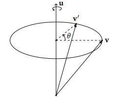

# 三维空间中的旋转
在讨论四元数之前，我们先来研究一下三维空间中旋转。
表示三维空间中旋转的方法有很多种，但我们这里关注的是轴角式（Axis-angle）的旋转。虽然使用欧拉角的旋转很常用，但是我们知道欧拉角的表示方法不仅会导致Gimbal Lock而且依赖于三个坐标轴的选定，使用四元数正是为了解决这个问题。我们这里所要讨论的轴角式旋转是旋转更加普遍的情况：
假设我们有一个经过原点的（如果旋转轴不经过原点我们可以先将旋转轴平移到原点，进行旋转，在平移回原处）旋转轴$u=(x,y,z)^T$，我们希望将一个向量v，沿着这个旋转轴旋转$\theta$度，变换到v'：

注意，在这篇教程中我们将使用右手坐标系统，并且我们将使用右手定则来定义旋转的正方向。
# 四元素
终于，我们可以开始讨论四元数与旋转之间的关系了。四元数的定义和复数非常类似，唯一的区别就是四元数一共有三个虚部，而复数只有一个。所有的四元数都可以协程下面这种形式：
$q=a+bi+cj+dk (a,b,c,d \in R)$
其中：
$i^2=j^2=k^2=ijk=-1$