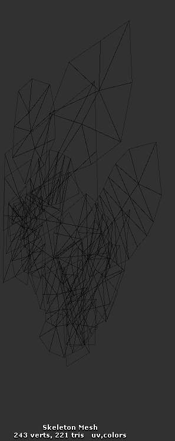
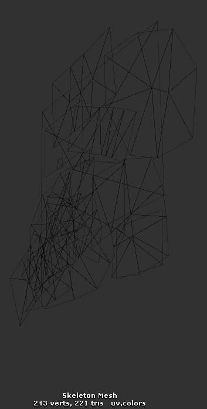

## Bone 骨骼
spine 是骨骼编辑器,所以骨骼是基础。每个骨骼都会有旋转，缩放，位移的属性。然后骨骼可以有子节点，最终形成了一个树型结构。可以对应2dx 里面的 node
## Slot 插槽
骨骼上的一个挂载点。不是所有的骨骼上都能放置东西的，因为很多骨骼其实只参与计算，真正重要的骨骼，也就是需要挂载其他东西的骨骼上必须放置插槽。slot 只是用来标记特殊的骨骼位置，本身只有一个颜色属性，也可以说，重要的骨骼节点可以称为 slot。
## Attachment 附件
挂在插槽上的内容，可以是图片，也可以是判定区域，只要是你能想到的东西，都可以当成附件。
## Draw order 描画顺序
骨架上插槽的一个顺序列表。用来控制描画的先后顺序。
## Animation 动画
基于时间轴的一个骨骼状态列表。
## Skin 皮肤
一套附件的集合，类似于换装。
## Bounding Box 边界框
用来指定骨骼上的边界的多边形的区域。
## atlas 图集
贴图集合，小图片合并在一起，就成了图集。
# 实现
上面大致介绍了一些基本概念，然后我们从实现角度上来说下为啥这么设计。
首先，假设我们需要一个骨骼系统。于是，我们就设计了一个树状的骨架，每个节点就是（Bone）。
很简单啊，再想下，骨骼上要放图片啥的，于是我们就要能访问到特定的骨骼，遍历太傻了，好吧，我们给这些骨骼加个名字，这样就能访问到具体 骨骼了，那这些名字就叫 slot。
好吧，可能有些人觉得，slot 和 bone 本质上一样，为啥需要分开呢，没必要的。我只能说事情其实并不简单，来想下，我们已经有了一个完美的骨架，图片也在应该在的骨骼上了。那我们该如何显示图片么？遍历么，从根结点开始，一直到最下层的节点，不管你用啥排序，这个顺序是固定的，但是现实总是很残酷，很多时候，我们需要不停调整图片描画的顺序，也就是调整树的节点排序，啊，好麻烦。那怎么办，我们指定下骨骼描画的顺序吧（Draw order），这些特定的骨骼也就是 slot。
你看，这下完美了，也就是 bone 用来计算位置，slot 用来控制描画。
完美的骨骼系统，一定要有碰撞区域（bounding box），这和图片差不多,一个用于显示,一个用于边界判断,好吧,那就抽象成一个概念叫（p_w_upload），于是，slot 上就可以附加不同的 p_w_upload 了。
终于可以换附件了，但是一个一个换好累。于是，我们把一组附件合在一起，组成了 skin。这下简单了，一换 skin，整个世界就变样了。
啊，做着做着，就发现图片太多了，要优化啊。怎么办，简单，把小图片合在一起，每个图片对应了一个大图里面的一个区域，这就是 atlas。
Spine-Unity使用Unity的MeshRenderer和MeshFiter组建，还有材质资源进行渲染。
SkeletonRenderer类（SkeletonAnimation和SkeletonAnimator均继承与它），在它的LateUpdate中构建Mesh。生成顶点，颜色，三角形索引和UV然后把这些放入Mesh中。以下讲解主要说明如何构建Mesh。
Spine一般使用alpha混合的方式来渲染模型，在一个网格中，它根据网格中三角形的顺序去渲染物体，然后绘制一个东西在另一个东西上面。该顺序是在Spine中控制槽的绘制顺序来决定的。
为了让大家更好的理解本文，先讲述涉及到的一些数据结构：
```CSharp
public class ExposedList<T>: IEnumerable<T>
{
    public void Clear (bool clearArray = true) {
        if (clearArray)
            Array.Clear(Items, 0, Items.Length);

        Count = 0;
        version++;
    }
}
```
暴露的链表，原理和List是一样的，但是扩展了一些方法，比如Clear(bool clearArray = true)，List只能Clear()，尝试在多找一些对比，但是代码中大部分是foreach,add,clear由于时间有限，暂时不对其进入深入了解。

# TransformMode
```CSharp
// 转换模式
public enum TransformMode {
    //0000 0 Flip Scale Rotation
    Normal = 0, // 0000 正常，平移，旋转，缩放
    OnlyTranslation = 7, // 0111 只平移
    NoRotationOrReflection = 1, // 0001 不旋转或映像
    NoScale = 2, // 0010 不缩放
    NoScaleOrReflection = 6, // 0110 不缩放或映像
}
```
# BoneData
```CSharp
public class BoneData {
    internal int index; // 骨骼索引，第几根骨骼
    internal string name;// 骨骼名，具有唯一性
    internal BoneData parent;//父亲骨骼
    internal float length; // 骨骼长度，不太理解
    internal float x, y, rotation, scaleX = 1, scaleY = 1, shearX, shearY;// 位移，旋转，缩放，裁剪
    internal TransformMode transformMode = TransformMode.Normal;//变换模式
}
```
# BlendMode
```CSharp
// 混合模式
public enum BlendMode {
    Normal, 
    Additive,// 加法 
    Multiply, // 乘法
    Screen // 屏幕
}
```
# SlotData
```CSharp
// 槽数据
class SlotData {
    internal int index;
    internal string name;
    internal BoneData boneData;
    internal float r = 1, g = 1, b = 1, a = 1;
    internal float r2 = 0, g2 = 0, b2 = 0;
    internal bool hasSecondColor = false;
    internal string attachmentName; // 附件名
    internal BlendMode blendMode;
}
```
# IKContraintData
```CSharp
// IK约束(动力学)
class IkConstraintData {
    internal string name;
    internal int order;
    internal List<BoneData> bones = new List<BoneData>();
    internal BoneData target;
    internal int bendDirection = 1;
    internal float mix = 1;
}
```
# TransformConstraintData
```CSharp
// 变换约束数据
class TransformConstraintData {
    internal string name;
    internal int order; // 命令
    internal ExposedList<BoneData> bones = new ExposedList<BoneData>();
    internal BoneData target;
    internal float rotateMix, translateMix, scaleMix, shearMix;
    internal float offsetRotation, offsetX, offsetY, offsetScaleX, offsetScaleY, offsetShearY;
    internal bool relative, local;//坐标系
}
```
# PathConstraintData
```CSharp
// 路径约束
class PathConstraintData {
    internal string name;
    internal int order;
    internal ExposedList<BoneData> bones = new ExposedList<BoneData>();
    internal SlotData target;
    internal PositionMode positionMode;
    internal SpacingMode spacingMode;
    internal RotateMode rotateMode;
    internal float offsetRotation;
    internal float position, spacing, rotateMix, translateMix;
}
```
# SkeletonData
```CSharp
// 骨架数据
class SkeletonData {
    internal string name;
    internal ExposedList<BoneData> bones = new ExposedList<BoneData>(); // Ordered parents first
    internal ExposedList<SlotData> slots = new ExposedList<SlotData>(); // S装配绘制顺序
    internal ExposedList<Skin> skins = new ExposedList<Skin>(); // 附件集合
    internal Skin defaultSkin;
    internal ExposedList<EventData> events = new ExposedList<EventData>();
    internal ExposedList<Animation> animations = new ExposedList<Animation>(); // 动画列表
    internal ExposedList<IkConstraintData> ikConstraints = new ExposedList<IkConstraintData>();
    internal ExposedList<TransformConstraintData> transformConstraints = new ExposedList<TransformConstraintData>();
    internal ExposedList<PathConstraintData> pathConstraints = new ExposedList<PathConstraintData>();
    internal float width, height;
    internal string version, hash;
}
```
# Skeleton(骨架)
```CSharp
// 骨架，总感觉数据有冗余，在看看吧
class Skeleton {
    internal SkeletonData data;
    internal ExposedList<Bone> bones;
    internal ExposedList<Slot> slots;
    internal ExposedList<Slot> drawOrder; // 画的命令槽
    internal ExposedList<IkConstraint> ikConstraints;
    internal ExposedList<TransformConstraint> transformConstraints;
    internal ExposedList<PathConstraint> pathConstraints;
    internal ExposedList<IUpdatable> updateCache = new ExposedList<IUpdatable>();
    internal ExposedList<Bone> updateCacheReset = new ExposedList<Bone>();
    internal Skin skin;
    internal float r = 1, g = 1, b = 1, a = 1;
    internal float time;
    internal bool flipX, flipY;
    internal float x, y;
}
```
# Bone(骨头)
```CSharp
class Bone : IUpdatable {
    static public bool yDown;
    internal BoneData data;
    internal Skeleton skeleton;
    internal Bone parent;
    internal ExposedList<Bone> children = new ExposedList<Bone>();
    internal float x, y, rotation, scaleX, scaleY, shearX, shearY;
    internal float ax, ay, arotation, ascaleX, ascaleY, ashearX, ashearY;
    internal bool appliedValid;
    internal float a, b, worldX; // 权重，坐标
    internal float c, d, worldY;
    internal bool sorted;
}
```
# SubmeshInstruction
```CSharp
// 子网格约束
struct SubmeshInstruction {
    public Skeleton skeleton;
    public int startSlot;
    public int endSlot;
    public Material material;

    public bool forceSeparate; // 强制分离
    public int preActiveClippingSlotSource;

    #if SPINE_TRIANGLECHECK
    // 缓存的值，因为它们是在生成指令的过程中确定的，
    // but could otherwise be pulled from accessing attachments, checking materials and counting tris and verts.
    public int rawTriangleCount;
    public int rawVertexCount;
    public int rawFirstVertexIndex;
    public bool hasClipping;
    #endif

    /// <summary>The number of slots in this SubmeshInstruction's range. Not necessarily the number of attachments.</summary>
    public int SlotCount { get { return endSlot - startSlot; } }
}
```
# RegionAttachment(显示纹理区域的附件)
```CSharp
class RegionAttachment : Attachment, IHasRendererObject {
    public const int BLX = 0; // bottom left x
    public const int BLY = 1; // bottom left y
    public const int ULX = 2; // upper left x
    public const int ULY = 3; // upper left y
    public const int URX = 4; // upper right x
    public const int URY = 5; // upper right y
    public const int BRX = 6; // bottom right x
    public const int BRY = 7; // bottom right y

    internal float x, y, rotation, scaleX = 1, scaleY = 1, width, height;
    internal float regionOffsetX, regionOffsetY, regionWidth, regionHeight, regionOriginalWidth, regionOriginalHeight;
    internal float[] offset = new float[8], uvs = new float[8];
    internal float r = 1, g = 1, b = 1, a = 1;
}
```
# MeshAttachment(使用网格显示纹理区域的附件)
```CSharp
class MeshAttachment : VertexAttachment, IHasRendererObject {
    internal float regionOffsetX, regionOffsetY, regionWidth, regionHeight, regionOriginalWidth, regionOriginalHeight;
    private MeshAttachment parentMesh;
    internal float[] uvs, regionUVs;
    internal int[] triangles;
    internal float r = 1, g = 1, b = 1, a = 1;
    internal int hulllength;
    internal bool inheritDeform;
}
```
# BuildMeshWithArrays(构建顶点等数据，渲染帧中只负责渲染)
```CSharp
// 当不涉及剪切时，使用这种更快的方法。
public void BuildMeshWithArrays(SkeletonRendererInstruction instruction, bool updateTriangles)
{
    var settings = this.settings;
    int totalVertexCount = instruction.rawVertexCount;

    // 扩容
    {
        if (totalVertexCount > vertexBuffer.Items.Length) { // Manual ExposedList.Resize()
            Array.Resize(ref vertexBuffer.Items, totalVertexCount);
            Array.Resize(ref uvBuffer.Items, totalVertexCount);
            Array.Resize(ref colorBuffer.Items, totalVertexCount);
        }
        vertexBuffer.Count = uvBuffer.Count = colorBuffer.Count = totalVertexCount;
    }

    // Populate Verts
    Color32 color = default(Color32);

    int vertexIndex = 0;
    var tempVerts = this.tempVerts;
    Vector3 bmin = this.meshBoundsMin;
    Vector3 bmax = this.meshBoundsMax;

    var vbi = vertexBuffer.Items;
    var ubi = uvBuffer.Items;
    var cbi = colorBuffer.Items;
    int lastSlotIndex = 0;

    // drawOrder[endSlot] is excluded
    for (int si = 0, n = instruction.submeshInstructions.Count; si < n; si++) {
        var submesh = instruction.submeshInstructions.Items[si]; // 通过骨骼的[startSlot,endSlot)来渲染网格
        var skeleton = submesh.skeleton; // 骨骼
        var skeletonDrawOrderItems = skeleton.drawOrder.Items; // 骨骼命令槽
        float a = skeleton.a * 255, r = skeleton.r, g = skeleton.g, b = skeleton.b;

        int endSlot = submesh.endSlot;
        int startSlot = submesh.startSlot;
        lastSlotIndex = endSlot;

        if (settings.tintBlack) { // 是不是浅黑色效果，增加两倍顶点来实现的
            Vector2 rg, b2;
            int vi = vertexIndex;
            b2.y = 1f;
            { 
                if (uv2 == null) {
                    uv2 = new ExposedList<Vector2>();
                    uv3 = new ExposedList<Vector2>();
                }
                if (totalVertexCount > uv2.Items.Length) { // Manual ExposedList.Resize()
                    Array.Resize(ref uv2.Items, totalVertexCount);
                    Array.Resize(ref uv3.Items, totalVertexCount);
                }
                uv2.Count = uv3.Count = totalVertexCount;
            }

            var uv2i = uv2.Items;
            var uv3i = uv3.Items;

            for (int slotIndex = startSlot; slotIndex < endSlot; slotIndex++) {
                var slot = skeletonDrawOrderItems[slotIndex];
                var attachment = slot.attachment;

                rg.x = slot.r2; //r
                rg.y = slot.g2; //g
                b2.x = slot.b2; //b

                var regionAttachment = attachment as RegionAttachment;
                if (regionAttachment != null) {
                    uv2i[vi] = rg; uv2i[vi + 1] = rg; uv2i[vi + 2] = rg; uv2i[vi + 3] = rg;
                    uv3i[vi] = b2; uv3i[vi + 1] = b2; uv3i[vi + 2] = b2; uv3i[vi + 3] = b2;
                    vi += 4;
                } else { 
                    var meshAttachment = attachment as MeshAttachment;
                    if (meshAttachment != null) {
                        int meshVertexCount = meshAttachment.worldVerticesLength;
                        for (int iii = 0; iii < meshVertexCount; iii += 2) {
                            uv2i[vi] = rg;
                            uv3i[vi] = b2;
                            vi++;
                        }
                    }
                }
            }
        }

        for (int slotIndex = startSlot; slotIndex < endSlot; slotIndex++) {
            var slot = skeletonDrawOrderItems[slotIndex];
            var attachment = slot.attachment;
            float z = slotIndex * settings.zSpacing;

            var regionAttachment = attachment as RegionAttachment;
            if (regionAttachment != null) {
                regionAttachment.ComputeWorldVertices(slot.bone, tempVerts, 0); // 根据权重上一位置，计算当前顶点
                float x1 = tempVerts[RegionAttachment.BLX], y1 = tempVerts[RegionAttachment.BLY];
                float x2 = tempVerts[RegionAttachment.ULX], y2 = tempVerts[RegionAttachment.ULY];
                float x3 = tempVerts[RegionAttachment.URX], y3 = tempVerts[RegionAttachment.URY];
                float x4 = tempVerts[RegionAttachment.BRX], y4 = tempVerts[RegionAttachment.BRY];
                vbi[vertexIndex].x = x1; vbi[vertexIndex].y = y1; vbi[vertexIndex].z = z;
                vbi[vertexIndex + 1].x = x4; vbi[vertexIndex + 1].y = y4; vbi[vertexIndex + 1].z = z;
                vbi[vertexIndex + 2].x = x2; vbi[vertexIndex + 2].y = y2; vbi[vertexIndex + 2].z = z;
                vbi[vertexIndex + 3].x = x3; vbi[vertexIndex + 3].y = y3;   vbi[vertexIndex + 3].z = z;
                // 混合颜色
                if (settings.pmaVertexColors) {
                    color.a = (byte)(a * slot.a * regionAttachment.a);
                    color.r = (byte)(r * slot.r * regionAttachment.r * color.a);
                    color.g = (byte)(g * slot.g * regionAttachment.g * color.a);
                    color.b = (byte)(b * slot.b * regionAttachment.b * color.a);
                    if (slot.data.blendMode == BlendMode.Additive) color.a = 0;
                } else {
                    color.a = (byte)(a * slot.a * regionAttachment.a);
                    color.r = (byte)(r * slot.r * regionAttachment.r * 255);
                    color.g = (byte)(g * slot.g * regionAttachment.g * 255);
                    color.b = (byte)(b * slot.b * regionAttachment.b * 255);
                }

                cbi[vertexIndex] = color; cbi[vertexIndex + 1] = color; cbi[vertexIndex + 2] = color; cbi[vertexIndex + 3] = color;
                // 阈值
                float[] regionUVs = regionAttachment.uvs;
                ubi[vertexIndex].x = regionUVs[RegionAttachment.BLX]; ubi[vertexIndex].y = regionUVs[RegionAttachment.BLY];
                ubi[vertexIndex + 1].x = regionUVs[RegionAttachment.BRX]; ubi[vertexIndex + 1].y = regionUVs[RegionAttachment.BRY];
                ubi[vertexIndex + 2].x = regionUVs[RegionAttachment.ULX]; ubi[vertexIndex + 2].y = regionUVs[RegionAttachment.ULY];
                ubi[vertexIndex + 3].x = regionUVs[RegionAttachment.URX]; ubi[vertexIndex + 3].y = regionUVs[RegionAttachment.URY];

                if (x1 < bmin.x) bmin.x = x1; // 潜在的第一个附件边界初始化。初始最小值不应阻止初始最大值。下面的Y也是一样。
                if (x1 > bmax.x) bmax.x = x1;
                if (x2 < bmin.x) bmin.x = x2;
                else if (x2 > bmax.x) bmax.x = x2;
                if (x3 < bmin.x) bmin.x = x3;
                else if (x3 > bmax.x) bmax.x = x3;
                if (x4 < bmin.x) bmin.x = x4;
                else if (x4 > bmax.x) bmax.x = x4;

                if (y1 < bmin.y) bmin.y = y1;
                if (y1 > bmax.y) bmax.y = y1;
                if (y2 < bmin.y) bmin.y = y2;
                else if (y2 > bmax.y) bmax.y = y2;
                if (y3 < bmin.y) bmin.y = y3;
                else if (y3 > bmax.y) bmax.y = y3;
                if (y4 < bmin.y) bmin.y = y4;
                else if (y4 > bmax.y) bmax.y = y4;

                vertexIndex += 4;
            } 
            else 
            {
                var meshAttachment = attachment as MeshAttachment;
                if (meshAttachment != null) {
                    int meshVertexCount = meshAttachment.worldVerticesLength;
                    if (tempVerts.Length < meshVertexCount) this.tempVerts = tempVerts = new float[meshVertexCount];
                    meshAttachment.ComputeWorldVertices(slot, tempVerts);

                    if (settings.pmaVertexColors) {
                        color.a = (byte)(a * slot.a * meshAttachment.a);
                        color.r = (byte)(r * slot.r * meshAttachment.r * color.a);
                        color.g = (byte)(g * slot.g * meshAttachment.g * color.a);
                        color.b = (byte)(b * slot.b * meshAttachment.b * color.a);
                        if (slot.data.blendMode == BlendMode.Additive) color.a = 0;
                    } else {
                        color.a = (byte)(a * slot.a * meshAttachment.a);
                        color.r = (byte)(r * slot.r * meshAttachment.r * 255);
                        color.g = (byte)(g * slot.g * meshAttachment.g * 255);
                        color.b = (byte)(b * slot.b * meshAttachment.b * 255);
                    }

                    float[] attachmentUVs = meshAttachment.uvs;

                    // 潜在的第一个附件边界初始化。参见区域连接逻辑中的条件。
                    if (vertexIndex == 0) {
                        // 初始最小值不应阻止初始最大值。
                        // vi == vertexIndex does not always mean the bounds are fresh. It could be a submesh. Do not nuke old values by omitting the check.
                        // Should know that this is the first attachment in the submesh. slotIndex == startSlot could be an empty slot.
                        float fx = tempVerts[0], fy = tempVerts[1];
                        if (fx < bmin.x) bmin.x = fx;
                        if (fx > bmax.x) bmax.x = fx;
                        if (fy < bmin.y) bmin.y = fy;
                        if (fy > bmax.y) bmax.y = fy;
                    }

                    for (int iii = 0; iii < meshVertexCount; iii += 2) {
                        float x = tempVerts[iii], y = tempVerts[iii + 1];
                        vbi[vertexIndex].x = x; vbi[vertexIndex].y = y; vbi[vertexIndex].z = z;
                        cbi[vertexIndex] = color; ubi[vertexIndex].x = attachmentUVs[iii]; ubi[vertexIndex].y = attachmentUVs[iii + 1];

                        if (x < bmin.x) bmin.x = x;
                        else if (x > bmax.x) bmax.x = x;

                        if (y < bmin.y) bmin.y = y;
                        else if (y > bmax.y) bmax.y = y;

                        vertexIndex++;
                    }
                }
            }
        }
    }

    this.meshBoundsMin = bmin;
    this.meshBoundsMax = bmax;
    this.meshBoundsThickness = lastSlotIndex * settings.zSpacing;

    int submeshInstructionCount = instruction.submeshInstructions.Count;
    submeshes.Count = submeshInstructionCount;

    // 添加三角形
    if (updateTriangles) {
        // Match submesh buffers count with submeshInstruction count.
        if (this.submeshes.Items.Length < submeshInstructionCount) {
            this.submeshes.Resize(submeshInstructionCount);
            for (int i = 0, n = submeshInstructionCount; i < n; i++) {
                var submeshBuffer = this.submeshes.Items[i];
                if (submeshBuffer == null)
                    this.submeshes.Items[i] = new ExposedList<int>();
                else
                    submeshBuffer.Clear(false);
            }
        }

        var submeshInstructionsItems = instruction.submeshInstructions.Items; // This relies on the resize above.

        // Fill the buffers.
        int attachmentFirstVertex = 0;
        for (int smbi = 0; smbi < submeshInstructionCount; smbi++) {
            var submeshInstruction = submeshInstructionsItems[smbi];
            var currentSubmeshBuffer = this.submeshes.Items[smbi];
            { //submesh.Resize(submesh.rawTriangleCount);
                int newTriangleCount = submeshInstruction.rawTriangleCount;
                if (newTriangleCount > currentSubmeshBuffer.Items.Length)
                    Array.Resize(ref currentSubmeshBuffer.Items, newTriangleCount); 
                else if (newTriangleCount < currentSubmeshBuffer.Items.Length) {
                    // Zero the extra.
                    var sbi = currentSubmeshBuffer.Items;
                    for (int ei = newTriangleCount, nn = sbi.Length; ei < nn; ei++)
                        sbi[ei] = 0;
                }
                currentSubmeshBuffer.Count = newTriangleCount;
            }

            var tris = currentSubmeshBuffer.Items;
            int triangleIndex = 0;
            var skeleton = submeshInstruction.skeleton;
            var skeletonDrawOrderItems = skeleton.drawOrder.Items;
            for (int a = submeshInstruction.startSlot, endSlot = submeshInstruction.endSlot; a < endSlot; a++) {            
                var attachment = skeletonDrawOrderItems[a].attachment;
                if (attachment is RegionAttachment) {
                    tris[triangleIndex] = attachmentFirstVertex;
                    tris[triangleIndex + 1] = attachmentFirstVertex + 2;
                    tris[triangleIndex + 2] = attachmentFirstVertex + 1;
                    tris[triangleIndex + 3] = attachmentFirstVertex + 2;
                    tris[triangleIndex + 4] = attachmentFirstVertex + 3;
                    tris[triangleIndex + 5] = attachmentFirstVertex + 1;
                    triangleIndex += 6;
                    attachmentFirstVertex += 4;
                    continue;
                }
                var meshAttachment = attachment as MeshAttachment;
                if (meshAttachment != null) {
                    int[] attachmentTriangles = meshAttachment.triangles;
                    for (int ii = 0, nn = attachmentTriangles.Length; ii < nn; ii++, triangleIndex++)
                        tris[triangleIndex] = attachmentFirstVertex + attachmentTriangles[ii];
                    attachmentFirstVertex += meshAttachment.worldVerticesLength >> 1; // length/2;
                }
            }
        }
    }
}
```
上述是构造Mesh方法。
# SpineMesh.cs
```CSharp
#region Step 3 : Transfer vertex and triangle data to UnityEngine.Mesh
public void FillVertexData (Mesh mesh) {
    var vbi = vertexBuffer.Items;
    var ubi = uvBuffer.Items;
    var cbi = colorBuffer.Items;

    // Zero the extra.
    {
        int listCount = vertexBuffer.Count;
        int arrayLength = vertexBuffer.Items.Length;
        var vector3zero = Vector3.zero;
        for (int i = listCount; i < arrayLength; i++)
            vbi[i] = vector3zero;
    }

    // Set the vertex buffer.
    {
        mesh.vertices = vbi;
        mesh.uv = ubi;
        mesh.colors32 = cbi;

        if (float.IsInfinity(meshBoundsMin.x)) { // meshBoundsMin.x == BoundsMinDefault // == doesn't work on float Infinity constants.
            mesh.bounds = new Bounds();
        } else {
            //mesh.bounds = ArraysMeshGenerator.ToBounds(meshBoundsMin, meshBoundsMax);
            Vector2 halfSize = (meshBoundsMax - meshBoundsMin) * 0.5f;
            mesh.bounds = new Bounds {
                center = (Vector3)(meshBoundsMin + halfSize),
                extents = new Vector3(halfSize.x, halfSize.y, meshBoundsThickness * 0.5f)
            };
        }
    }

    {
        int vertexCount = this.vertexBuffer.Count;
        if (settings.addNormals) {
            int oldLength = 0;

            if (normals == null)
                normals = new Vector3[vertexCount]; 
            else
                oldLength = normals.Length;

            if (oldLength < vertexCount) {
                Array.Resize(ref this.normals, vertexCount);
                var localNormals = this.normals;
                for (int i = oldLength; i < vertexCount; i++) localNormals[i] = Vector3.back;
            }
            mesh.normals = this.normals;
        }

        if (settings.tintBlack) {
            if (uv2 != null) {
                mesh.uv2 = this.uv2.Items;
                mesh.uv3 = this.uv3.Items;
            }   
        }               
    }
}
// 通过上面设置的三角形，在这里设置(lateUpdate)
public void FillTrianglesSingle (Mesh mesh) {
    mesh.SetTriangles(submeshes.Items[0].Items, 0, false);
}
```
# SkeletonRenderer.cs
```CSharp
// Generates a new UnityEngine.Mesh from the internal Skeleton.
public virtual void LateUpdate () {
    if (!valid) return;

    #if SPINE_OPTIONAL_RENDEROVERRIDE
    bool doMeshOverride = generateMeshOverride != null;
    if ((!meshRenderer.enabled) && !doMeshOverride) return;
    #else
    const bool doMeshOverride = false;
    if (!meshRenderer.enabled) return;
    #endif
    var currentInstructions = this.currentInstructions;
    var workingSubmeshInstructions = currentInstructions.submeshInstructions;
    var currentSmartMesh = rendererBuffers.GetNextMesh(); // Double-buffer for performance.

    bool updateTriangles;

    if (singleSubmesh) {
        // STEP 1. Determine a SmartMesh.Instruction. Split up instructions into submeshes. =============================================
        MeshGenerator.GenerateSingleSubmeshInstruction(currentInstructions, skeleton, skeletonDataAsset.atlasAssets[0].materials[0]);

        // STEP 1.9. Post-process workingInstructions. ==================================================================================
        #if SPINE_OPTIONAL_MATERIALOVERRIDE
        if (customMaterialOverride.Count > 0) // isCustomMaterialOverridePopulated 
            MeshGenerator.TryReplaceMaterials(workingSubmeshInstructions, customMaterialOverride);
        #endif

        // STEP 2. Update vertex buffer based on verts from the attachments.  ===========================================================
        meshGenerator.settings = new MeshGenerator.Settings {
            pmaVertexColors = this.pmaVertexColors,
            zSpacing = this.zSpacing,
            useClipping = this.useClipping,
            tintBlack = this.tintBlack,
            calculateTangents = this.calculateTangents,
            addNormals = this.addNormals
        };
        meshGenerator.Begin();
        updateTriangles = SkeletonRendererInstruction.GeometryNotEqual(currentInstructions, currentSmartMesh.instructionUsed);
        if (currentInstructions.hasActiveClipping) {
            meshGenerator.AddSubmesh(workingSubmeshInstructions.Items[0], updateTriangles);
        } else {
            meshGenerator.BuildMeshWithArrays(currentInstructions, updateTriangles);
        }

    } else {
        // STEP 1. Determine a SmartMesh.Instruction. Split up instructions into submeshes. =============================================
        MeshGenerator.GenerateSkeletonRendererInstruction(currentInstructions, skeleton, customSlotMaterials, separatorSlots, doMeshOverride, this.immutableTriangles);

        // STEP 1.9. Post-process workingInstructions. ==================================================================================
        #if SPINE_OPTIONAL_MATERIALOVERRIDE
        if (customMaterialOverride.Count > 0) // isCustomMaterialOverridePopulated 
            MeshGenerator.TryReplaceMaterials(workingSubmeshInstructions, customMaterialOverride);
        #endif

        #if SPINE_OPTIONAL_RENDEROVERRIDE
        if (doMeshOverride) {
            this.generateMeshOverride(currentInstructions);
            if (disableRenderingOnOverride) return;
        }
        #endif

        updateTriangles = SkeletonRendererInstruction.GeometryNotEqual(currentInstructions, currentSmartMesh.instructionUsed);

        // STEP 2. Update vertex buffer based on verts from the attachments.  ===========================================================
        meshGenerator.settings = new MeshGenerator.Settings {
            pmaVertexColors = this.pmaVertexColors,
            zSpacing = this.zSpacing,
            useClipping = this.useClipping,
            tintBlack = this.tintBlack,
            calculateTangents = this.calculateTangents,
            addNormals = this.addNormals
        };
        meshGenerator.Begin();
        if (currentInstructions.hasActiveClipping)
            meshGenerator.BuildMesh(currentInstructions, updateTriangles);
        else
            meshGenerator.BuildMeshWithArrays(currentInstructions, updateTriangles);
    }

    if (OnPostProcessVertices != null) OnPostProcessVertices.Invoke(this.meshGenerator.Buffers);

    // STEP 3. Move the mesh data into a UnityEngine.Mesh ===========================================================================
    var currentMesh = currentSmartMesh.mesh;
    meshGenerator.FillVertexData(currentMesh);
    rendererBuffers.UpdateSharedMaterials(workingSubmeshInstructions);
    if (updateTriangles) { // Check if the triangles should also be updated.
        meshGenerator.FillTriangles(currentMesh);
        meshRenderer.sharedMaterials = rendererBuffers.GetUpdatedSharedMaterialsArray();
    } else if (rendererBuffers.MaterialsChangedInLastUpdate()) {
        meshRenderer.sharedMaterials = rendererBuffers.GetUpdatedSharedMaterialsArray();
    }

    meshGenerator.FillLateVertexData(currentMesh);

    // STEP 4. The UnityEngine.Mesh is ready. Set it as the MeshFilter's mesh. Store the instructions used for that mesh. ===========
    meshFilter.sharedMesh = currentMesh;
    currentSmartMesh.instructionUsed.Set(currentInstructions);
}
```



左图是默认的mesh，右图是设置关键帧的状态，三角形数量和顶点数量没有改变，只是改变的顶点位置。类似蒙皮的原理
```CSharp
public static void DrawBoundingBoxes (Transform transform, Skeleton skeleton) {
    foreach (var slot in skeleton.Slots) {
        var bba = slot.Attachment as BoundingBoxAttachment;
        if (bba != null) SpineHandles.DrawBoundingBox(slot, bba, transform);
    }
}
```
