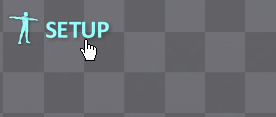

Spine 不限于角色动画，但角色动画是最常见也是最好的例子。在 Spine 中角色使用 的不是一张完整的图片，而是将各个部分切片成一系列的小图。比如：头、躯干、胳膊和腿。 这些小图片被附加到骨骼上，然后用骨骼自由的设置角色动作。这些切片会随着骨骼运动而 产生流畅的动画。
# 装配模式 Setup Mode
使用 Spine 从装配模式开始，在此模式中创建骨骼，附加切片。在编辑区的左上角显 示着 Setup（装配）或 Animate（动画）来指示当前的模式，可以通过点击进行切换。

# 切片 Images
层级树中的 Images 节点定义了 Spine 从哪里为你找到这副骨架要用的图片。图片的路 径 path 默认使用当前项目的相对路径。也支持绝对路径。设置完成后，路径下的图片会被加 载到图片 Images 节点中。
Spine 实时监控图片所在路径，如果图片发生改变，立刻更新到项目中。
# 参考图片 Template Image
通过将一张完整的角片作为参考，能更简单准确的创建骨骼和放置图片。操作如 下：把 template 图片从 Images 节点拖到编辑区域，它会被附加到 root 骨骼点上。在层 级树底部的属性面板勾选背景 Background ，被设置成背景后它将不可选，也不会被输出。

可以改变参考图片的颜色，这样更容易辨认。
# 角色切片 Character Images
在 Images 节点下，点选切片，然后 shift + 左键或 ctrl+左键把其它切片全部选中。 把它们拖放到编辑区，Spine 会为它们创建切片插槽 slots 并全部放在 root 骨骼点下。
对照参考图片把所有肢体切片对位。

切片不是直接附加到骨骼上的，而是附加到一个切片插槽中，插槽再附加到骨骼上。一 个切片插槽中可以放置多个切片，但一次只能显示一个。切片插槽对复杂骨骼的绘制顺序提 供更多控制权限。

在层级树的 Draw Order 节点中拖拽改变绘制顺序。在列表上方的切片插槽会显示在 前面，而下方的插槽会显示在后面。你还可以用+或-号键来调整顺序，按住 Shift 可以一次 移动5个单位。


当参考图用完后，可以点击层级树的中的显示点隐藏它。

## Photoshop
如果在使用 Photoshop，那架设骨骼时可以使用 Spine 提供的“LayersToPNG.jsx” PS 脚本。在 Spine 安装目录下的 scripts/photoshop/LayersToPNG.jsx 能找到。此脚本能 导出图层为 PNG 文件和 Spine 的 JSON 文件。点击 Spine 左上角的 Spine 标志，然后 Import Data, Skeleton。导入的骨架包含一个骨骼点和所有的图片，这些图片位置和显示绘制顺序 都和 PS 中的图层一至。留给你的工作就只有创建骨骼了。这在后面会介绍。

另一个提高工作效率的方案是使用 Adobe Generator . 它能让 PNG 文件与 PSD 同步， 妈妈再也不用担心我手动导图几万张图而发飙了。而 Spine 也是实时同步文件夹中的 PNG 的，这也就相当于 Spine 中的切片素材可以和 PSD 保持同步了。
# 创建骨骼 Creating Bones
使用创建 Create 工具，创建新骨骼时，首先要选中一个骨骼作为它的父级，然后再拖 拽创建出新骨骼。

当创建新骨骼时，按 shift（不用按住不放）选择光标下的图片。当拖出新骨骼后，被 选中的图片将会变成新骨骼的子物体。

使用这个功能来创建骨骼能更高效，因为你同时创建了新骨骼，并改变了图片的父级。

最后你可能要想改变某个骨头，插槽，图片或其它东西的父级。方法如下：选中要改变 父级的对象，按 P 键或 Set Parent 按钮，然后在层级树中选择新的父级。如果目前是骨骼 的话，比起在层级树中选，在编辑区域选可能更方便。

要改变骨骼的长度，选中任意一个变换工具 Rotate, Translate 或 Scale。然后拖动骨 骼的末端。另外骨骼长度也可以在层级树下方的属性面板中调整。如果骨骼长度为0，在编 辑区它将显示为一个特殊的图标。而在别的地方和其它骨骼没什么不同。

骨骼可以在层级树底部的属性面板中设置颜色。这将便于区分各个不同的骨骼。

在 Compensation 面板中 Image 和 Bone 按钮用于调整骨骼但保持它的子物体，如附 加在它下面的骨骼和图片不受影响。

别一个调整已经创建好的骨骼的方法，用 Create 工具选要调整的骨骼，按住 Alt 键， 然后点击拖拽。这样可以在新的位置重画骨骼，而不影响它的子物体。

# 动画模式 Animate Mode

点击编辑区左上角的 Setup 切换到动画模式。

在动画模式下，层级树会显示动画 Animations 节点，其中包含所有可编辑和查看的 动画。

用骨骼摆出姿势，然后设置关键帧创建动画。当动画播放时，骨骼会自动在关键帧之间 添加中间帧以实现平滑的运动。

# 摄影表 Dopesheet

Dopesheet 按钮可以点击以展开摄影表，它提供更详细的关键帧视图。可以在摄影表 中拖动关键帧调整动画。


# 设置关键帧 Setting Keyframes

通常第一个关键帧设置在0帧上。通过点击位移、缩放、旋转（Translate, Scale, and Rotate）工具后的关键帧图标，设置关键帧。绿色表示当前没关键帧，***表示值已经发 生变化，但是没有再次添加关键帧，红色表示已经添加关键帧。



热键 K 可以为所有发生改变的值设置关键帧。 热键 L 可以为当前激活工具设置关键帧。 如果 AutoKey 按钮被按下，所有发生改变的值都会自动被设置关键帧。

接着，在时间轴上选到下一个位置，调整骨骼摆出姿势，添加关键帧。点击并拖动时间 线就能看到流畅的骨骼动画了。


# 动画工作流程 Animation Workflow

常见的动画工作流程，先 K 出关键 pose 然后再回头细化润色动作。点击时间轴上方 的 Playback 按钮，在打开的面板中激活“步进 Stepped”按钮来实现关键 pose 预览。


它能够禁用补间帧，从而更容易观察关键 pose。一旦所有大动作都创建完成，关闭 Stepped，添加更多 key 优化过度的效果。
# 曲线编辑器 Graph
曲线 Graph 按钮可以展开曲线编辑器。在摄影表中选择一个关键帧，这里会显示它与 下一帧之间的补间插值曲线。

通过点击贝塞尔 Bezier Curve 曲线图标，启动非线性插值，要想 K 出栩栩如生的动画 这是关键所在。

在曲线编辑器中拖动 Bezier 手柄改变插值。X 轴代表当前帧到下一帧之间的时间，Y 轴代表值。
