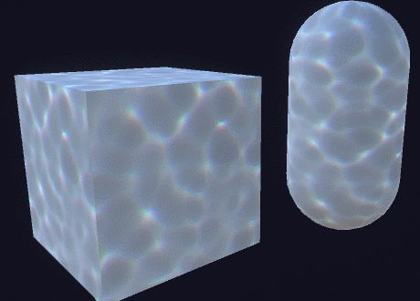
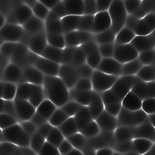
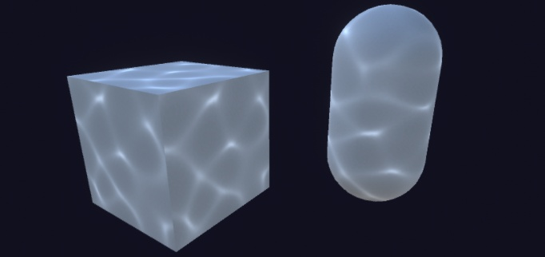
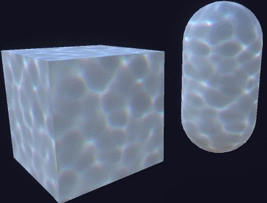

创建可信的焦散需要先了解焦散。

焦散是由曲面引起的光反射。一般来说，任何曲面都可以表现得像一个透镜，将光线聚焦在某些点上并将其散射到其他点上。玻璃和水是最常见的形成介质。如下图：


焦散可以采用许多其他形式。例如，彩虹是光被雨滴偏转时可能发生的光学想象。但是他们都是焦散的呈现方式。
# 效果刨析：
波光焦散的一个非常明显的特点是他们的移动方式。真是模拟焦散的光学原理是很费的。
所以我们通过纹理来创建可信的效果。

通过这样一张四方连续的焦散图案。
## Unity
在Unity中我们首先创建一个surface表面着色器。创建这样的两个属性：
```Shader
Properties
{
    ...
    [Header(Caustics)]
    _CausticsTex("Caustics (RGB)", 2D) = "white" {}

    // Tiling X, Tiling Y, Offset X, Offset Y
    _Caustics_ST("Caustics ST", Vector) = (1,1,0,0)
}
```
以及生命变量：
```
sampler2D _CausticsTex;
float4 _Caustics_ST;
```
其中_CausticsTex是一个Float4，将使用它控制焦散纹理的采样方式。
_CausticsTex.x是焦散纹理在X轴上的比例。
_CausticsTex.Y是焦散纹理在Y轴上的比例。
_CausticsTex.Z是焦散纹理在X轴上的偏移量。
_CausticsTex.W是焦散纹理在Y轴上的偏移量。

纹理采样：
我们要改变的是它的o.Albedo部分。采样纹理的颜色，然后添加到Albedo上
着色器代码如下：
```c
void surf(Input IN, inout SurfaceOutputStandard o)
{
    // Albedo comes from a texture tined by color
    fixed4 c = tex2D(_MainTex, IN.uv_MainTex) * _Color;
    o.Albedo = c.rgb;

    // Caustics sampling
    fixed2 uv = IN.uv_MainTex * + _Caustics_ST.xy + _Caustics_ST.zw;
    fixed3 caustics = tex2D(_CausticsTex, uv).rgb;

    // Add
    o.Albedo.rgb += caustics;

    // Metallic and smoothness come from slider variables
    o.Metallic = _Metallic;
    o.Smoothness = _Glossiness;
    o.Alpha = c.a;
}
```
效果如下：

动画焦散：
使用_time属性使其移动：
```
// Caustics UV
fixed2 uv = IN.uv_MainTex * _Caustics_ST.xy + _Caustics_ST.zw;
uv += _CausticsSpeed * _Time.y;
...
```
现在焦散纹理可以动起来了但是效果还是很基础。下一步通过多重采样的方式丰富纹理：
两次采样焦散纹理，以两个不同的速度移动他们。复制Caustics的属性，采样两个纹理使他们有不同的比例，偏移和速度：
```
Properties
{
    ...
    [Header(Caustics)]
    _CausticsTex("Caustics (RGB)", 2D) = "white" {}

    // Tiling X, Tiling Y, Offset X, Offset Y
    _Caustics1_ST("Caustics ST", Vector) = (1,1,0,0)
    _Caustics2_ST("Caustics ST", Vector) = (1,1,0,0)

    // Speed X, Speed Y
    _Caustics1_Speed("Caustics 1 Speed", Vector) = (1,1,0,0)
    _Caustics2_Speed("Caustics 2 Speed", Vector) = (1,1,0,0)
}
```
通过取最小值来达到一个比较好的效果：
```
// Caustics samplings
fixed3 caustics1 = ...
fixed3 caustics2 = ...

// Blend
o.Albedo.rgb += min(caustics1, caustics2);
```

最后模仿光线的彩虹色，将每个焦散样本分为三个颜色通道。通过对红色 绿色 蓝色 通道的轻微偏移采样。来达到颜色错位的效果。
添加一个_splitRGB属性。表示拆分的效果的强度：
```
// RGB split
fixed s = _SplitRGB;
fixed r = tex2D(tex, uv + fixed2(+s, +s)).r;
fixed g = tex2D(tex, uv + fixed2(+s, -s)).g;
fixed b = tex2D(tex, uv + fixed2(-s, -s)).b;

fixed3 caustics = fixed3(r,g,b);
```

## Unreal