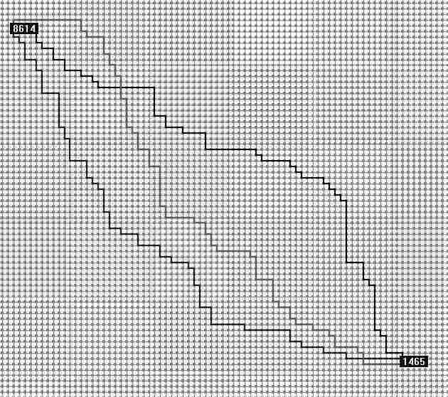
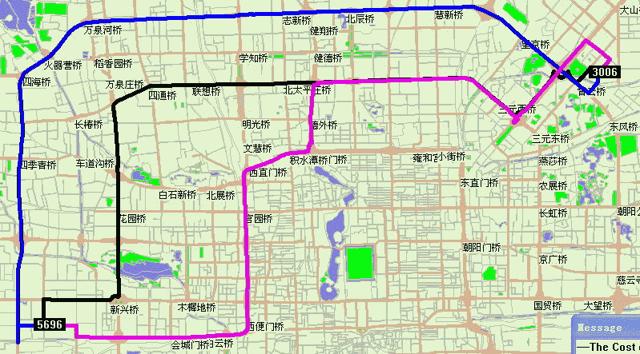

最短路径计算分静态最短计算和动态最短路径计算。
静态最短路径算法是外界环境不变，计算最短路径。主要有Dijkstra算法，A*（A Star）算法。
动态最短路径算法是外界环境不断发生变化，即不能计算预测的情况下计算最短路径。如在游戏中敌人或障碍物不断移动的情况下。典型的有D*算法。

这是Drew程序实现的10000个节点的随机路网三条互不相交最短路径

**真实路网计算K条路径示例**：节点5696到节点3006，三条最快路径，可以看出路径基本上走环线或主干路。黑线为第一条，蓝线为第二条，红线为第三条。约束条件系数为1.2。共享部分路段。

# Dijkstra算法求最短路径

Dijkstra算法是典型的最短路径算法，用于计算一个节点到其他所有节点的最短路径。主要特点是起始点为中心向外层层层扩展，直到扩展到终点位置。Dijkstra算法能得出最短路径的最优解，但由于它遍历计算的节点很多，所以效率低。

Dijkstra算法是很有代表性的最短路径算法。

Dijkstra一般的表述通常有两种方式，一种用永久和临时标号方式，一种是用OPEN，CLOSE表方式，Drew为了和下面要介绍的A*算法和D*算法表述一致，这里均采用OPEN，CLOSE表的方式。

大概过程：
创建两个表，OPEN，CLOSE。
1. 访问路网中里起始点最近且没有被检查过的点，把这个点放入OPEN组中等待检查。
2. 从OPEN表中找出距离起始点最近的点，找出这个点的所有子节点，把这个点放到CLOSE表中。
3. 遍历考察这个点的子节点。求出这些子节点距离起起始点的距离值，放子节点到OPEN表中。
4. 重复2、3步。直到OPEN表为空，或找到目标点。

# 动态路由，最短路径算法D*

1. 先用Dijstra算法从目标节点G向起始节点搜索。存储路网中目标点到各个节点的最短路和该位置到目标点的实际值h,k（k为所有变化h之中最小的值，当前为k=h。每个节点包含上一节到目标点的最短路信息1（2），2（5），5（4））