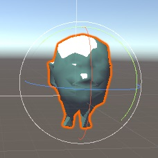
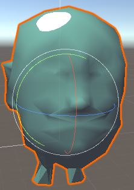

# 卡通风格的渲染
实现方式：基于色调的着色技术（tone-based shading）
高光：一块块分界明显的纯色区域
## 渲染轮廓线
- 基于观察者角度和表面法线的轮廓线渲染。使用视角方向和表面法线的点乘结果得到轮廓线信息。优点可以在一个Pass中得到渲染结果，但效果不好。
- 过程式几何轮廓线渲染，使用两个Pass渲染。第一个Pass渲染背面的面片，第二个Pass渲染正面的面片，适用于绝大多数表面平滑的模型，缺点不适合类似立方体这样平整的模型。
- 基于图像处理的轮廓线渲染，利用边缘检测，缺点是深度和法线变化很小的轮廓无法被检测出来
- 基于轮廓边检测的轮廓线渲染，检查是否是轮廓边的公式：$(n_0 \cdot v > 0) \neq (n_1 \cdot v > 0)$
其中，$n_0$和$n_1$分别表示两个相邻三角面片的法线，v是从视角到该边上任意顶点的方向。上述公式的本质在与检查两个相邻面片是否一个朝正面、一个朝背面。

# 添加高光
Blinn-Phong使用法线点乘光照方向以及视角方向和的一半，再和另一个参数指数操作得到高光反射系数。代码如下：
```c
float spec = pow(max(0, dot(normal, halfDir)), _Gloss)
```
对于卡通渲染需要的高光反射光照模型，我们同样需要计算normal和halfDir的点乘结果，但不同的是，我们把该值和一个阈值进行比较，如果小于该阈值，则高光反射系数为0，否则返回1。
```c
float spec = dot(worldNormal, worldHalfDir);
spec = step(threshold, spec);
```
但是，这种粗暴的判断方法会在高光区域的边界造成锯齿。
```c
Shader "Zenita/Non-photo"
{
    Properties
    {
        _Color ("Color Tint", Color) = (1,1,1,1)
        _MainTex("Main Tex", 2D) = "white"{}
        _Ramp ("Ramp Texture", 2D) = "white" {} // 漫反射色调的渐变纹理
        _Outline("Outline", Range(0, 1)) = 0.1 // 用于控制轮廓线宽度
        _OutlineColor ("Outline Color", Color) = (0,0,0,1) // 轮廓线颜色
        _Specular("Specular", Color)=(1,1,1,1) // 高光反射颜色
        _SpecularScale("Specular Scale", Range(0, 0.1)) = 0.01 // 高光反射的阈值
    }
    SubShader
    {
        Tags { "RenderType"="Opaque" }
        LOD 100

        Pass
        {
            NAME "OUTLINE"
            Cull Front
            CGPROGRAM
            #pragma vertex vert
            #pragma fragment frag
            // make fog work
            #pragma multi_compile_fog

            #include "UnityCG.cginc"
            #include "Lighting.cginc"

            struct appdata
            {
                float4 vertex : POSITION;
                float2 uv : TEXCOORD0;
                float3 normal : NORMAL;
            };

            struct v2f
            {
                float2 uv : TEXCOORD0;
                float4 vertex : SV_POSITION;
                float3 normal : NORMAL;
            };

            sampler2D _MainTex;
            float4 _MainTex_ST;
            sampler2D _Ramp;
            float4 _Ramp_ST;
            fixed4 _Specular;
            float _Gloss;
            float _Outline;
            float4 _OutlineColor;
            v2f vert (appdata v)
            {
                v2f o;
                o.vertex = mul(UNITY_MATRIX_MV, v.vertex);
                float3 normal = mul((float3x3)UNITY_MATRIX_IT_MV, v.normal);
                normal.z = -0.5;
                o.vertex = o.vertex + float4(normalize(normal), 0) * _Outline;
                o.vertex = mul(UNITY_MATRIX_P, o.vertex);
                return o;
            }

            fixed4 frag (v2f i) : SV_Target
            {
                return fixed4(_OutlineColor.rgb, 1);
            }
            ENDCG
        }
        Pass {
            Tags {"LightMode"="ForwardBase"}
            Cull Back
            CGPROGRAM
            #pragma vertex vert
            #pragma fragment frag
            #include "UnityCG.cginc"
            #include "Lighting.cginc"
            #include "AutoLight.cginc"

            #pragma multi_compile_fwdbase
            struct a2v
            {
                float4 vertex : POSITION;
                float3 texcoord : TEXCOORD0;
                float3 normal : NORMAL;
            };
            struct v2f {
                float4 pos : POSITION;
                float2 uv : TEXCOORD0;
                float3 worldNormal : TEXCOORD1;
                float3 worldPos : TEXCOORD2;
                SHADOW_COORDS(3)
            };
            sampler2D _MainTex;
            float4 _MainTex_ST;
            sampler2D _Ramp;
            float4 _Ramp_ST;
            fixed4 _Specular;
            float _Gloss;
            float _Outline;
            float4 _OutlineColor;
            float4 _Color;
            float _SpecularScale;
            v2f vert (a2v v){
                v2f o;
                o.pos = UnityObjectToClipPos(v.vertex);
                o.uv = TRANSFORM_TEX(v.texcoord, _MainTex);
                o.worldNormal = mul(v.normal, (float3x3)unity_WorldToObject);
                o.worldPos = mul(unity_ObjectToWorld, v.vertex).xyz;

                TRANSFER_SHADOW(o);
                return o;
            }
            float4 frag(v2f i) : SV_Target{
                fixed3 worldNormal = normalize(i.worldNormal);
                fixed3 worldLightDir = normalize(UnityWorldSpaceLightDir(i.worldPos));
                fixed3 worldViewDir = normalize(UnityWorldSpaceViewDir(i.worldPos));
                fixed3 worldHalfDir = normalize(worldLightDir + worldViewDir);

                fixed4 c = tex2D(_MainTex, i.uv);
                fixed3 albedo = c.rgb * _Color.rgb;

                fixed3 ambient = UNITY_LIGHTMODEL_AMBIENT.xyz * albedo;

                UNITY_LIGHT_ATTENUATION(atten, i, i.worldPos);

                fixed diff = dot(worldNormal, worldLightDir);
                diff = (diff*0.5+0.5)*atten;
                fixed3 diffuse = _LightColor0.rgb * albedo * tex2D(_Ramp, float2(diff, diff)).rgb;

                fixed spec = dot(worldNormal, worldHalfDir);
                fixed w = fwidth(spec) * 2.0;
                fixed3 specular = _Specular.rgb * lerp(0, 1, smoothstep(-w, w, spec + _SpecularScale - 1)) * step(0.0001, _SpecularScale);

                return fixed4(ambient + diffuse + specular, 1.0);
            }
            ENDCG
        }
    }
}
```





抗锯齿处理：
```c
specular = lerp(0,1,smoothstep(-0.0001, 0.0001, specular - _Threshold));
```
首先，我们计算了光照模型中需要的各个方向矢量，并对它们进行了归一化处理。然后我们计算了材质的反射率albedo和环境光照ambient。接着，我们使用内置的`UNITY_LIGHT_ATTENUATION`宏来计算当前世界坐标下的阴影值。随后，我们计算了半兰伯特漫反射系数，并和阴影值相乘得到最终的漫反射系数。我们使用这个漫反射系数对渐变纹理_Ramp进行采样，并将结果和材质的反射率、光照颜色颜色相乘，作为最后的漫反射光照。高光反射使用fwidth对高光区域的边界进行抗锯齿处理，并将计算得到的高光反射系数和高光反射颜色相乘，得到高光反射的光照部分。值得注意的是，我们在最后还使用了`step(0.0001,_SpecularScale)`，这是为了在\_SpecularScale为0时，可以完全消除高光反射的光照。最后，返回环境光照、漫反射光照和高光反射光照叠加的结果。
最后，我们为Shader设置了合适的Fallback:
```c
Fallback "Diffuse"
```

这对产生正确的阴影投射效果很重要。
# 素描风格的渲染
另一个非常流行的非真实感渲染是素描风格的渲染。
```c
Properties{
    _Color("Color Tint", Color)=(1,1,1,1)
    _TitleFactor("Tile Factor", Float) = 1
    _Outline("Outline", Range(0, 1))=0.1
    _Hatch0("Hatch 0", 2D)="white"{}
    _Hatch1("Hatch 1", 2D)="white"{}
    _Hatch2("Hatch 2", 2D)="white"{}
    _Hatch3("Hatch 3", 2D)="white"{}
    _Hatch4("Hatch 4", 2D)="white"{}
    _Hatch5("Hatch 5", 2D)="white"{}
}
```
其中，\_Color是用于控制模型颜色的属性。\_TileFactor是纹理的平铺系数，\_TileFactor越大，模型上的素描线条越密。\_Hatch0至\_Hatch5对应了渲染时使用的6张素描纹理，它们的线条密度依次增大。
由于素描风格往往也需要在物体周围渲染轮廓线，因此我们直接使用上面的渲染轮廓线的Pass：
```c
SubShader{
    Tags{"RenderType"="Opaque" "Queue"="Geometry"}

    UsePass "Zentia/Toon Shading/OUTLINE"
}
```
我们使用UsePass命令调用了轮廓线渲染的Pass
下面，我们需要定义光照模型所在的Pass。为了能够正确获取各个光照变量，我们设置了Pass的标签和相关的编译指令：
```c
Pass {
    Tags {"LightMode"="ForwardBase"}
    CGPROGRAM
    #pragma vertex vert
    #pragma fragment frag

    #pragma multi_compile_fwdbase
}
```
由于我们需要在顶点着色器中计算6张纹理的混合权重，我们首先需要在v2f结构体中添加相应的变量：
```c
struct 
{
    
};
```