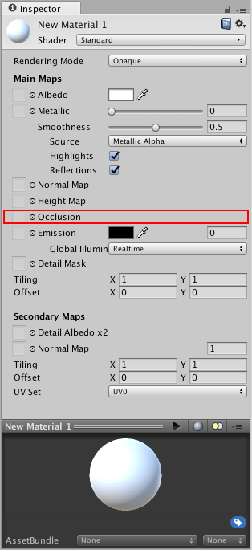

The occlusion map is used to provide information about which areas of the model should receive high or low indirect lighting.Indirect lighting comes from ambient lighting and reflections,and so steep concave parts of your model such as a crack or fold would not realistically receive much indirect light.

Occlusion texture maps are normally calculated by 3D applications directly from the 3D model using the modeller or third party software.

An occlusion map is a greyscale image（灰度图像）,with white indicating areas（白色显示区域） that should receive full indirect lighting（间接光照）,and black indicating（指示） no indirect lighting.Sometimes this is as simple as a greyscale hightmap,for simple surface(such as the knobbly stone wall（有节的石墙）texture shown in the heightmap example above).

At other times,generating the correct occlusion texture is slightly more complex（稍微复杂的）.For example,if a character in you scene is wearing a hood（戴着头巾）,the inside edegs of the hood should be set to very low indirect lighting（头巾外围应该设置很低的间接光）,or none at all（或者一点也没有）.In these situations（状况）,occlusion maps will be often be produced by artists,using 3D applications to automaticalyy generate an occlusion map based on the model.



This occlusion map identifies ares on a character's sleeve（头套）that are exposed（暴露）or hidden from ambient lighting.It is used on the model pictured below.（它用在下面的模型）

Before and after applying an occlusion map.The areas that partially obscured,（部分模糊的区域）particularly in the folds of fabric around the neck.（特别是在脖子周围的织物褶皱上）are lit too brightly on the left.After the ambient occlusion map is assigned,these ares are no longer lit by the green ambient light from the surrounding wooded envirnoment.