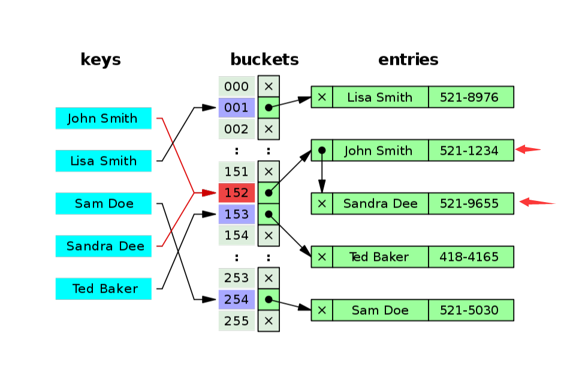

散列表（Hash table，也叫哈希表），是根据关键码值（key value）而直接进行访问的数据结构。也就是说，它通过把关键码值映射到表中一个位置来访问，以加快查找的速度。这个映射函数叫做散列函数，存放记录的数组叫做散列表。
给定表M，存在函数f(key)，对任意给定的关键值key，代入函数后若能得到包含该关键字的记录在表中的地址，则称表M为哈希（Hash）表，函数f（key）为哈希（Hash）函数。

# 基本概念
- 若关键字为k，则其值存放在f(k)的存储位置上。由此，不需比较便可直接取得所查记录。称这个对应关系f为散列函数，按这个思想建立的表为散列表。
- 对不同的关键字可能得到同一散列地址，即$k1 \neq k2$，而f(k1)=f(k2)，这种现象称为冲突（Collision）。具有相同函数值的关键字对该散列函数来说称作同义词。综上所述，根据散列函数f(k)和处理冲突的方法将一组关键字映射到一个有限的连续的地址集（区间）上，并以关键字在地址集中的“像”作为记录在表中的存储位置，这种表便成为散列表，这一映射过程称为散列造表或散列，所得的存储位置成散列地址。
- 若对于关键字集合中的任一个关键字，经散列函数映射到地址集合中任何一个地址的概率是相等的，则称此类散列函数为均匀散列函数（Uniform Hash function），这就是关键字经过散列函数得到一个“随机的地址”，从而减少冲突。

# 常用方法

散列函数能使对一个数据序列的访问过程更加迅速有效，通过散列函数，数据元素将被更快地定位。
实际工作需视不通的情况采用不同的哈希函数，通常考虑的因素有：
- 计算哈希函数所需时间
- 关键字的长度
- 哈希表的大小
- 关键字的分布情况
- 记录的查找频率

1. 直接寻址法：取关键字或关键字的某个线性函数值为散列地址。即H(key)=key或H(key)=a·key + b，其中a和b为常数（这种散列函数叫做自身函数）。若其中H(key)中已经有值了，就往下一个找，直到H(key)中没有值了，就放进去。
2. 数字分析法：分析一组数据，比如一组员工的出生年月日，这时我们发现出生年月日的前几位数字大体相同，这样的话，出现冲突的几率就会很大，但是我们发现年月日的后几位表示月份和具体日期的数字差别很大，如果用后面的数字来构建散列地址，则冲突的几率就会明显降低。因此数字分析法就是找出数字的规律，尽可能利用这些数据来构造冲突几率较低的散列地址。
3. 平方取中法：当无法确定关键字中哪几位分布较均匀时，可以先求出关键字的平方值，然后按需要取平方值的中间几位作为哈希地址。这是因为：平方后中间几位和关键字中每一位都相关，故不同关键字会以较高的概率产生不同的哈希地址。
   例：我们把英文字母在字母表中的位置序号作为该英文字母的内部编码。例如K的内部编码为11，E的内部编码为05，Y的内部编码为25，A的内部编码为01，B的内部编码为02。由此组成关键字“KEYA”的内部代码为1105201，同理我们可以得到关键字“KYAB”、“AKEY”、“BKEY”的内部编码。之后对关键字进行平方运算后，取出第7位到第9位作为该关键字哈希地址，如下图所示

关键字|内部编码|内部编码的平方值|H(k)关键字的哈希地址
------|--------|----------------|--------------------
KEYA|11052501|122157778355001|778
KEYB|11250102|126564795010404|795
AKEY|01110525|001233265775625|265
BKEY|02110525|004454315775625|315

4. 折叠法：将关键字分割成位数相同的几部分，最后一部分位数可以不同，然后取这几部分的叠加和（去除进位）作为散列地址。数位叠加可以有移位叠加和间界叠加两种方法。移位叠加是将分割后的每一部分的最低位对齐，然后相加；间界叠加是从一端向另一端分割界来回折叠，然后对齐相加。
5. 随机数法：选择一随机函数，取关键字的随机值作为散列地址，通常用于关键字长度不同的场合。
6. 除留余数法：取关键字被某个不大于散列表表长m的数p除后所得的余数为散列地址。即H(key)=key MOD p,p <= m。不仅可以对关键字直接取模，也可在折叠、平方取中等运算之后取模。对p的选择很重要，一般取素数或m，若p选的不好，容易产生同义词。

# Hash桶算法
说到Hash算法就会想到hash表，一个key通过hash函数运算后可快速得到hashCode，通过hashCode的映射可直接获取Value，但是hashCode一般取值都是非常大的，经常是$2^32$以上，不可能对每个hashCode都指定一个映射。
因为这样一个问题，所以将hashCode以分段的形式来映射，把每一段称之为一个Bucket(桶)，一般常见的Hash桶就是直接将结果取余。

# 处理冲突

1. 开放寻址法：Hi=(H(key)+di)MOD m,i=1,2,...,k(k<=m-1)，其中H(key)为散列函数，m为散列表长，di为增量序列，可有下列3种取法：
   1.1. di=1,2,3,...,m-1，称线性探测在散列；
   1.2. $di=1^2,-1^2,2^2,-2^2,...,k^2,-k^2(k<=m/2)$称为二次探测在散列；
   1.3. di=伪随机数序列，称伪随机探测在散列。
2. 再散列法：Hi=RHi(key),i\1,2,...,k RHi均是不通的散列函数，即在同义词产生地址冲突时计算另一个散列函数地址，直到冲突不再发生，这种方法不易产生“聚集”，但增加了计算时间。
3. 链地址法（拉链法）：这种方法的思路是将产生冲突的元素建立一个单链表，并将头指针地址存储到hash表对应桶的位置。这样定位到Hash表桶的位置后可通过遍历单链表的形式查找元素。
   
4. 建立一个公共溢出区

# 查找性能

散列表的查找过程基本上和造表过程相同。一些关键码可通过散列函数转换的地址直接找到，另一些关键码在散列函数得到的地址上产生了冲突，需要按处理冲突的方法进行查找。在介绍的三种处理冲突的方法中，产生冲突后的查找仍然是给定值与关键码进行比较的过程。所以，对散列表查找效率的量度，依然用平均查找长度来衡量。
查找过程中，关键码的比较次数，取决于产生冲突的多少，产生的冲突少，查找效率就高，产生的冲突多，查找效率就低。因此，影响产生冲突多少的因素，也就是影响查找效率的因素。影响产生冲突多少有以下3个因素：
1. 散列函数是否均匀；
2. 处理冲突的方法；
3. 散列表的装填因子；
   散列表的装填因子定义为：$\alpha$=填入表中的元素个数/散列表的长度
   $\alpha$是散列表装满程度的标志因子。由于表长是定值，$\alpha$与“填入表中的元素个数”成正比，所以，$\alpha$越大，填入表中的元素较多，产生冲突的可能性就越大；$\alpha$越小，填入表中的元素较少，产生冲突的可能性就越小。
   实际上，散列表的平均查找长度是装填因子$\alpha$的函数，只是不同处理冲突的方法有不同的函数。

# 常见的hash函数

## MD4

MD4(RFC 1320)是MIT的Ronald L.Rivest在1990年设计的，MD是Message Digest的缩写。它适用在32位字长的处理器上用高速软件实现，它是基于32位操作数的位操作来实现的。

## MD5

MD5(RFC 1321)是Rivest于1991年对MD4的改进版本。它对输入仍以512位分组，其输出是4个32位字的级联，与MD4相同。MD5比MD4来的复杂，并且速度较之要慢一点，但更安全，在抗分析和抗差分方面表现更好

## SHA-1

SHA1是由NIST NSA设计为同DSA一起使用的，它对长度小于264的输入，产生长度为160bit的散列值，因此抗穷举（bruteforce）性更好。SHA-1设计时基于和MD4相同原理，并且模仿了该算法。

# 用途

## 文件校验

我们比较熟悉的校验算法有奇偶校验和CRC校验，这两种校验并没有抗数据篡改的能力，它们一定程度上能检测出数据传输中信道误码，但却不能防止对数据的恶意破坏。
MD5 Hash算法的“数字指纹”特性，使它成为目前应用最广发的一种文件完整性校验和（Checksum）算法，不少Unix系统有提供计算md5 checksum的命令。

## 数字签名

Hash算法也是现代密码体系中的一个重要组成部分。由于非对称算法的运算速度较慢，所以在数字签名协议中，单向散列函数扮演了一个重要的角色。对hash值，又称“数字摘要”进行数字签名，在统计上可以认为与对文件本身进行数字签名是等效的。

## 鉴权协议

如下的鉴权协议又被称作挑战--认证模式：在传输信道是可被侦听，但不可被篡改的情况下，这是一种简单而安全的方法。

### MD5、SHA1的破解

2004年8月17日，在美国国际密码大会上MD5、HAVAL-128、MD4和RIPEMD等四个著名密码算法的破译结果。2005年宣布破解SHA-1密码。

# 字符串
（ELFhash算法）
```c
int ELFhash(char* key)
{
    unsigned long h = 0;
    while(*key)
    {
        h = (h<<4)+*key++;
        unsigned long g = h & 0xF0000000L;
        if (g)
            h ^= g >> 24;
        h &= ~g;
    }
    return h % MOD;
}
```
