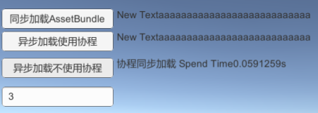

# 问题提出
昨晚临下班的时候在同时讨论到Unity的资源异步加载接口是否是多线程的时候，然后自己发了一份源自网上的测试文档，地址：https://github.com/zentia/UnityDemo
然后群里开始讨论这个问题，根据文档出现两个分歧
1. LoadFormFileAsync是否是多线程实现的？
2. yield 即协程是否是多线程实现的？

带着上述两个问题，我们开始分析和验证。
# 验证与分析
## LoadFormFileAsync是否是多线程？
测试环境：Unity 2018.3
测试平台：Windows(由于没有Android打包环境和设备，暂时选Windows)
测试工程：https://github.com/zentia/UnityDemo




好吧，是图片不具有代表性吗？那我们换大点的图片。
  
从结果来看，我认为LoadFromFileAsync内部是多线程实现的。协程不具备多线程的功能。
我们来分析协程，下面是4.7的源码
## Coroutine
```c
#include "UnityPrefix.h"

#include "Coroutine.h"

#if ENABLE_SCRIPTING

#include "Runtime/Misc/AsyncOperation.h"
#include "Runtime/Mono/MonoBehaviour.h"
#include "Runtime/Mono/MonoScript.h"
#include "Runtime/Mono/MonoIncludes.h"
#include "Runtime/Mono/MonoManager.h"
#include "Runtime/GameCode/CallDelayed.h"
#include "Runtime/Export/WWW.h"
#include "Runtime/Scripting/ScriptingUtility.h"
#include "Runtime/Scripting/Backend/ScriptingBackendApi.h"
#include "Runtime/Scripting/ScriptingObjectWithIntPtrField.h"

#if UNITY_IPHONE_API
# include "Runtime/Input/OnScreenKeyboard.h"
#endif

#include "Runtime/Scripting/Backend/ScriptingBackendApi.h"

// copied from MonoBehaviour.cpp
// if they should be synced - blame the author not me ;-)
#define DEBUG_COROUTINE 0
#define DEBUG_COROUTINE_LEAK 0

Coroutine::Coroutine()
    : m_DoneRunning(false)
{
    #if DEBUG_COROUTINE
    static int coroutineCounter = 0;
    coroutineCounter++;
    printf_console("Allocating coroutine %d --- %d : 0x%x\n", this, coroutineCounter, &m_RefCount);
    #endif
}

Coroutine::~Coroutine()
{
    Assert(m_CoroutineEnumeratorGCHandle == 0);
    
    #if DEBUG_COROUTINE
    printf_console("Deconstructor coroutine %d\n", this);
    #endif
}

void Coroutine::SetMoveNextMethod(ScriptingMethodPtr method)
{
    m_MoveNext = method;
}

void Coroutine::SetCurrentMethod(ScriptingMethodPtr method)
{
    m_Current = method;
}

void Coroutine::ContinueCoroutine (Object* o, void* userData)
{
    Coroutine* coroutine = (Coroutine*)userData;
    Assert(coroutine->m_RefCount > 0 && coroutine->m_RefCount < 1000000);
    
    if ((Object*)coroutine->m_Behaviour != o)
    {
        ErrorString("Coroutine continue failure");
        #if DEBUG_COROUTINE
        if ((Object*)coroutine->m_Behaviour != o)
        {
            printf_console ("continue Coroutine fuckup %d refcount: %d behaviour: %d \n", coroutine, coroutine->m_RefCount, coroutine->m_Behaviour);
            printf_console ("continue Coroutine fuckup name: %s methodname\n", ((MonoBehaviour*)(o))->GetScript()->GetName());
            if (coroutine->m_CoroutineMethod)
                printf_console ("continue Coroutine methodname: %s\n", scripting_method_get_name(coroutine->m_CoroutineMethod));
        }
        #endif
        return;
    }

    coroutine->Run ();
}

void Coroutine::CleanupCoroutine (void* userData)
{
    Coroutine* coroutine = (Coroutine*)userData;
    AssertIf(coroutine->m_RefCount <= 0);
    AssertIf(coroutine->m_RefCount > 1000000);
    coroutine->m_RefCount--;

    #if DEBUG_COROUTINE
    printf_console("decrease refcount %d - active: %d \n", coroutine, coroutine->m_RefCount);
    #endif

    if (coroutine->m_RefCount > 0)
        return;

    coroutine->m_DoneRunning = true;

    #if DEBUG_COROUTINE
    printf_console ("CleanupCoroutine %d\n", coroutine);
    if (coroutine->m_Behaviour && GetDelayedCallManager().HasDelayedCall(coroutine->m_Behaviour, Coroutine::ContinueCoroutine, CompareCoroutineMethodName, coroutine))
    {
        printf_console ("FUCKUP is still in delayed call manager%d!\n", coroutine->m_Behaviour);
    }
    #endif

    if (coroutine->m_ContinueWhenFinished)
    {
        CleanupCoroutine (coroutine->m_ContinueWhenFinished);
        coroutine->m_ContinueWhenFinished = NULL;
    }

    if (coroutine->m_WaitingFor)
        coroutine->m_WaitingFor->m_ContinueWhenFinished = NULL;

    coroutine->RemoveFromList();
    
    if (coroutine->m_AsyncOperation)
    {
        coroutine->m_AsyncOperation->SetCoroutineCallback(NULL, NULL, NULL, NULL);
        coroutine->m_AsyncOperation->Release();
        coroutine->m_AsyncOperation = NULL;
    }
    
    Assert(coroutine->m_CoroutineEnumeratorGCHandle != 0);

    scripting_gchandle_free (coroutine->m_CoroutineEnumeratorGCHandle);

    coroutine->m_CoroutineEnumeratorGCHandle = 0;

    if (!coroutine->m_IsReferencedByMono)
    {
        delete coroutine;
        
        #if DEBUG_COROUTINE_LEAK
        gCoroutineCounter--;
        #endif
    }
}

void Coroutine::CleanupCoroutineGC (void* userData)
{
    Coroutine* coroutine = (Coroutine*)userData;
    if (!coroutine->m_IsReferencedByMono)
        return;
    
    if (coroutine->m_RefCount != 0)
    {
        coroutine->m_IsReferencedByMono = false;
        return;
    }
    
    ErrorIf(coroutine->IsInList());
            
    delete coroutine;

    #if DEBUG_COROUTINE
    printf_console ("GC free coroutine: %d\n", coroutine);
    #endif
            
    #if DEBUG_COROUTINE_LEAK
    gCoroutineCounter--;
    #endif
}


bool Coroutine::CompareCoroutineMethodName (void* callBackUserData, void* cancelUserdata)
{
    Coroutine* coroutine = (Coroutine*)callBackUserData;
    if (!coroutine->m_CoroutineMethod)
        return false;
    
    return strcmp(scripting_method_get_name(coroutine->m_CoroutineMethod), (const char*)cancelUserdata) == 0;
}

bool Coroutine::InvokeMoveNext(ScriptingExceptionPtr* exception)
{
    ScriptingInvocation invocation(m_MoveNext);
    invocation.object = m_CoroutineEnumerator;
    invocation.classContextForProfiler = m_Behaviour->GetClass();
    invocation.objectInstanceIDContextForException = m_Behaviour->GetInstanceID();
    bool result = invocation.Invoke<bool>(exception);
    return result && *exception==NULL;
}


void Coroutine::Run ()
{
    Assert(m_RefCount != 0);
    Assert(m_Behaviour != NULL);
    
    #if DEBUG_COROUTINE
    AssertIf(GetDelayedCallManager().HasDelayedCall(m_Behaviour, Coroutine::ContinueCoroutine, CompareCoroutineMethodName, this));
    if (m_Behaviour == NULL)
    {
        printf_console ("Coroutine fuckup %d refcount: %d behaviour%d\n", this, m_RefCount, m_Behaviour);
    }
    #endif
        
    // - Call MoveNext (This processes the function until the next yield!)
    // - Call Current (This returns condition when to continue the coroutine next.)
    //   -> Queue it based on the continue condition
    
    // Temporarily increase refcount so the object will not get destroyed during the m_MoveNext call
    m_RefCount++;
    ScriptingExceptionPtr exception = NULL;
    bool keepLooping = InvokeMoveNext(&exception);
    AssertIf(m_RefCount <= 0 || m_RefCount > 10000000);
    
    bool coroutineWasDestroyedDuringMoveNext = m_RefCount == 1;
    // Decrease temporary refcount so the object will not get destroyed during the m_MoveNext call
    CleanupCoroutine(this);
    
    // The coroutine has been destroyed in the mean time, probably due to a call to StopAllCoroutines, stop executing further
    if (coroutineWasDestroyedDuringMoveNext)
    {
        Assert(m_ContinueWhenFinished == NULL);
        return;
    }   
    
    if (exception != NULL)
        return;
    
    // Are we done with this coroutine?
    if (!keepLooping)
    {
        // If there is a coroutine waiting for this one to finish Run it!
        if (m_ContinueWhenFinished)
        {
            AssertIf (this != m_ContinueWhenFinished->m_WaitingFor);
            Coroutine* continueWhenFinished = m_ContinueWhenFinished;
            m_ContinueWhenFinished->m_WaitingFor = NULL;
            m_ContinueWhenFinished = NULL;
            // The coroutine might have been stopped inside of the last coroutine invokation
            if (continueWhenFinished->m_Behaviour)
                continueWhenFinished->Run ();
            CleanupCoroutine (continueWhenFinished);
        }
                
        return;
    }
        
    if (m_Behaviour == NULL)
        return;

    ProcessCoroutineCurrent();
}

void Coroutine::ProcessCoroutineCurrent()
{
    ScriptingExceptionPtr exception = NULL;
#if !UNITY_FLASH
    ScriptingInvocation invocation(m_Current);
    invocation.object = m_CoroutineEnumerator;
    invocation.objectInstanceIDContextForException = m_Behaviour->GetInstanceID();
    invocation.classContextForProfiler = m_Behaviour->GetClass();
    ScriptingObjectPtr monoWait = invocation.Invoke(&exception);
#else
    ScriptingObjectPtr monoWait = Ext_Flash_getProperty(m_CoroutineEnumerator,"IEnumerator_Current"); 
#endif

    AssertIf(m_RefCount <= 0 || m_RefCount > 10000000);
        
    if (exception != NULL)
        return;
            
    if (monoWait == SCRIPTING_NULL)
    {
        m_RefCount++;
        CallDelayed (ContinueCoroutine, m_Behaviour, 0.0F, this, 0.0F, CleanupCoroutine, DelayedCallManager::kRunDynamicFrameRate | DelayedCallManager::kWaitForNextFrame);
        return;
    }

    HandleIEnumerableCurrentReturnValue(monoWait);
}

void Coroutine::HandleIEnumerableCurrentReturnValue(ScriptingObjectPtr monoWait)
{
    AsyncOperation* async = NULL;
    ScriptingClassPtr waitClass = scripting_object_get_class (monoWait, GetScriptingTypeRegistry());
    const CommonScriptingClasses& classes = GetMonoManager ().GetCommonClasses ();
            
    // Continue the coroutine in 'wait' seconds
    if (scripting_class_is_subclass_of (waitClass, classes.waitForSeconds))
    {
        m_RefCount++;

        float wait;
        MarshallManagedStructIntoNative(monoWait,&wait);
        CallDelayed (ContinueCoroutine, m_Behaviour, wait, this, 0.0F, CleanupCoroutine, DelayedCallManager::kRunDynamicFrameRate | DelayedCallManager::kWaitForNextFrame);
        return;
    }
    
    // Continue the coroutine on the next fixed update
    if (scripting_class_is_subclass_of (waitClass, classes.waitForFixedUpdate))
    {
        m_RefCount++;
        CallDelayed (ContinueCoroutine, m_Behaviour, 0.0F, this, 0.0F, CleanupCoroutine, DelayedCallManager::kRunFixedFrameRate);
        return;
    }
    
    // Continue the coroutine at the end of frame
    if (scripting_class_is_subclass_of (waitClass, classes.waitForEndOfFrame))
    {
        m_RefCount++;
        CallDelayed (ContinueCoroutine, m_Behaviour, 0.0F, this, 0.0F, CleanupCoroutine, DelayedCallManager::kEndOfFrame);
        return;
    }
    
    // Continue after another coroutine is finished
    if (scripting_class_is_subclass_of (waitClass, classes.coroutine))
    {
        Coroutine* waitForCoroutine;
        MarshallManagedStructIntoNative(monoWait,&waitForCoroutine);                
        if (waitForCoroutine->m_DoneRunning)
        {
            // continue executing.
            ContinueCoroutine(m_Behaviour, this);
            return;
        }
        
        if (waitForCoroutine->m_ContinueWhenFinished != NULL)
        {
            LogStringObject ("Another coroutine is already waiting for this coroutine!\nCurrently only one coroutine can wait for another coroutine!", m_Behaviour);
            return;
        }
        
        m_RefCount++;
        waitForCoroutine->m_ContinueWhenFinished = this;
        m_WaitingFor = waitForCoroutine;
        return;
    }
    
#if ENABLE_WWW
    // Continue after fetching an www object is done
            
    if (classes.www && scripting_class_is_subclass_of (waitClass, classes.www ))
    {
        WWW* wwwptr;
        MarshallManagedStructIntoNative(monoWait,&wwwptr);
        if(wwwptr != NULL)
        {
            m_RefCount++;
            wwwptr->CallWhenDone (ContinueCoroutine, m_Behaviour, this, CleanupCoroutine);
        }
        return;
    }
#endif
    // Continue after fetching an www object is done
    if ((scripting_class_is_subclass_of (waitClass, classes.asyncOperation)) && (async = ScriptingObjectWithIntPtrField<AsyncOperation> (monoWait).GetPtr()) != NULL)
    {
        m_RefCount++;

        if (async->IsDone())
        {
            CallDelayed (ContinueCoroutine, m_Behaviour, 0.0F, this, 0.0F, CleanupCoroutine, DelayedCallManager::kRunDynamicFrameRate | DelayedCallManager::kRunDynamicFrameRate | DelayedCallManager::kWaitForNextFrame);
            return;
        }
        
        // Use AysncOperation ContinueCoroutine - default path
        if (async->HasCoroutineCallback ())
        {
            ////@TODO: Throw exception?
            ErrorString("This asynchronous operation is already being yielded from another coroutine. An asynchronous operation can only be yielded once.");
            CallDelayed (ContinueCoroutine, m_Behaviour, 0.0F, this, 0.0F, CleanupCoroutine, DelayedCallManager::kRunDynamicFrameRate | DelayedCallManager::kRunDynamicFrameRate | DelayedCallManager::kWaitForNextFrame);
            return;
        }
        
        async->SetCoroutineCallback(ContinueCoroutine, m_Behaviour, this, CleanupCoroutine);
        m_AsyncOperation = async;
        m_AsyncOperation->Retain();
        
        return;
    }
    
    // Continue the coroutine on the next dynamic frame update
    m_RefCount++;
    CallDelayed (ContinueCoroutine, m_Behaviour, 0.0F, this, 0.0F, CleanupCoroutine, DelayedCallManager::kRunDynamicFrameRate | DelayedCallManager::kRunDynamicFrameRate | DelayedCallManager::kWaitForNextFrame);
    //Ext_MarshalMap_Release_ScriptingObject(monoWait);//RH TODO : RELEASE THE MONOWAIT OBJECTS SOMEWHERE
}
#endif

```
## MonoBehaviour.cpp
```c

Coroutine* MonoBehaviour::CreateCoroutine(ScriptingObjectPtr userCoroutine, ScriptingMethodPtr method)
{
    ScriptingMethodPtr moveNext = scripting_object_get_virtual_method(userCoroutine, MONO_COMMON.IEnumerator_MoveNext, GetScriptingMethodRegistry());

#if !UNITY_FLASH
    ScriptingMethodPtr current = scripting_object_get_virtual_method(userCoroutine, MONO_COMMON.IEnumerator_Current, GetScriptingMethodRegistry());
#else
    //todo: make flash use generic path. set a bogus value for flash here right now so it passes current != NULL check,  flash path will never use this value for now.
    ScriptingMethodPtr current = (ScriptingMethodPtr)1;
#endif

    if (current == SCRIPTING_NULL || moveNext == SCRIPTING_NULL)
    {
        std::string message = (method != SCRIPTING_NULL) ? Format ("Coroutine '%s' couldn't be started!", scripting_method_get_name(method)) : "Coroutine couldn't be started!";
        LogStringObject (message, this);
        return NULL;
    }
    
    Coroutine* coroutine = new Coroutine ();
    
    coroutine->m_CoroutineEnumeratorGCHandle = scripting_gchandle_new (userCoroutine);
    coroutine->m_CoroutineEnumerator = userCoroutine;
    coroutine->m_CoroutineMethod = method;
    coroutine->SetMoveNextMethod(moveNext);
    coroutine->SetCurrentMethod(current);
    coroutine->m_Behaviour = this;
    coroutine->m_ContinueWhenFinished = NULL;
    coroutine->m_WaitingFor = NULL;
    coroutine->m_AsyncOperation = NULL;
    coroutine->m_RefCount = 1;
    coroutine->m_IsReferencedByMono = 0;
    #if DEBUG_COROUTINE
    printf_console ("Allocate coroutine %d\n", coroutine);
    AssertIf(GetDelayedCallManager().HasDelayedCall(coroutine->m_Behaviour, Coroutine::ContinueCoroutine, CompareCoroutine, coroutine));
    #endif

    #if DEBUG_COROUTINE_LEAK            
    printf_console ("Active coroutines %d\n", gCoroutineCounter);
    gCoroutineCounter++;
    #endif

    m_ActiveCoroutines.push_back (*coroutine);
    AssertIf(&m_ActiveCoroutines.back() != coroutine);
    m_ActiveCoroutines.back ().Run ();

    AssertIf(coroutine->m_RefCount == 0);
    if (coroutine->m_RefCount <= 1)
    {
        Coroutine::CleanupCoroutine(coroutine);
        return NULL;
    }
    
    Coroutine::CleanupCoroutine(coroutine);
    return coroutine;               
}
```
好了，入口我们找到了，那么它是运行的呢？我们跟踪run的时候会发现有一个CallDelaye函数，而这个函数是一个定时器函数，内部最终在Update上执行，那么我们的目标转而它的Update在哪里执行的呢？我们继续看。
我们发现它最终是在场景的中Tick执行的，但是我目前并未发现Tick是多线程执行的，而且在个人的理解中，Tick也不太会或者不敢用多线程。