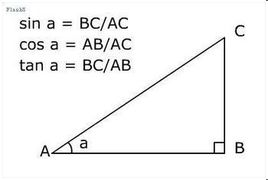
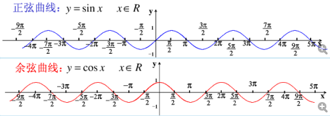
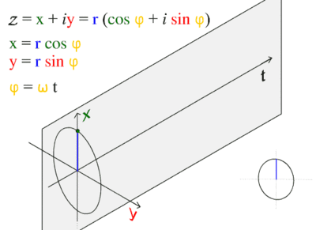

1. 正弦、余弦、正切

2. 正弦、余弦曲线

正弦曲线公式可表示为$y = Asin({\omega}x+\phi)+k$
A：振幅，最高和最低的距离（shader中理解为离圆心最近和最远的距离）
W：角速度，用于控制周期（shader中理解为圈数）
K：偏距，曲线整体上下偏移量（shader中理解为多边形整体大小）
3. 余弦（正弦）曲线和圆的基本关系

根据余弦（或正弦）曲线与园的基本关系。
${\omega}t={\omega}x=角度$