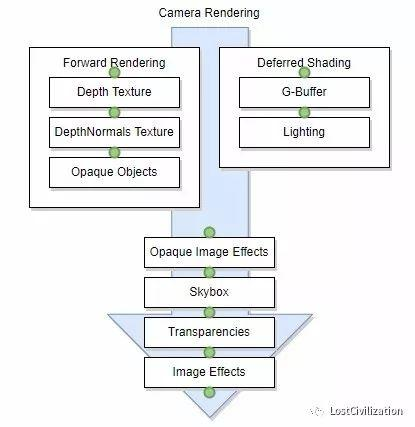

# CommandBuffer



上图是摄像机渲染的两个路径。这两种通用的方法，能很好的解决常用物体的渲染的光影效果。但一些特效会需要在此基础上进行改动。
CommandBuffer可以在上图任意的绿点插入式渲染。
为了解决此问题常规的方法是使用后效。
但是这种方法操作麻烦，而且性能不是很好。
# CommandBuffer类的常规操作
```CSharp
// 声明
CommandBuffer commandBuffer = new CommandBuffer();
// 设置渲染目标
commandBuffer.SetRenderTarget(renderTexture);
commandBuffer.ClearRenderTarget(true, true, Color.black);
// 设置渲染数据
commandBuffer.DrawRenderer(targetRenderer, material);
// 将commandBuffer的渲染进行后处理
commandBuffer.Bilt(renderTexture,DestTexture,material);
// 向主camera中插入CommandBuffer
commandBuffer.AddCommandBuffer(CameraEvent.BeforeForwardOpaque,commandBuffer);
```
# 描边思路实现
