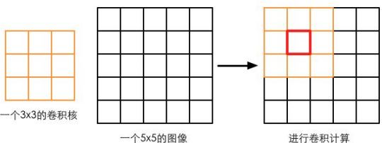

边缘检测是描边效果的一种实现方法，在本节结束后，我们可以得到类似下图中的效果。


边缘检测的原理是利用一些边缘检测算子对图像进行卷积（convolution）操作，我们首先来了解什么是卷积。
# 什么是卷积
在图像处理中，卷积操作指的就是使用一个**卷积核（kernel）**对一张图像中的每个像素进行一系列操作。卷积核通常是一个四方形网格结果（例如2x2、3x3的方形区域），该区域内每个方格都有一个权重值。当对图像中的某个像素进行卷积时，我们会把卷积核的中心放置于该像素上，如下图所示，翻转核之后再依次计算核中每个元素和其覆盖的图像像素值的乘积并求和，得到的结构就是该位置的新像素值。



卷积核和卷积。使用一个3x3大小的卷积核对一张5x5大小的图像进行卷积操作，当计算图中红色方法对应的像素的卷积结果时，我们首先把卷积核的中心放置在该像素位置，翻转核之后在依次计算核中每个元素和其覆盖的图像像素值的乘积并求和，得到新的像素值。
这样的计算过程虽然简单，但可以实现很多常见的图像处理效果，例如图像模糊、边缘检测等。例如，如果我们想要对图像进行均值模糊，可以使用一个3x3的卷积核，核内每个元素的值均为1/9。
# 常见的边缘检测算子
卷积操作的神奇之处在于选择的卷积核。那么，用于边缘检测的卷积核（也被称为边缘检测算子）应该长什么样子呢？在回答这个问题前，我们可以首先回想一下边到底是如何形成的。如果相邻像素之间存在差别明显的颜色、亮度、纹理等属性，我们就会认为它们之间应该有一条边界。这种相邻像素之间的插值可以用梯度（gradient）来表示，可以想象得到，边缘处的梯度绝对值会比较大。基于这样的理解，有几种不同的边缘检测算子被先后提出来。

3中常见的边缘检测算子如上图所示，它们都包含了两个方向的卷积核，分别用于检测水平方向和竖直方向上的边缘信息。在进行边缘检测时，我们需要对每个像素分别进行一次卷积计算，得到这两个方向上的梯度值$G_x$和$G_y$，而整体的梯度可按下面的公式计算而得：

$G = \sqrt{G_x^2 + G_y^2}$

由于上述计算包含了开根号操作，出于性能的考虑，我们有时会使用绝对值操作来代替开根号操作：

$G = |G_x| + |G_y|$
当得到梯度G后，我们就可以据此来判断哪些像素对应了边缘（梯度值越大，越有可能是边缘点）。
# 实现
本节将会使用Sobel算子进行边缘检测，实现描边效果。
（4）在顶点着色器的代码中，我们计算了边缘检测时需要的纹理坐标：
```c
struct v2f {
    float4 pos : SV_POSITION;
    half2 uv[9] : TEXCOORD0;
};

v2f vert(appdata_img v) {
    v2f o;
    o.pos = mul(UNITY_MATRIX_MVP, v.vertex);
    
    half2 uv = v.texcoord;
    
    o.uv[0] = uv + _MainTex_TexelSize.xy * half2(-1, -1);
    o.uv[1] = uv + _MainTex_TexelSize.xy * half2(0, -1);
    o.uv[2] = uv + _MainTex_TexelSize.xy * half2(1, -1);
    o.uv[0] = uv + _MainTex_TexelSize.xy * half2(-1, 0);
    o.uv[1] = uv + _MainTex_TexelSize.xy * half2(0, 0);
    o.uv[2] = uv + _MainTex_TexelSize.xy * half2(1, 0);
    o.uv[0] = uv + _MainTex_TexelSize.xy * half2(-1, 1);
    o.uv[1] = uv + _MainTex_TexelSize.xy * half2(0, 1);
    o.uv[2] = uv + _MainTex_TexelSize.xy * half2(1, 1);
    
    return o;
}
```
我们在v2f结构体中定义了一个维数为9的纹理数组，对应了使用Sobel算子采样时需要的9个领域纹理坐标。通过把计算采样纹理坐标的代码从片元着色器中转移到顶点着色器中，可以减少运算，提高性能。由于从顶点着色器到片元着色器的插值是线性的，因此这样的转移并不会影响纹理坐标的计算结果。
（5）片元着色器是我们的重点，它的代码如下：
```c
fixed4 fragSobel(v2f i) : SV_Target {
    half edge = Sobel(i);
    
    fixed4 withEdgeColor = lerp(_EdgeColor,tex2D(_MainTex, i.uv[4]), edge);
    fixed4 onlyEdgeColor = lerp(_EdgeColor, _BackgroundColor,edge);
    return lerp(withEdgeColor,onlyEdgeColor,_EdgeOnly);
}
```
我们首先调用Sobel函数计算当前像素的梯度值edge，并利用该值分别计算了北京为原图和纯色下的颜色值，然后利用_EdgeOnly在两者之间插值得到最终的像素值。Sobel函数将利用Sobel算子对原图进行边缘检测，它的定义如下：
```c
fixed luminance(fixed4 color) {
    return 0.2125 * color.r + 0.7154 * color.g + 0.0721 * color.b;
}
half Sobel(v2f i) {
    const half Gx[9] = {
        -1,-2,-1,
         0, 0, 0,
         1, 2, 1
    };
    const half Gy[9] = {
        -1, 0, 1,
        -2, 0, 2,
        -1, 0, 1
    };
    half texColor;
    half edgeX = 0;
    half edgeY = 0;
    for (int it = 0; it < 9; it++) {
        texColor = luminance(tex2D(_MainTex, i.uv[it]);
        edgeX += texColor * Gx[it];
        edgeY += texColor * Gy[it];
    }
    half edge = 1 - abs(edgeX) - abs(edgeY);
    return edge;
}
```