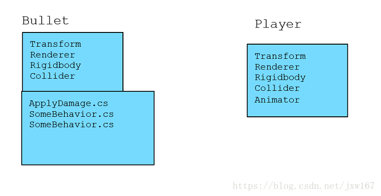
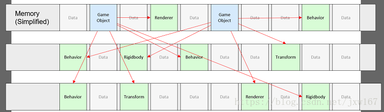
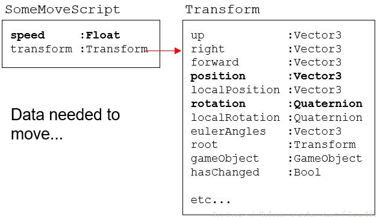
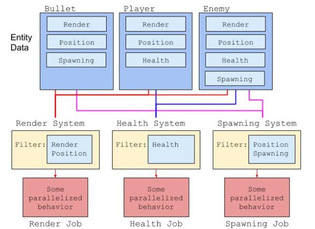
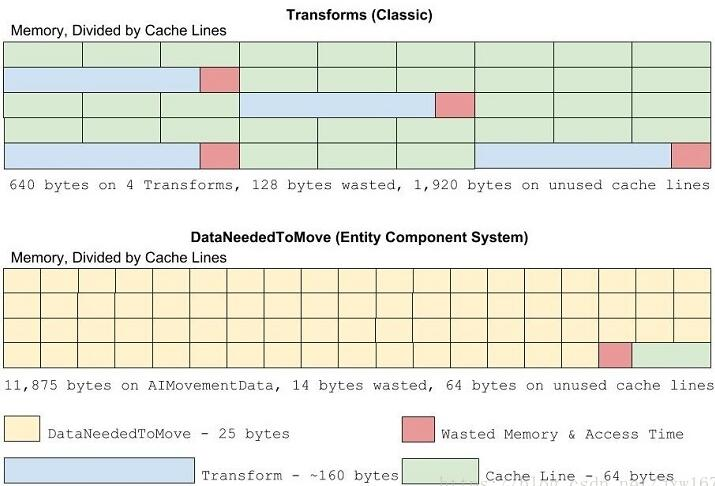
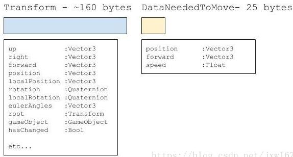

# Coroutines

WaitForENdOffFrame 帧末尾执行
yield return null 表示暂缓一帧，在下一帧接着往下处理，于yield return 0 或 yield return 1一样的功能
yield return new WaitForSeconds
协程的真正用途是分布做一个比较耗时的事情，比如游戏里面的加载资源

# Unity面对的问题

- 面向对象的编程方式（曾经的圣典，已经跟不上时代，OOP最大的问题是数据和逻辑混在一起，而现在我们要数据驱动模型）
- 由Mono编译的非最优机器码
- GC机制
- 单线程开发

## 工作流程

- 创建一个GameObject对象；
- 在对象上添加组件：Renderer，Collider，Rigidbody physics；
- 创建MonoBehaviour脚本并将其添加到对象中，以便在运行时控制和更改这些组件的状态属性；

以上3个步骤执行，我们成为Unity的执行流程，作为Unity开发者来说，这个是最基本的流程。
但是这种做法有它自己的缺点和性能问题。比如数据和逻辑是紧密耦合的，这意味着代码重用的频率比较低，因为逻辑与特定数据相关联，无法单独分离出来。
例如下图所示的GameObject和Components实例中，GameObject依赖于Transform、Renderer、Rigidbody和Collder引用，这些脚本中的引用对象分散在堆内存中。



游戏对象、其行为及其组件之间的内存引用：



Unity GameObject场景可以让游戏在非常短的时间内完成原型构建并运行，这个也是Unity的特色可以让开发者快速入手，但它对于性能来说不太理想。我们在深层次的探讨这个问题，每个引用类型都包含可能不需要访问的许多额外数据，这些未使用的成员也占用了处理器缓存中的宝贵空间。比如我们继承的Mono就是一个典型的案例，如果只需要现有组件的极少功能接口函数或者变量，则可以将其余部分视为浪费空间，如下面的“浪费空间”图所示：



在上图中，粗体表示实际用于移动操作的成员，其余的就是浪费空间，若要移动GameObject，脚本需要从Transform组件访问位置和旋转数据成员。当硬件从内存中获取数据时，缓存航中会填充许多可能无用的数据，如果只是为所有应该移动的GameObjects设置一个只有位置和旋转成员的阵列，这将能够在很短的时间内执行，如何去掉无用的数据？ECS就是味解决此问题而设计的。

# ECS实体组件系统

Unity的新实体组件系统可帮助消除低效的对象引用，我们考虑只包含它所需数据的实体，而不考虑自带集合的GameObjects。
在下面的实体组件系统中，请注意Bullet实体没有附件Transform或Rigidbody组件，Bullet实体只是显示运行更新所需的原始数据，借助这个新系统，您可以将逻辑与各个对象类型完全分离。



这个系统具有很大的优势：它不仅可以提供缓存效率，缩短访问时间；它还支持在需要使用这种数据对齐方式的现代CPU中采用先进技术（自动矢量化/SIMD）这为游戏提供了所需的默认性能。如下图所示：



上图请注意缓冲行存储中的碎片和继承Mono系统生成的空间浪费，数据对比如下所示：



上图是将与单个移动操作相关的内存空间与实现系统目标的两个操作进行对比的结果。

<p align="center">
    <a href="https://gitter.im/sschmid/Entitas-CSharp?utm_source=badge&utm_medium=badge&utm_campaign=pr-badge&utm_content=badge">
        </a>
    <a href="https://twitter.com/intent/follow?original_referer=https%3A%2F%2Fgithub.com%2Fsschmid%2FEntitas-CSharp&screen_name=s_schmid&tw_p=followbutton">
        </a>
    <a href="https://twitter.com/intent/follow?original_referer=https%3A%2F%2Fgithub.com%2Fsschmid%2FEntitas-CSharp&screen_name=entitas_csharp&tw_p=followbutton">
        </a>
    <a href="https://travis-ci.org/sschmid/Entitas-CSharp">
        </a>
    <a href="https://github.com/sschmid/Entitas-CSharp/releases">
        </a>
</p>

Entitas - The Entity Component System Framework for C# and Unity
================================================================

Entitas is a super fast Entity Component System Framework (ECS) specifically made for C# and Unity. Internal caching and blazing fast component access makes it second to none. Several design decisions have been made to work optimal in a garbage collected environment and to go easy on the garbage collector. Entitas comes with an optional code generator which radically reduces the amount of code you have to write and [makes your code read like well written prose.][clean-coders]

---

### **[» Download](#download-entitas)**
### **[» Documentation][documentation]**
### **[» Ask a question][issues-new]**
### **[» Wiki and example projects][wiki]**
### **[» #madeWithEntitas][wiki-games-and-examples]**

---

Video Tutorials & Unity Unite Talks
=================

| Entitas ECS Unity Tutorial        | Entitas ECS Unity Tutorial        | Entity system architecture with Unity                                | ECS architecture with Unity by example                               |
|:---------------------------------:|:---------------------------------:|:--------------------------------------------------------------------:|:--------------------------------------------------------------------:|
| [![Shmup1][shmup1-thumb]][shmup1] | [![Shmup2][shmup2-thumb]][shmup2] | [![Unite 15][unite15-thumb]][unite15]                                | [![Unite 16][unite16-thumb]][unite16]                                |
| Setup & Basics                    | Git & Unit Tests                  | [» Open the slides on SlideShare: Unite Europe 2015][unite15-slides] | [» Open the slides on SlideShare: Unite Europe 2016][unite16-slides] |


First glimpse
=============

The optional [code generator][wiki-code-generator] lets you write code that is super fast, safe and literally screams its intent.

```csharp
public static GameEntity CreateRedGem(this GameContext context, Vector3 position) {
    var entity = context.CreateEntity();
    entity.isGameBoardElement = true;
    entity.isMovable = true;
    entity.AddPosition(position);
    entity.AddAsset("RedGem");
    entity.isInteractive = true;
    return entity;
}
```

```csharp
var entities = context.GetEntities(Matcher<GameEntity>.AllOf(GameMatcher.Position, GameMatcher.Velocity));
foreach(var e in entities) {
    var pos = e.position;
    var vel = e.velocity;
    e.ReplacePosition(pos.value + vel.value);
}
```


Overview
========

Entitas is fast, light and gets rid of unnecessary complexity. There are less than a handful classes you have to know to rocket start your game or application:

- Entity
- Context
- Group
- Entity Collector

[Read more...][wiki-overview]


Code Generator
==============

The Code Generator generates classes and methods for you, so you can focus on getting the job done. It radically reduces the amount of code you have to write and improves readability by a huge magnitude. It makes your code less error-prone while ensuring best performance. I strongly recommend using it!

[Read more...][wiki-code-generator]


Unity integration
=================

The optional Unity module integrates Entitas nicely into Unity and provides powerful editor extensions to inspect and debug contexts, groups, entities, components and systems.

[Read more...][wiki-unity-integration]

<p align="center">
    <br />
    
    
</p>


Entitas deep dive
=================

[Read the wiki][wiki] or checkout the [example projects][wiki-example-projects] to see Entitas in action. These example projects illustrate how systems, groups, collectors and entities all play together seamlessly.


Download Entitas
================

Each release is published with zip files containing all source files you need.

[Show releases][releases]


Thanks to
=========

Big shout out to [@mzaks][github-mzaks], [@cloudjubei][github-cloudjubei] and [@devboy][github-devboy] for endless hours of discussion and helping making Entitas awesome!


Maintainer(s)
=============

- [@sschmid][github-sschmid] | [@s_schmid][twitter-sschmid] | [@entitas_csharp][twitter-entitas_csharp]


Different language?
===================

Entitas is available in
- [C#](https://github.com/sschmid/Entitas-CSharp)
- [Swift](https://github.com/mzaks/Entitas-Swift)
- [C++](https://github.com/JuDelCo/Entitas-Cpp)
- [Objective-C](https://github.com/wooga/entitas)
- [Java](https://github.com/Rubentxu/entitas-java)
- [Python](https://github.com/Aenyhm/entitas-python)
- [Scala](https://github.com/darkoverlordofdata/entitas-scala)
- [Go](https://github.com/wooga/go-entitas)
- [F#](https://github.com/darkoverlordofdata/entitas-fsharp)
- [TypeScript](https://github.com/darkoverlordofdata/entitas-ts)
- [Kotlin](https://github.com/darkoverlordofdata/entitas-kotlin)
- [Haskell](https://github.com/mhaemmerle/entitas-haskell)
- [Erlang](https://github.com/mhaemmerle/entitas_erl)
- [Clojure](https://github.com/mhaemmerle/entitas-clj)


[clean-coders]: https://cleancoders.com "Clean Coders"

[documentation]: http://sschmid.github.io/Entitas-CSharp/ "Entitas Documentation"
[wiki]: https://github.com/sschmid/Entitas-CSharp/wiki "Entitas Wiki"
[wiki-code-generator]: https://github.com/sschmid/Entitas-CSharp/wiki/Code-Generator "Wiki - Code Generator"
[wiki-overview]: https://github.com/sschmid/Entitas-CSharp/wiki/Overview "Wiki - Overview"
[wiki-unity-integration]: https://github.com/sschmid/Entitas-CSharp/wiki/Unity-integration "Wiki - Unity Integration"
[wiki-example-projects]: https://github.com/sschmid/Entitas-CSharp/wiki/Example-projects "Wiki - Example Projects"
[wiki-games-and-examples]: https://github.com/sschmid/Entitas-CSharp/wiki/Made-With-Entitas "Wiki - #madeWithEntitas"

[shmup1-thumb]: https://raw.githubusercontent.com/sschmid/Entitas-CSharp/master/Readme/Images/Entitas-Shmup-Part-1.jpg "Video: Entitas - Shmup - Part 1"
[shmup1]: https://www.youtube.com/watch?v=L-18XRTarOM "Video: Entitas - Shmup - Part 1"
[shmup2-thumb]: https://raw.githubusercontent.com/sschmid/Entitas-CSharp/master/Readme/Images/Entitas-Shmup-Part-2.jpg "Video: Entitas - Shmup - Part 2"
[shmup2]: https://www.youtube.com/watch?v=DZpvUnj2dGI "Video: Entitas - Shmup - Part 2"
[unite15-thumb]: https://raw.githubusercontent.com/sschmid/Entitas-CSharp/master/Readme/Images/UniteEurope2015-Video.png "Video: Watch the Entitas Talk at Unite Europe 2015"
[unite15]: https://www.youtube.com/watch?v=Re5kGtxTW6E "Video: Watch the Entitas Talk at Unite Europe 2015"
[unite15-slides]: http://www.slideshare.net/sschmid/uniteeurope-2015 "SlideShare: Unite Europe 2015"
[unite16-thumb]: https://raw.githubusercontent.com/sschmid/Entitas-CSharp/master/Readme/Images/UniteEurope2016-Video.png "Video: Watch the Entitas Talk at Unite Europe 2016"
[unite16]: https://www.youtube.com/watch?v=Phx7IJ3XUzg "Video: Watch the Entitas Talk at Unite Europe 2016"
[unite16-slides]: http://www.slideshare.net/sschmid/uniteeurope-2016 "SlideShare: Unite Europe 2016"

[releases]: https://github.com/sschmid/Entitas-CSharp/releases "Releases"
[issues-new]: https://github.com/sschmid/Entitas-CSharp/issues/new "New issue"

[twitter-sschmid]: https://twitter.com/s_schmid "s_schmid on Twitter"
[twitter-entitas_csharp]: https://twitter.com/entitas_csharp "entitas_csharp on Twitter"

[github-sschmid]: https://github.com/sschmid "@sschmid"
[github-mzaks]: https://github.com/mzaks "@mzaks"
[github-cloudjubei]: https://github.com/cloudjubei "@cloudjubei"
[github-devboy]: https://github.com/devboy "@devboy"
