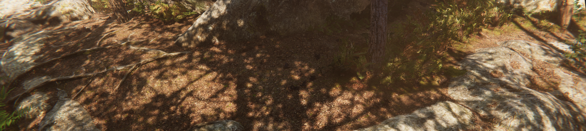

# RenderPipeline
## PathTracing
## Raytracing
## RenerPass
### MotionVectors
### MSAA
### DLSS

## ShaderPass
## 阴影

HDRP使用多种方法来计算阴影：

- 阴影级联：HDRP使用级联分割来根据与摄像机的距离控制方向光投影的阴影质量。
- 接触阴影：HDRP在深度缓存区内进行光线以处理这些阴影。这样，HDRP可以捕获常规阴影算法无法捕获的小细节。
- 微阴影：HDRP使用材质的法线贴图和环境光遮挡贴图来估算这些贴图（如果它们是网格）将投射的阴影。

要减少主级联阴影贴图的锯齿，可以对它们应用不同的过滤器，例如PCF或PCSS。

对于精准光源和面光源阴影，HDRP可以根据光源覆盖的屏幕大小来实现动态分辨率。HDRP会重新缩放阴影图集的内容，否则为全屏。

## Sky

## Water