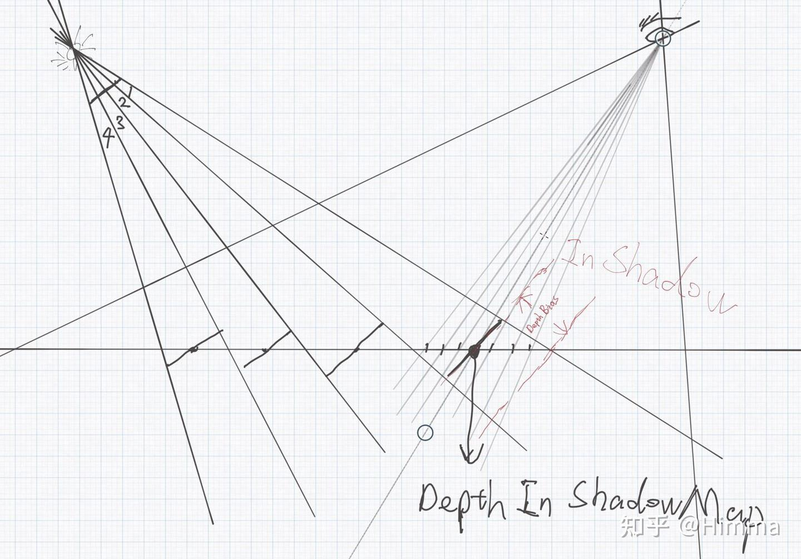

# 接触阴影(Contact Shadows)
接触阴影体积覆盖(Contact Shadows Volume Override)

传统的ShadowMap有两个缺陷：

1. 锯齿
2. 自遮挡

锯齿问题应该很好理解，ShadowMap本质上就是离散数据，工业应用时，分辨率也不会设置太大，导致Lighting阶段像素与阴影空间像素不是一一对应关系，往往时1-N管线。

自遮挡问题，浮点精度问题只是次要原因，在某些极端情况下确实有Z-Fighting情况，但绝不是自遮挡问题的根源，根源还是在于阴影空间采样信号频率与相机空间不一致。

图中阴影空间只有4个像素，每个像素映射到相机空间有N个，是1-N的关系，这N个像素，都要跟ShadowMap里的同一个像素深度(ShadowMap存的深度不一定是途中标记位置的深度，这取决于光栅化时最近一个像素的深度)进行比较，自然就出现了一部分在阴影里，一部分在阴影外。解决办法就是加个depth bias，将相机空间的像素深度往灯光位置推一段。引入bias也就引入了我们耳熟能详的一个BUG：Peter Pan。

为了解决这些问题，实质就是改变1-N的关系，实现N-N，或者是接近N-N。当然，实现方式很有多，这里只说Contact ShadowMap。

# 理论基础

Contact ShadowMap的核心利用深度构建三维空间，从当前绘制像素往Light方向做RayMatching