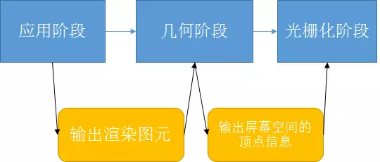
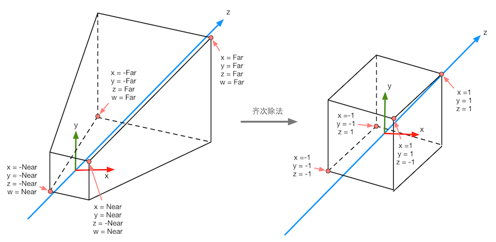

## 像素光 Pixel Light

Unity中将平行光称作为像素光，第一个像素光是基础平行光，以LightMode=ForwardBase标签修饰，每多一个像素光都以LightMode=ForwardAdd标签修饰。
并不是所有的光源在运行时都会反射到物体上，而是根据Project的Quality中设置的像素光数量来渲染的。
默认的像素光的数量应该是2，我们有更多的平行光照在物体上，就需要在Edit->Project Setting->Quality中去调节像素光的数量Pixel Light Count
当场景中的实际像素光数量超过这个设定值的时候，Unity只会渲染最重要的光。

## 关于像素光的叠加原理

片段着色器是要将mesh组件传递的信息最终计算为颜色(或者深度)存储在帧缓存(Frame Buffer)中。
每个Pass之间输出的颜色通过一定的公式进行混合。
在这里我们简单使用一比一的模式进行颜色混合，即混合指令为：
`Blend One One`
第二个Pass的代码同样的也直接复制第一个Pass即可，相应的将Tags标签中LightMode=ForwardBase修改为LightMode=ForwordAdd。

```shader
Shader "Custom/Multi-Light Diffuse" {
	Properties {
		// 材料颜色默认为黑色，
	}
}
```

# 渲染流水线
渲染流水线的工作任务在于由一个三维场景触发、生成（或者说渲染）一张二维图像。换句话说，计算机需要从一系列的顶点数据、纹理等信息出发，把这些信息最终转换成一张人眼可以看到的图像。而这个工作通常是由CPU和GPU共同完成的。
《Render-Time Rendering, Third Edition》将一个渲染流程分成3个阶段：**应用阶段(Application Stage)、几何阶段(Geometry Stage)、光栅化阶段(Rasterizer Stage)**。



#### 应用阶段（CPU处理）
这一阶段是由开发者主导的，在这一阶段中开发都有3个主要的任务：
首先，需要准备好场景数据（摄像机位置，视锥体，模型和光源等）
接着，还需要做粗粒度的剔除工作
最后，需要设置好每个模型的渲染状态（使用的材质，使用的纹理，使用的Shader等）
这一阶段最重要的输出是渲染所需的几何信息，即渲染图元，渲染图元可以是点，线，三角面等。
#### 几何阶段（GPU处理）
几何阶段主要用于处理所有和我们绘制的几何相关的事情。几何阶段负责和每个渲染图元打交道，进行逐顶点，逐多边形的操作。这个阶段可以进一步分成更小的流水线阶段。
几何阶段的一个重要任务就是把顶点坐标变换到屏幕空间中，再交给光栅器进行处理。
总结：输入的渲染图元->屏幕空间的二维顶点坐标、每个顶点对应深度、着色等信息

### 光栅化阶段（GPU处理）

将会使用上一个阶段传递的数据来产生屏幕上的像素，并渲染出最终的图像。主要任务是决定每个渲染图元中的那些像素应该被绘制在屏幕上。
**顶点着色器（Vertex Shader）**是完全可编程的，它通常用于实现顶点的空间变换、顶点着色等功能。**曲面细分着色器（Tessellation Shader）**是一个可选的着色器，**几何着色器（Geometry Shader）**同样是一个可选的着色器，它可以被用于执行逐图元（Per-Pimitive）的着色操作，或者被用于产生更多的图元。下一个流水线是**裁剪（Clipping）**，这一阶段的目的是将那些不在摄像机视野内的顶点裁剪掉，并剔除某些三角图元的面片。这个阶段是可配置的。例如，我们可以使用自定义的裁剪平面来配置裁剪区域，也可以通过指令控制裁剪三角图元的正面还是背面。几何概念阶段的最后一个流水线阶段是**屏幕映射（Screen Mapping）**。这一阶段是不可配置和编程的，它负责把每个图元的坐标转换到屏幕坐标系中。
光栅化概念阶段中的**三角形设置（Triangle Setup）**和**三角形遍历（Triangle Traversal）**阶段也都是固定函数（Fixed-Function）的阶段。接下来的**片元着色器（Fragment Shader）**，则是完全可编程的，它用于实现逐片元（Per-Fragment）的着色操作。最后，**逐片元操作（Per-Fragment Operations）**阶段负责执行很多重要的操作，例如修改颜色、深度缓冲、进行混合等，它不是可编程，但具有很高的可配置型。
Unity内置的DiffuseShader,也就是说我们创建一个Material出来时默认的Shader也是多光源的，所以这篇文章完成的Shader与默认的diffuse shader基本效果一致。

## 2.2 CPU与GPU之间的通信

渲染流水线的起点是CPU，即应用阶段。应用阶段可以分为下面3个阶段：
- 把数据加载到显存中
- 设置渲染状态
- 调用Draw Call

### 2.2.1 把数据加载到显存中
基本步骤就是纹理、网格等数据从硬盘加载到系统内存在加载到显存中。数据记载到显存后系统内存中的数据就可以被移除了，但是对于一些数据来说CPU需要访问他们，例如用于碰撞检测用的网格数据，这些数据则会被保留。

### 2.2.3 设置渲染状态
渲染状态指的是场景中的网格是如何被渲染的，例如使用哪个Vertex Shader或者哪个Fragment Shader、光源属性、材质等。

### 2.2.3 调用Draw Call
Draw Call指的是一个命令，发起方为CPU，接收方为GPU。当给定了一个Draw Call时，GPU会根据渲染状态（例如材质、纹理、着色器等）和所有输入的顶点数据来进行计算，最终输出成屏幕上显示的那些漂亮的像素。而这个计算过程，就是我们下一节要讲的GPU流水线。
## 2.3 GPU流水线
当GPU从CPU那里得到渲染命令后，就会进行一系列流水线操作，最终把图元渲染到屏幕上。
### 2.3.1 概述
在上一节中，我们解释了在应用阶段，CPU是如何和GPU通信，并通过调用Draw Call来命令GPU进行渲染。GPU渲染的过程就是GPU流水线。

对于概念阶段的后两个阶段，即几何阶段和光栅化阶段，开发者无法拥有绝对的控制权，其实现的载体是GPU。GPU通过实现流水线化，大大加快了渲染速度。虽然我们无法完全控制这两个阶段的实现细节，但GPU向开发者开放了很多控制权。在这一节中，我们将具体了解GPU是如何实现这两个概念阶段的。

几何阶段和光栅化阶段可以分为若干更小的流水线阶段，这些流水线阶段由GPU来实现，每个阶段GPU提供了不同的可配置性或可编程性。

### 从应用程序阶段模型数据给顶点着色器时支持的语义

|语义|描述|
|:--|:--|
|POSITION|模型空间的顶点位置，通常是float4类型|
|NORMAL|顶点法线，通常是float3类型|
|TANGENT|顶点切线，通常是float4类型|
|TEXCOORDn,如TEXCOORD0、TEXCOORD1|该顶点的纹理坐标，TEXCOORD0表示第一组纹理坐标，依次类推，通常是float2或float4类型|

其中TEXCOORDn中的数目是和Shader Model有关的，例如一般在Shader Model 2(即Unity默认编译到的Shader Model版本)和Shader Model 3中，n等于8，而在Shader Model 4 和Shader Model 5中，n等于16.通常情况下，一个模型的纹理坐标数组一般不超过2，即我们往往只只用TEXCOORD0和TEXCOORD1。在Unity内置的数据结构体appdata_full中，它最多使用了6个坐标纹理。

### 从顶点着色器传递数据给片元着色器时的语义

|语义|描述|
|:--|:--|
|SV_POSITION|裁剪空间中的顶点坐标，结构体中必须包含一个用该语义修饰的变量。等同于Direct9中的POSITION，但最好使用SV_POSITION|
|COLOR0|通常用于输出第一组顶点颜色，但不是必须的|
|COLOR1|通常用于输出第二组顶点颜色，但不是必须的|
|TEXCOORD0~TEXCOORD7|通常用于输出纹理坐标，但不是必须的|

上面的语义中，除了SV_POSITION是有特别含意外，其他语义对变量的含义没有明确要求，也就是说，我们可以存储任意值到这些描述变量中。

### 片元着色器输出时Unity支持的常用语义

|语义|描述|
|:--|

#### 点和矢量的区别

点是一个没有大小之分的空间中的位置，而矢量是一个有模和方向但是没有位置的量。

#### 齐次坐标

对于一个点，从三维坐标转换成齐次坐标是把w分量设为1，而对于方向矢量来说，需要把w分量设为0。

#### 平移矩阵

我们可以使用矩阵乘法来表示对一个点进行平移变换：

$\begin{bmatrix}
{1}&{0}&{0}&{t_{x}}\\
{0}&{1}&{0}&{t_{y}}\\
{0}&{0}&{1}&{t_{z}}\\
{0}&{0}&{0}&{1}\\
\end{bmatrix}
\begin{bmatrix}
{x}\\
{y}\\
{z}\\
{1}\\
\end{bmatrix} = 
\begin{bmatrix}
{x+t_{x}}\\
{y+t_{y}}\\
{z+t_{z}}\\
{1}\\
\end{bmatrix}$

从结果来看我们可以很容易看出为什么这个矩阵有平移的效果：点的x、y、z分量分别增加了一个位置偏移。在3D中的可视化效果是，把点$(x,y,z)$在空间中平移了$(t_{x},t_{y},t_{z})$。
如果我们对一个方向矢量进行平移变换，结果如下：

$\begin{bmatrix}
{1}&{0}&{0}&{t_{x}}\\
{0}&{1}&{0}&{t_{y}}\\
{0}&{0}&{1}&{t_{z}}\\
{0}&{0}&{0}&{1}\\
\end{bmatrix}
\begin{bmatrix}
{x}\\
{y}\\
{z}\\
{0}\\
\end{bmatrix} = 
\begin{bmatrix}
{x}\\
{y}\\
{z}\\
{0}\\
\end{bmatrix}$
可以发现，平移变换不会对方向矢量产生任何影响。因为矢量没有位置属性，也就是说它可以位于空间中的任意一点，因此对位置的改变不应该对四维矢量产生影响。

#### 缩放矩阵

我们可以对一个模型沿空间的x轴、y轴和z轴进行缩放。

$\begin{bmatrix}
{k_{x}}&{0}&{0}&{0}\\
{0}&{k_{y}}&{0}&{0}\\
{0}&{0}&{k_{z}}&{0}\\
{0}&{0}&{0}&{1}\\
\end{bmatrix}
\begin{bmatrix}
{x}\\
{y}\\
{z}\\
{1}\\
\end{bmatrix} = 
\begin{bmatrix}
{k_{x}x}\\
{k_{y}y}\\
{k_{z}z}\\
{1}\\
\end{bmatrix}$

如果缩放系数$k_{x}=k_{y}=k_{z}$，我们把这样的缩放称为统一缩放（uniform scale），否则称为非同一缩放（nonuniform scale）。从外观看，统一缩放是扩大整个模型，而非同一缩放会拉伸或挤压模型。更重要的是，统一缩放不会改变角度和比例信息。

#### 复合变换

在绝大多数情况下，我们约定变换的顺序就是先缩放，再旋转，最后平移。
变换矩阵如下：(注意，矩阵是从右往左算的)
$
M_{translation}M_{rotation}M_{scale} = 
\begin{bmatrix}
{1}&{0}&{0}&{t_{x}}\\
{0}&{1}&{0}&{t_{y}}\\
{0}&{0}&{1}&{t_{z}}\\
{0}&{0}&{0}&{1}\\
\end{bmatrix}
$
当我们直接给出$(\theta_{x}, \theta_{y}, \theta_{z})$这样的旋转角度时，需要定义一个旋转顺序。在Unity中，这个旋转顺序是zxy。


### 顶点的坐标空间变化

在渲染流水线中，一个顶点要经过多个坐标空间的变换才能最终被画在屏幕上。一个顶点最开始是在模型空间中定义的，最后它将会变换到屏幕空间中，得到真正的屏幕像素坐标。

#### 模型空间

**模型空间（model space）**，是和某个模型或者说是对象有关的。有时模型空间也被称为**对象空间（object space）**或**局部空间（local space）**。每个模型都有自己独立的坐标空间，当它移动或旋转的时候，模型空间也会跟着它移动和旋转。
顶点变换的第一步，就是将顶点坐标从模型空间变换到世界空间中。这个变换通常叫做模型变换（model transform）。

#### 世界空间

顶点变换的第一步，就是将顶点坐标从模型空间变换到世界空间中。这个变换通常叫做**模型变换（model transform）**。
变换矩阵如下：
$M_{model} = \begin{bmatrix}
{1}&{0}&{0}&{t_{x}}\\
{0}&{1}&{0}&{t_{y}}\\
{0}&{0}&{1}&{t_{z}}\\
{0}&{0}&{0}&{1}\\
\end{bmatrix}
\begin{bmatrix}
{cos\theta}&{0}&{sin\theta}&{0}\\
{0}&{1}&{0}&{0}\\
{-sin\theta}&{0}&{cos\theta}&{0}\\
{0}&{0}&{0}&{1}\\
\end{bmatrix}
\begin{bmatrix}
{k_{x}}&{0}&{0}&{0}\\
{0}&{k_{y}}&{0}&{0}\\
{0}&{0}&{k_{z}}&{0}\\
{0}&{0}&{0}&{1}\\
\end{bmatrix} = 
\begin{bmatrix}
{k_{x}cos\theta}&{0}&{k_{z}sin\theta}&{t_{x}}\\
{0}&{k_{y}}&{0}&{t_{y}}\\
{-k_{x}sin\theta}&{0}&{k_{z}cos\theta}&{-t_{z}}\\
{0}&{0}&{0}&{1}\\
\end{bmatrix}$
注意：上述变换顺序是不能互换的，即先进行缩放，在进行旋转，最后是平移。
因为每个Transform的平移旋转缩放都是不一样的，所以他们的矩阵也是不一样的。
#### 观察空间

观察空间（view space）也被称为摄像机空间（camera space）。顶点变换的第二步，就是将顶点坐标从世界空间变换到观察空间中。这个变换叫做观察变换（view transform）。

#### 裁剪空间

裁剪空间（clip space，也称齐次裁剪空间），这个用于变换的矩阵叫做裁剪矩阵（clip matrix），也称为投影矩阵（projection matrix）。
裁剪空间的目标是能够方便地对渲染图元进行裁剪：完全位于这块空间内部的图元将会被保留，完全位于这块空间外部的图元将会被剔除，而与这块空间边界相交的图元就会被裁剪。这块空间是由视锥体来决定的。
视锥体指的是空间中的一块区域，这块区域决定了摄像机可以看到的空间。视锥体由六个平面包围而成，这些平面也被称为**裁剪平面（clip planes）**。视锥体有两种类型，一种是**正交投影（orthographic projection）**，一种是**透视投影（perspective projection）**。
在视锥体的6块裁剪平面中，有两块裁剪平面比较特殊，它们分别被称为**近裁剪平面（near clip plane）**和**远裁剪平面（far clip plane）**。它们决定了摄像机可以看到的深度范围。

##### 透视投影

视锥体的意义在于定了场景中的一块三维空间。所有位于这块空间内的物体将会被渲染，否则就会被剔除或裁剪。这块区域是由6个裁剪平面组成，在Unity中，它们由Camera组件中的参数和Game视图中横纵比共同决定


Camera组件的Field of View（简称FOV）属性来改变视锥体竖直方向的张开角度，而Clipping Planes中的Near和Far参数可以控制视锥体的近裁剪面和远裁剪面距离相机的远近。
这样，我们可以求出视锥体近裁剪面和远裁剪面的高度

$nearClipPlaneHeight = 2 \cdot Near \cdot tan {FOV \over 2}$

$farClipPlaneHeight = 2 \cdot Far \cdot tan {FOV \over 2}$

透视投影的横向信息，可以通过相机的横纵比得到。在Unity中，一个摄像机的横纵比由Game视图的横纵比和Viewport Rect中的W和H属性共同决定（实际上，Unity允许我们在脚本里通过Camera.aspect进行更改）。假设，当前相机的横纵比为Aspect，则：

$Aspect = {nearClipPlaneWidth \over nerClipPlaneHeight}$

$Aspect = {farClipPlaneWidth \over farClipPlaneHeight}$	

现在，我们可以根据已知的Near、Far、FOV和Aspect的值来确定透视投影的投影矩阵。如下：

$
M_{frustum} = \begin{bmatrix}
{cot{FOV \over 2} \over Aspect}&{0}&{0}&{0}\\
{0}&{cot{FOV \over 2}}&{0}&{0}\\
{0}&{0}&{-{Far+Near \over Far-Near}}&{-{2 \cdot Far \cdot Near \over Far-Near}}\\
{0}&{0}&{-1}&{0}\\
\end{bmatrix}
$
这里针对的是观察空间是右手坐标系，使用列矩阵在矩阵右侧相乘的，且变换后z分量范围在[-w,w]之间的情况。
而一个顶点和上述投影矩阵相乘后，可以由观察空间变换到裁剪空间中，结果如下
$
P_{clip} = M_{frustum}P_{view} = 
\begin{bmatrix}
{cot{FOV \over 2} \over Aspect}&{0}&{0}&{0}\\
{0}&{cot{FOV \over 2}}&{0}&{0}\\
{0}&{0}&{-{Far+Near \over Far-Near}}&{-{2 \cdot Far \cdot Near \over Far-Near}}\\
{0}&{0}&{-1}&{0}\\
\end{bmatrix}
\begin{bmatrix}
{x}\\{y}\\{z}\\{1}\\
\end{bmatrix}
= 
\begin{bmatrix}
{x{cot{FOV \over 2} \over Aspect}}\\{y{cot{FOV \over 2}}}\\{-z{Far+Near \over Far-Near}-{2 \cdot Near \cdot Far \over Far-Near}}\\{-z}\\
\end{bmatrix}
$
从这个结果来看，这个投影矩阵本质就是对x、y和z分量进行了不同程度的缩放（z分量还有一个平移），缩放的目的是为了方便裁剪。此时顶点的w分量不再是1，而是原先z分量的取反结果。
现在，我们就可以按如下不等式来判断一个变换后的顶点是否位于视锥体内。如果一个顶点在视锥体内，那么它变换后的坐标必须满足：
$-w \le x \le w$
$-w \le y \le w$
$-w \le z \le w$
任何不满足上述条件的图元都需要被剔除或者裁剪。下图显示了经过上述投影矩阵后，视锥体的变化。

从上图还可以注意到，裁剪矩阵会改变空间的旋向行；空间从右手坐标系变换到了左手坐标系。这意味着，离摄像机越远，z值将越大。

##### 正交投影


正交投影的6个裁剪面和透视投影类似，在Unity中，它们也是由Camera组件中的参数和Game视图的横纵比共同决定。
正交投影的视锥体是一个长方体，因此计算上相比透视投影来说更加简单。由图可以看出，我们可以通过Camera组件的Size属性来改变视锥体竖直方向上高度的一般，而Clipping Planes中的Near和Far参数可以控制视锥体的近裁剪面和远裁剪面距离相机的远近。这样，可以求出视锥体近裁剪面和远裁剪面的高度，也就是：
$newClipPlaneHeight=2 \cdot Size$
$farClipPlaneHeight=nearClipPlaneHeight$

现在我们还缺乏横向的信息。同样，我们可以通过摄像机的横纵比得到。假设，当前摄像机的横纵比为Aspect，那么：
$nearClipPlaneWidth=Aspect \cdot nearClipPlaneHeight$
$farClipPlaneWidth=nearClipPlaneWidth$
现在，我们可以根据已知的Near、Far、Size和Aspect的值来确定正交投影的裁剪矩阵。如下：
$M_{prtho} = 
\begin{bmatrix}
{1 \over Aspect \cdot Size}&{0}&{0}&{0}\\
{0}&{1 \over Size}&{0}&{0}\\
{0}&{0}&{-{2 \over Far-Near}}&{-{Far+Near} \over {Far-Near}}\\
{0}&{0}&{0}&{1}\\
\end{bmatrix}$

#### 屏幕空间

经过投影矩阵的变换后，我们可以进行裁剪操作。当完成了所有的裁剪工作后，就需要进行真正的投影了，也就是说，我们需要把视锥体投影到**屏幕空间（screen space）**中。经过这一步变换，我们会得到真正的像素位置，而不是虚拟的三维坐标。
屏幕空间是一个二维空间，因此，我们必须把顶点从裁剪空间投影到屏幕空间中，来生成对应的2D坐标。这个过程可理解成有两个步骤。
首先，我们需要进行标准**齐次除法（homogeneous division）**，也被称为**透视除法（perspective division）**。虽然这个步骤听起来很陌生，但是它实际上非常简单，就是用齐次坐标系的w分量去除以x、y、z分量。在OpenGL中，我们把这一步得到的坐标叫做**归一化的设备坐标（Normalized Device Coordinates，NDC）**。经过这一步，我们可以把坐标从齐次裁剪坐标空间转换到NDC中。经过透视投影变换后的裁剪空间，经过齐次除法会变换到一个立方体内。按照OpenGL的传统，这个立方体的x、y、z分量的范围都是[-1,1]。但在DirectX这样的API中，z分量的范围会是[0,1]。而Unity选择了OpenGL这样的齐次裁剪空间。



#### 总结

顶点着色器的最基本的任务就是把顶点坐标从模型空间转换到裁剪空间中。

 


### 一个最简单的顶点/片元着色器

#### 顶点/片元着色器的基本结构

Unity Shader的基本结构包含了Shader、Properties、SubShader、Fallback等语义块。顶点/片元着色器的结构与之大体类似，它的结构如下：

```Shader
Shader "MyShaderName" {
	Properties {
		// 属性
	}
	SubShader {
		// 针对显卡A的SubShader
		Pass {
			// 设置渲染状态和标签

			// 开始CG代码片段
			CGPROGRAM
			// 该片段的编译指令，例如:
			#pragma vertex vert
			#pragma fragment frag

			// CG代码写在这里

			ENDCG

			// 其他设置
		}
		// 其他需要的Pass
	}
	SubShader {
		// 针对显卡B的SubShader
	}

	// 上述SubShader都失败后用于回调的Unity Shader
	Fallback "VertexLit"
}
```
其中，最重要的部分是Pass语义块，我们绝大部分的代码都是写在这个语义块里面的。下面我们就来创建一个最简单的顶点/片元着色器。
```
Shader "Shader/Simple" {
	SubShader {
		Pass {
			CGPROGRAM
			#pragma vertex vert
			#pragma fragment frag

			float4 vert(float4 v : POSITION) : SV_POSITION {
				return UnityObjectToClipPos(v);
			}
			fixed4 frag() : SV_Target{
				return fixed4(1.0, 1.0, 1.0, 1.0);
			}
			ENDCG
		}
	}
}
```
```
Shader "Shader/Simple1"{
	SubShader{
		Pass{
			CGPROGRAM
			#pragma vertex vert
			#pargma fragment frag
			// 使用一个结构体来定义顶点着色器的输入
			struct a2v {
				// POSITION语义告诉Unity，用模型空间的顶点坐标填充vertex变量
				float4 vertex : POSITION;

			}
			ENDCG
		}
	}
}
```

#### 模型数据从哪里来


#### 顶点着色器和片元着色器之间如何通信

#### 如何使用属性

### Unity提供的内置文件和变量

#### 内置的包含文件

#### 内置的变量

### Unity提供的CG/HLSL语义

### Unity支持的语义

|语义|描述|
|--|--|
|POSITION	|模型空间的顶点位置，通常是float4类型|
|NORMAL		|顶点法线，通常是float3类型|
|TANGENT	|顶点切线，通常是float4类型|
|$TEXCOORD_{n}$，如TEXCOORD0、TEXCOORD1|该顶点的纹理坐标，TEXCOORD0表示第一组纹理坐标，依此类推。通常是float2或float4类型
|COLOR		|顶点颜色，通常是fixed4或float4类型|

#### 如何定义复杂的变量类型

#### 使用假彩色图形

#### float、half还是fixed

在本书中，我们使用CG/HLSL来编写Unity Shader中的代码。而在CG/HLSL中，有3中精度的数值类型：float、half和fixed。这些精度将决定计算结果的数值范围。表5.8给出了这3中精度在通常情况下的数值范围。

CG/HLSL中3种精度的数值类型

|类型|精度|
|:----|:----------------------------------|
|float|最高精度的浮点值。通常使用32位来存储|
|half |中等精度的浮点值。通常用16位来存储，精度范围是-60000~+60000|
|fixed|最低精度的浮点值。通常使用11位来存储，精度方位是-2.0~+2.0|