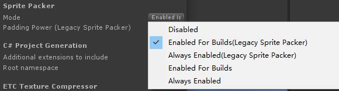
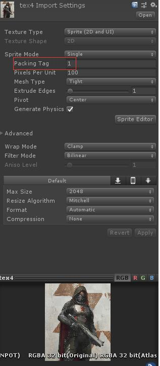
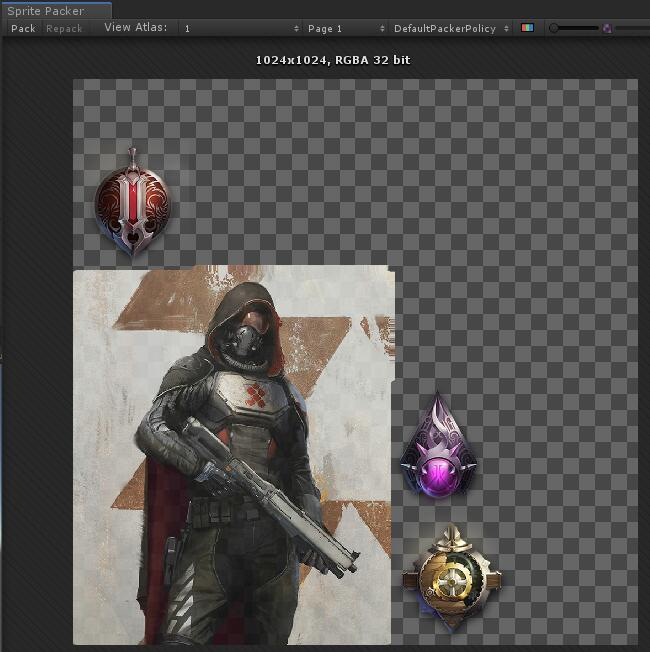
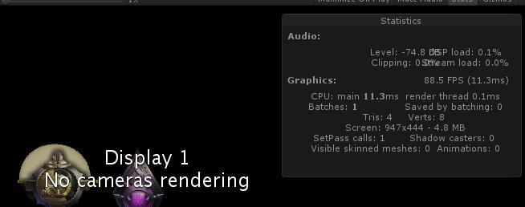

# 启用
在Edit->Project Settings->Editor->Sprite Packer->Mode中进行设置


1. Disabled: 不启用
2. Enabled For Builds(Legacy Sprite Packer):打包的时候使用，过时的
3. Always Enabled(Legacy Sprite Packer):总是开启，过时了
4. Enabled For Builds: 打包的时候使用
5. Always Enabled: 总是使用，推荐方式
开始的时候我们需要清楚看到现在的有几个Draw Call，从而才能优化小图。在最终打包的时候Unity会自动构建大的图集，将同一图集的所有图片的packing tag设置成一个名字就可以看到这个图集占几个Draw Call了。



图集的预览仅仅是让你看看你的图集大概长什么样子。图集保存在Libary/AtlasCache里面。
Window->2D->Sprite Packer



此时在Hierarchy试图中创建两个Image对象。如下图所示，我们发现此时Draw Calls变成了1。



注意你的图片不能放在Resources文件夹下面，Resources文件夹下的资源将不会被打入图集。此时在Hierarchy试图中创建两个Image对象。可以发现Draw Call已经被合并成1了。

```CSharp
[MenuItem("Build AssetBundle")]

```