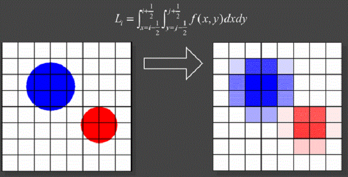
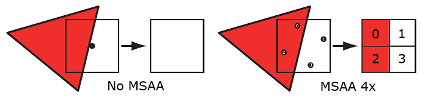
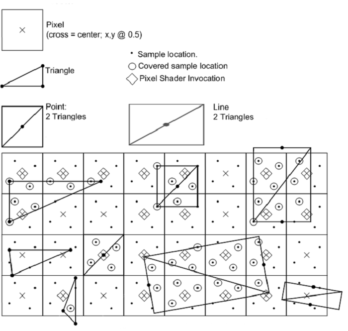
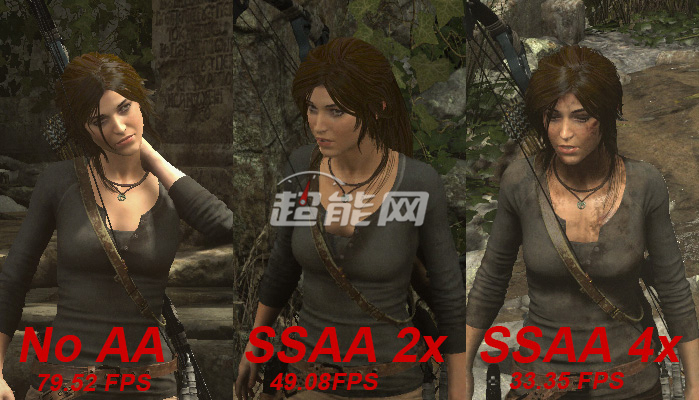

SMAAD技术的全称为"Enhanced Subpixel Morphological Antialiasing"，与FXAA一样同为后期处理抗锯齿技术，可以提供基于过滤算法的通用图像抗锯齿解决方案。SMAA技术使用了更好的几何形体和对角形体检测处理机制，通过图形边缘局部特征对比来识别图像的锯齿特征，并通过重建子像素的方式实现抗锯齿功能，效果与传统的4x MSAA相近而且可以根据游戏的需要进行定制。



通过”以模糊换取精确“的手段来消除显示屏上的锯齿，而这个过程我们称其为采样(Sampling)，也就是针对某一点的像素，通过让它带有周围像素的特性，因此在足够的分辨率下，这一点便不再顽固般地锐利，也达到消除锯齿的目的。

# 超级采样抗锯齿(Super Sampling Anti-Aliasing,SSAA)
通过名字就知道，SSAA最大的特点来自采样过程，以常见的SSAA*4为例，在面对一张最后需要以1920*1080像素渲染的画面时，SSAA会首先渲染一张尺寸位3840*2160像素的缓存，再在这种长宽都乘以2的画面上进行采样，采样的精度和效果当然是最理想的，但是你也可以想象，这种只为追求理想情况的手段对于硬件资源的消耗非常大，成本也非常高。更重要的是，即使在原理上SSAA拥有最理想的精度，但是最现实的情况万般变化中的游戏世界，SSAA并不能永远保证采样效果是最讨好眼睛的，换句话说性价比会随着新技术的现身而面临越来越大的挑战，这其中就包括SSAA本身的一种灵活的变体：多重采样抗锯齿技术(Multi-Sampling Anti-Aliasing,MSAA)。

MSAA的原理和SSAA一致，都是通过将图形拉伸至更高倍率之下的缓存之后再精细的图像上进行采样，但是前者真正聪明的地方在于，再开始狮子大开口之前MSAA存在一个判断的过程，换句话说MSAA仅仅针对画面中边缘部分进行放大处理，这么一来对于硬件的负担着实大大减轻，正式因为如此，MSAA早已是最流行的抗锯齿方案之一，对于任何一款现代游戏来说，不支持MSAA几乎是不可想象的。





无论是SSAA还是MSAA，他们运作都集中在非常考前的位置，比如光栅化阶段，因此对于硬件开销有较大的呼声，但是从2012年的GeFore 600系列以来，NVIDIA就已经开始推广一款全新的抗锯齿方案，它们最大的特点就是出发点非常靠前，作为一款后处理抗锯齿它的硬件需求非常低，甚至达到几乎难以察觉的地步，同时因为较低的实现难度，它已经成为MSAA之后最流行的抗锯齿方案之一，就是快速近似抗锯齿(Fast approximate anti-aliasing)。
# SSAA画质与性能变化
我们再来对比开启SSAA之后的情况，首先这里可以看到SSAA的一个特点，虽然抗锯齿技术逃不过采样的过程，但是这里可以看到开启SSAA之后，原本充满锯齿的地方首先还是一如既往的清晰、锐利，衣物和衣物的过度非常干净，完全没有后处理抗锯齿那种模糊的干净，而是锯齿真的缩小既视感，不过开启SSAA的代价确实高，2倍环境下Benchmark成绩已经滑落至49.08帧。



# OpenGL中的MSAA
如果我们想要在OpenGL中使用MSAA，我们必须要使用一个能在每个像素中存储大于1个颜色值的颜色缓冲（因为多重采样需要我们为每个采样点都储存一个颜色）。所以，我们需要一个新的缓冲类型，来存储特定数量的的多重采样样本，它叫做多重采样缓冲（Multisample Buffer）。

大多数的窗口系统都应该提供一个多重采样缓冲，用以代替默认的颜色缓冲。GLFW同样给了我们这个功能，我们所要做的只是提示(Hint)GLFW，我们希望使用一个包含N个样本的多重采样缓冲。这可以在创建窗口之前调用glfwWindowHint来完成。

```c
glfwWindowHint(GLFW_SAMPLES, 4);
```

现在再调用glfwCreateWindow创建渲染窗口时，每个屏幕坐标就会调用一个包含4个子采样点的颜色缓冲了。GLFW会自动创建一个每像素4个子采样点的深度和样本缓冲。这也意味着所有缓冲的大小都增长了4倍。

现在我们已经向GLFW请求了多重采样缓冲，我们还需要调用glEnable并启用GL_MULTISAMPLE，来启用多重采样。再大多数OpenGL的驱动上，多重采样都是默认启用的，所以这个调用可能会有点多余，但显示地调用可能会有点多余，但显示地调用一下会更保险一点。这样子不论是什么OppenGL地实现都能够正常启用多重采样了。
```c
glEnable(GL_MULTISAMPLE);
```
只要默认的帧缓冲有了多重采样缓冲的附件，我们所要做的只是调用`glEnable`来启用多重采样。因为多重采样的算法都在OpenGL驱动的光栅器中实现了，我们不需要再多做什么。如果现在再来渲染本节一开始的那个绿色的立方体，我们应该能看到更平滑的边缘：

# 离屏MSAA
由于GLFW负责了创建多重采样缓冲，启用MSAA非常简单。然而，如果我们想要使用我们自己的帧缓冲来进行离屏渲染，那么我们就必须要自己手动生成多重采样缓冲了。

有两种方式可以创建多重采样缓冲，将其作为帧缓冲的附件：纹理附件和渲染缓冲附件，这和帧缓冲教程中所讨论的普通附件很相似。

## 多重采样纹理附件

为了创建一个支持存储多个采样点的纹理，我们使用`glTexImage2DMultisample`来替代glTexImage2D，它的纹理目标是`GL_TEXTURE_2D_MULTISAPLE`。

```c
glBindTexture(GL_TEXTURE_2D_MULTISAPLE, tex);
glTexImage2DMultisample(GL_TEXTURE_2D_MULTISAPLE, samples, GL_RGB, width, height, GL_TRUE);
glBindTexture(GL_TEXTURE_2D_MULTISAPLE, 0);
```