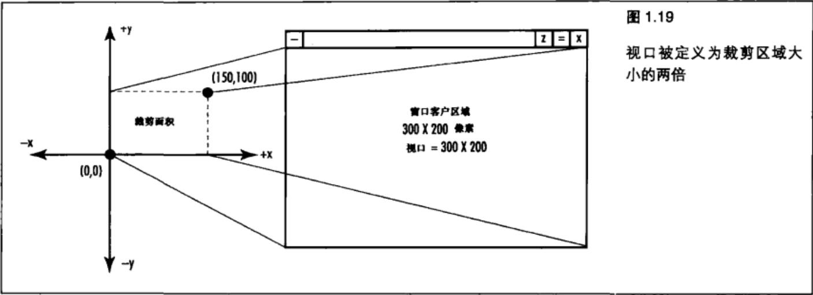

# 指定顶点属性数据
顶点属性数据可以用一个顶点数组对每个顶点指定，也可以将一个常量值用于一个图元的所有顶点。
所有OpenGL ES 3.0实现必须支持最少16个顶点属性。应用程序可以查询特定实现支持的顶点属性的准确数量。下面的代码说明应用程序如何查询OpenGL ES 3.0实现真正支持的顶点属性数量。
```c
GLint maxVertexAttribs; // n will be >= 16
glGetIntegerv(GL_MAX_VERTEX_ATTRIBS, &maxVertexAttribs);
```
假定每个顶点有4个顶点属性----位置、发现和两个纹理坐标----这些属性一起保存在为所有顶点分配的一个缓冲区中。顶点位置属性以3个浮点数的向量(x,y,z)的形式指定，顶点发现也以3个浮点数组成的向量的形式指定，每个纹理坐标以两个浮点数组成的向量的形式指定。下图给出了这个缓冲区的内存布局。

在这个例子中，缓冲区的跨距为组成顶点的所有属性总大小（一个顶点等于10个浮点数或者40个字节----12个字节用于位置、12字节用于发现，8个字节用于Tex0，8个字节用于Tex1）。
下面例子中描述了如何用glVertexAttribPointer指定这4个顶点属性。注意，我们在此介绍如何使用客户端顶点数组，以便解释逐顶点数据指定的概念。我们建议应用程序使用顶点缓冲区对象，避免使用客户端顶点数组，以实现最佳性能。在OpenGL ES 3.0中支持客户端顶点数组只是为了与OpenGL ES 2.0兼容。在OpenGL ES 3.0中，总是建议使用顶点缓冲区对象。
结构数组
```c
#define VERTEX_POS_SIZE         3 // x,y, and z
#define VERTEX_NORMAL_SIZE      3 // x,y, and z
#define VERTEX_TEXCOORD0_SIZE   2 // s and t
#define VERTEX_TEXCOORD1_SIZE   2 // s and t

#define VERTEX_POS_INDX         0
#define VERTEX_NORMAL_INDX      1
#define VERTEX_TEXCOORD0_INDX   2
#define VERTEX_TEXCOORD1_INDX   3

// the following 4 defines are used to determine the locations
// of various attributes if vertex data are stoored as an array
// of structures
#define VERTEX_POS_OFFFSET      0
#define VERTEX_NORMAL_OFFSET    3
#define VERTEX_TEXCOORD0_OFFSET 6
#define VERTEX_TEXCOORD1_OFFSET 8

#define VERTEX_ATTRIB_SIZE (VERTEX_POS_SIZE + \
                            VERTEX_NORMAL_SIZE + \
                            VERTEX_TEXCOORD0_SIZE + \
                            VERTEX_TEXCOORD1_SIZE)

float *p = (float*)malloc(numVertices * VERTEX_ATTRIB_SIZE
                * sizeof(float));

// position is vertex attribute 0
glVertexAttribPointer(VERTEX_POS_INDX, VERTEX_POS_SIZE,
                      GL_FLOAT, GL_FALSE,
                      VERTEX_ATTRIB_SIZE * sizeof(float),
                      p);

// normal is vertex attribute 1
glVertexAttribPointer(VERTEX_NORMAL_INDX, VERTEX_NORMAL_SIZE,
                      GL_FLOAT, GL_FALSE,
                      VERTEX_ATTRIB_SIZE * sizeof(float),
                      (p + VERTEX_NORMAL_OFFSET));

// texture coordinate 0 is vertex attribute 2
glVertexAttribPointer(VERTEX_TEXCOORD0_INDX,
                      VERTEX_TEXCOORD0_SIZE,
                      GL_FLOAT, GL_FALSE,
                      VERTEX_ATTRIB_SIZE * sizeof(float),
                      (p + VERTEX_TEXCOORD0_OFFSET));

// texture coordinate 1 is vertex attribute 3
glVertexAttribPointer(VERTEX_TEXCOORD1_INDX,
                      VERTEX_TEXCOORD1_SIZE,
                      GL_FLOAT, GL_FALSE,
                      VERTEX_ATTRIB_SIZE * sizeof(float),
                      (p + VERTEX_TEXCOORD1_OFFSET));
```