https://zhuanlan.zhihu.com/p/385946279
https://imzlp.com/posts/25136/
https://www.bilibili.com/video/BV1ir4y1c76g

游戏包体：
- 程序
  - Android PC运行时加载动态链接库
- 美术资源
- 脚本、数据文件等

热更新解决了哪些问题？
- 不需要玩家重新安装应用
- 快速迭代游戏内容

UE中热更新的是基于Pak的更新
- 资源在Pak中
- 自己控制挂载时机
- Pak可以设定优先级

UE热更新的核心点
- UFS(UE文件系统)读取文件具有优先级（PakOrder)，比如说有一个a.txt文件，他会根据Pak Order从上往下查找，当在某个Pak文件中找到的时候就不会在继续往下面查找了
- 默认读取Order最大的Pak中的文件

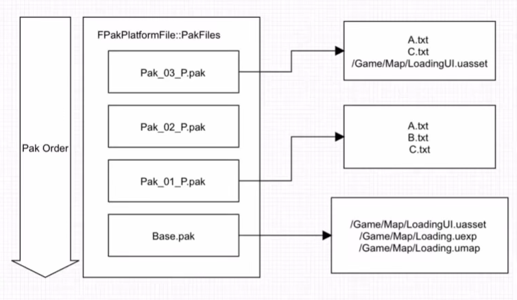

#  Part Two UE4热更新：资源管理
哪些内容可以被热更新
打包热更的资源
管理热更新的版本
使用热更的资源
## Pak中包含哪些内容
- Cooked uasset Cook行为就是转换的过程，不同的平台会有更好的格式来支持
- Slate资源 
- Internationalization
- .uproject/.uplugin
- Config
- AssetRegistry.bin 游戏中资源注册表，包含了哪些资源和之间的关系AssetRegistry模块就是通过这个文件来分析的。
- ushaderbytecode
- shadercache 两个shader文件只有在项目中开启share shader code才会生成，其它地方用到的shader都会去这里面去读，减少空间浪费
- 添加的Non-Asset文件 数据类文件对应这我们的RawAsset下面的

Engine\Config\BaseGame.ini
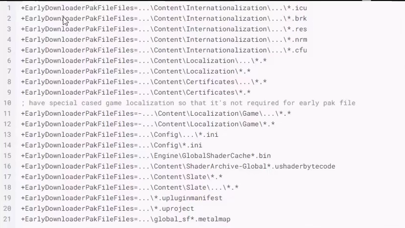

这个文件其实是个规则，UAT根据这个文件把符合规则的文件打入到pak里面去。
## 热更新需要重点关注的内容
- uasset
- Internationalization
- AssetRegistry
- Shaderbytecode
- Shadercache
- 外部文件（RawAssets）

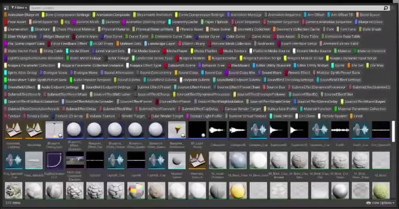

## Pak打包流程：
- 收集要打包的资源以及外部文件
- cook uasset
- 存储打包的Response文件
- 使用UnrealPak执行打包

ResponseFile格式：文件的绝对路径+Mount之后的路径+打包参数

UnrealPak的打包命令：

  `UnrealPak.exe SAVE_PAK.pak -create=RESPONSE_FILE.txt -compress`

## 手动打包的繁琐问题
1. 需要分析uasset资源的依赖
2. 对uasset资源进行Cook
3. 添加需要打包的Non-Asset文件
4. 编辑ResponseFile文件
5. 执行UnrealPak命令
6. 每个平台都要执行一遍上述流程

## 自动化Pak打包工具 HotPatcher
优势：
- 开源：https://github.com/hxhb/HotPatcher
- MIT License
- 持续迭代更新
- 灵活的配置话选项
- 支持自动化打包，可以与ci集成

## HotPatcher核心功能模块
- Cook: 方便对uasset进行多平台的Cook，平且支持Commandlet
- Release：对基础包资源信息的记录、导出
- Patch：版本比对、生成Pactch信息、打包Pak

## HotPatcher的工作流程

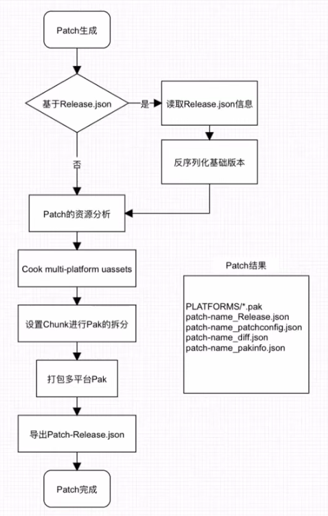

## HotPatcher功能简介
1. 支持uasset的资源选择包含
2. 支持uasset的资源依赖分析
3. 支持从Paklist导入基础包信息（支持多平台）
4. 支持版本信息比对，打出差异包
5. 支持添加Non-Asset文件
6. 支持版本间Non-Asset的Diff
7. 支持自定义UnrealPak参数
8. 支持同时Cook多个平台
9. 支持添加ini/Shaderbytecode/AssetRegistry
10. 支持同时打出多个平台的Patch

## Pak的几种打包粒度：
1. 整个Patch为单个Pak
2. 根据地图为Patch打包
3. 根据资源分类Patch打包

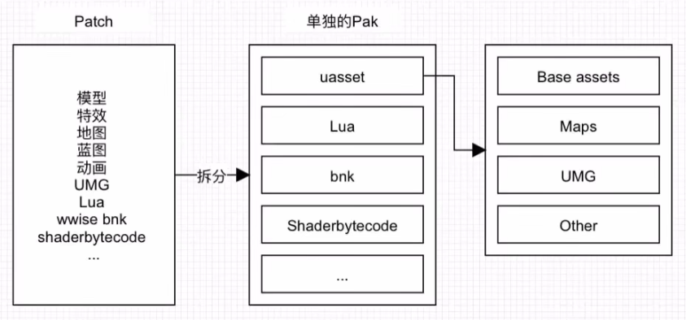

思考：基础包更新后，先前热更的Pak如何处理？

## UE4热更版本管理需求：
1. 能够完整记录打出的基础包内的资源信息
2. 开发中能够精确地定位变动的资源
3. 能够在变动的基础上更新完整游戏的资源信息

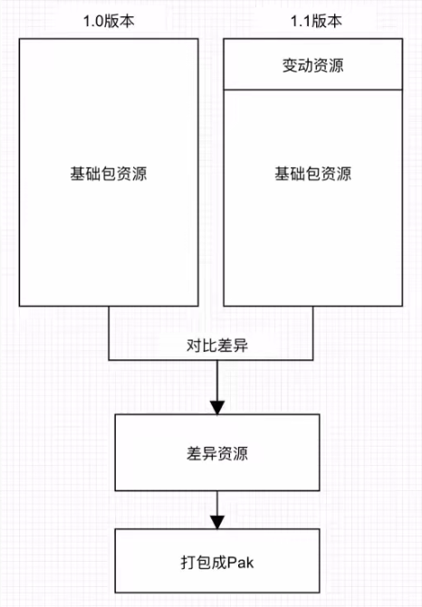

并且需要支持迭代的方式更新

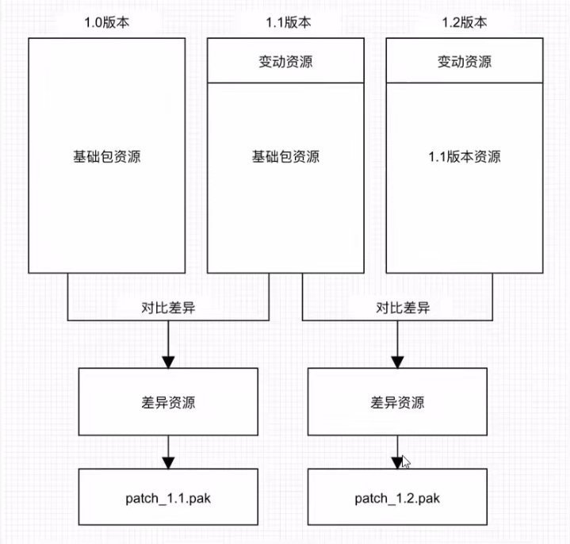

记录游戏包资源信息的思路：
1. 分析UE打包时通过UAT生成的PakList*.txt文件
2. 记录Content内资源信息

需要注意的问题：
1. 每个平台包含的资源并不一定完全相同
2. 不同平台具有不同的文件（如Wwise的bnk)
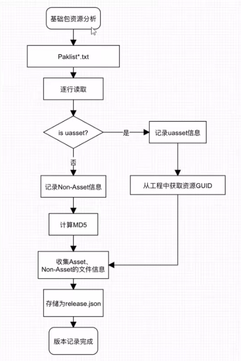

解决多个平台基础包内资源不统一的方案
1. 对每个平台的paklist*.txt都进行分析
2. 记录各个平台相同、不同的部分
3. 对全平台生成同意的Releas.json

# 资源管理
## 热更Pak包的使用
1. Pak需要挂载（mount)到游戏中才可以使用
2. Mount时可以给Pak设置优先级(PakOrder)

## UE4 Pak自动挂载目录
1. Engine/Content/Paks
2. GAME_DIR/Content/Paks
3. GAME_DIR/Saved/Paks

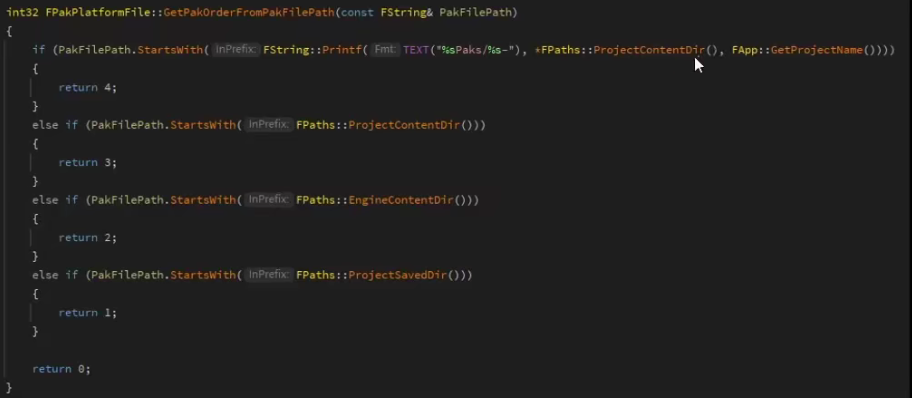

注：GAME_DIR/Content/Pak/GAME_NAME-*pak是基础包内Pak的命名规则。

## 热更完成读取文件
Pak中的文件需要以UFS方式读取

FFileHelper
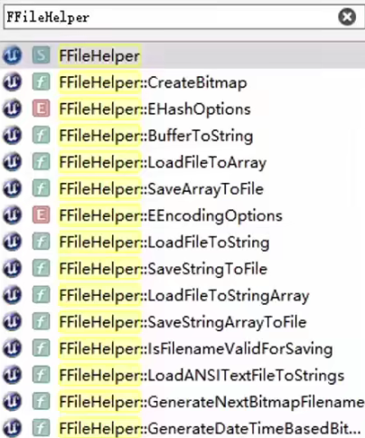

UFS文件读取

# Part Three UE4热更新：脚本语言
UE蓝图 集成TypeScript/JavaScript

- 蓝图是资源(uasset)，可以被热更新
- 难以Merge
- 难以协同开发
- 不方便阅读
- 执行效率不高 

TypeScript/JavaScript

基于反射的机制实现，并且提供了静态绑定。
把JavaScript文件以Non-Asset的方式打包至Pak，实现脚本热更新。

# Part Four

## 热更新包的版本管理
流程：
1. 记录所有可更新版本的信息
2. 记录Pak文件MD5/大小等信息
3. 运行时请求列表与本地比对
4. 分析出需要下载的文件
5. 按照版本顺序挂在pak

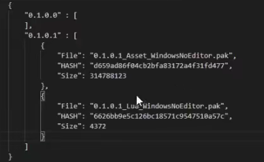
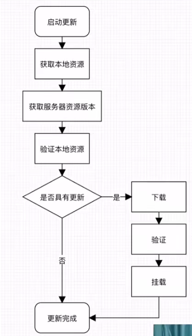

## 热更新包的下载
需要的服务：
1. 自建HTTP服务
2. OSS对象存储
3. Dolphin等游戏下载服务

客户端下载方案：
1. 使用HTTP模块发起下载请求
2. OpenSSL提供的MD5计算
3. 实现分块下载、边下载便计算MD5

## UE的开源下载库
开源仓库：
ue4-downloadtoolkit: https://github.com/hxhb/ue4-downloadtookit
功能简介：
- 基于HTTP
- 支持Win/Mac/Android/iOS
- 支持便下边存盘
- 支持分块下载
- 支持暂停/继续
- 支持边下边计算MD5

## Pak的验证
需求：
1. 下载的完整度验证
2. 是否被认证的pak

方案：
1. 下载时计算文件MD5进行验证
2. 打包pak时启用signing

# Part Five
UE4热更新：需要注意的问题

解决方案：
1. Mount之后加载一遍最新的Shaderbytecode
   1. 
2. Cook资源时不要开启Share Material Shader code

UE4.25+加载Pak资源丢失材质 UMG子控件变动父控件不生效

复现流程：
1. UI_Main中添加子控件UI_Child
2. 打出初始安装包
3. 修改UI_Child保存
4. 打包子UI——Child为Pak
5. 在初始包基础上挂载Pak
6. 游戏中UIMain不生效

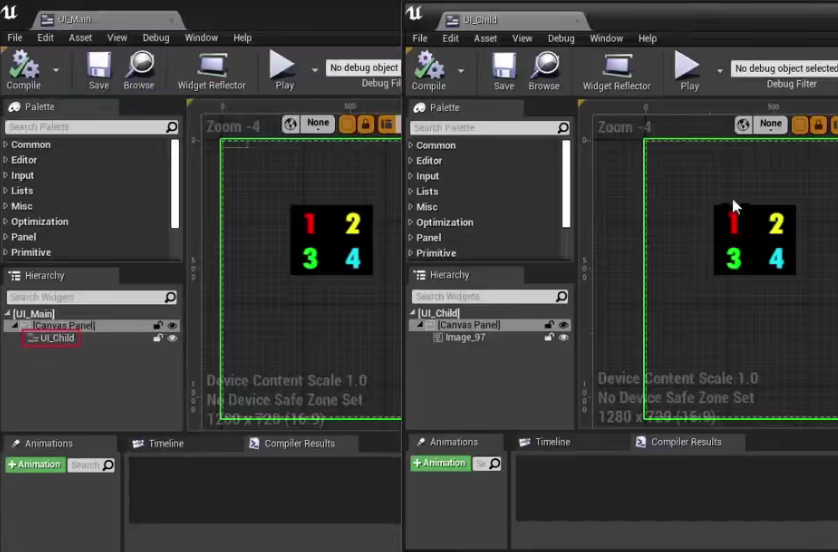

问题分析：
- UMG的子控件是以Instanced方式创建的
- Compile子控件蓝图会导致父控件WidgetTree变动
- 但没有造成父控件资源的变动

HotPatcher的解决方案
- 生成patch时提供了Recursive Widget Tree选项
- 遍历引用被变动UMG的父级UMG资源
- 把这些资源一起打包到当前patch的pak中

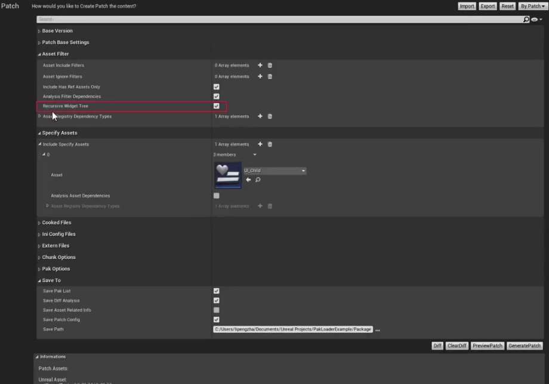