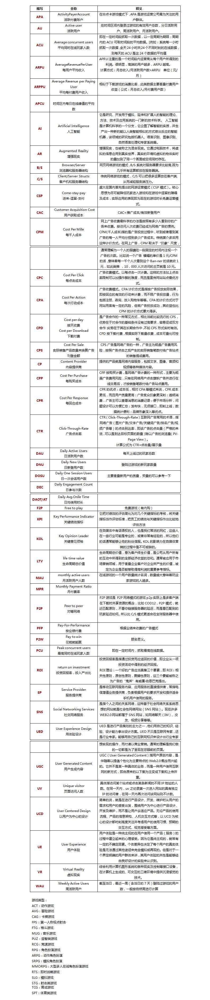

原文链接: https://www.red-gate.com/simple-talk/dotnet/.net-framework/understanding-garbage-collection-in-.net/

>一旦你理解了.NET的垃圾收集器是如何工作的，那么一些复杂的.NET应用程序问题的原因就会变得更加清晰。.NET已承诺结束显式内存管理，但如果您希望避免与内存相关的错误和一些性能问题，则在开发.NET应用程序时仍需要分析内存的使用情况。

在应用程序中，.NET的垃圾收集器被认为是显式内存管理和内存泄漏的结束，在后台运行垃圾收集器时，开发人员不再需要担心需要管理他们创建的对象的生命周期，一旦应用程序完成它们，垃圾收集器将处理它们。

然而，现实比这更复杂。垃圾收集器解决了非托管程序中最常见的泄漏，那些由开发人员在完成后忘记释放内存而导致的泄漏。它还解决了过早释放内存的相关问题，但是当垃圾收集器对开发人员关于对象是否仍然“live”并且能够具有不同意见时，解决此问题的方式会导致内存泄漏要使用的。在解决这些问题之前，您需要了解收集器的工作原理。

# GC的工作原理
那么，垃圾收集器如何实现呢？基本思想非常简单：它检查对象如何在内存中布局，并通过遵循一系列引用来识别正在运行的程序可以引用的所有对象。

当GC开始时，它会查看一组称为“GC Roots”的引用。这些内存位置由于某种原因被指定为始终可访问，并且包含对程序创建的对象的引用。它将这些对象标记为“live”，然后查看它们引用的任何对象; 它标志着这些也是“live”。它以这种方式继续，遍历它所知道的所有“live”对象。它标记它们引用的任何内容，直到它找不到其他对象为止。

GC将对象标识为引用另一个对象（如果它或其中一个超类具有包含另一个对象的字段）。

一旦知道了所有这些活动对象，就可以丢弃任何剩余的对象，并将空间重新用于新对象。.NET压缩内存使得没有冗余（有效地压缩丢弃的对象） - 这意味着空闲内存总是位于堆的末尾并且非常快速地分配新对象。

GC roots 本身不是对象，而是对象的引用。GC roots 引用的任何对象将自动在下一个垃圾回收中存活。.NET中有四种主要的root用户：

1. 当前正在运行的方法中的局部变量被视为GC root。这些变量引用的对象始终可以通过声明它们的方法立即访问，因此必须保留它们。这些root的生命周期可能取决于程序的构建方式。在调试版本中，只要方法在堆栈上，局部变量就会持续。在发布版本中，JIT能够查看程序结构，以计算出该方法可以使用变量的执行中的最后一点，并在不再需要时将其丢弃。此策略并不总是使用，可以关闭，例如，通过在调试器中运行程序。
2. 静态变量也始终被视为GC root。它们引用的对象可以由声明它们的类（或程序的其余部分，如果它们是公共的）随时访问，因此.NET将始终保留它们。声明为“thread static”的变量只会持续该线程运行的时间。
3. 如果通过interop将托管对象传递给非托管COM +library，那么它也将成为具有引用计数的GC root。这是因为COM +不进行垃圾收集：它使用引用计数系统; 一旦COM +library通过将引用计数设置为0来完成对象，它就不再是GC root，可以再次收集。
4. 如果一个对象有一个finalizer，当垃圾收集器决定它不再“live”时，它不会被立即删除。相反，它在.NET调用终结器方法之前成为一种特殊的root。这意味着这些对象通常需要从内存中删除多个垃圾收集，因为它们将在第一次被发现未使用时存活。

# The Object Graph
总的来说，.NET中的内存形成了一个复杂的，打结的引用和交叉引用图。这可能使得难以确定特定对象使用的内存量。例如，List<X>对象使用的内存非常小，因为List<X>类只有几个字段。但是，其中一个是List中的对象数组如果有许多节点，这可能会非常大。这几乎总是由List所拥有，因此关系非常简单：List的总大小是小的初始对象和它引用的大型数组的大小。但是，数组中的对象可能完全是另一回事：可能存在一些通过内存的其他路径，通过它们可以到达它们。在这种情况下，当循环引用发挥作用时，事情变得更加混乱。

在开发代码时，通常会将内存视为一个更容易理解的结构：从单个root开始的tree：



事实上，以这种方式思考确实可以更容易（或确实可能）思考如何在内存中布置对象。这也是编写程序或使用调试器时数据的表示方式，但这样可以很容易地忘记对象可以附加到多个root。.NET中的内存泄漏通常是来自开发人员忘记或者从未意识到对象被附加到多个root。考虑这里显示的情况：将GC root 2设置为null（看下图，不要看上图）实际上不会允许垃圾收集器删除任何对象，这可以从查看完整图形而不是从树中看到。

内存分析器使得可以从另一个角度查看图形，作为以单个对象为根的树并向后跟随引用以将GC root放在叶子上。对于root 2引用的ClassC对象，我们可以向后跟随引用以获取以下图形：



以这种方式思考表明ClassC对象有两个最终的归属者，两者都必须在垃圾收集器移除它之前放弃它。GC root 3与对象之间的任何链接都可以被破坏，以便在GC root 2设置为null后将其删除。

在实际的.NET应用程序中很容易出现这种情况。最常见的一个是数据对象由用户界面中的元素引用，但在数据完成后不会被删除。这种情况并不是很严重：使用新数据更新UI控件时将回收内存，但这可能意味着应用程序使用的内存比预期的多得多。
事件处理程序是另一个常见原因：很容易忘记一个对象将至少与它接收事件的对象一样长，这在某些全局事件处理程序（例如Application类中的那些事件处理程序）的情况下永远存在。

真实应用程序，尤其是那些具有用户界面组件的应用程序，具有比这更复杂的图形 甚至像对话框中的标签这样简单的东西也可以从大量不同的地方引用......



很难查找对象的引用关系。

# 垃圾收集器的限制
## Unused objects
.NET中垃圾收集器的最大限制：虽然它找到了未引用的对象，但是它仍然可能无法删除。而这个对象永远不会被程序再次引用; 虽然它有一些路径导致可能仍然使用的对象，但它永远不会从内存中释放出来。这会导致内存泄漏; 在.NET中，当不再使用的对象仍然被引用时会发生这种情况。

虽然内存使用量上升的症状很明显，但这些泄漏的来源很难被发现。有必要确定哪些未使用的对象保留在内存中，然后跟踪引用以找出它们未被收集的原因。内存分析器对于此任务至关重要：通过在发生泄漏时比较内存状态，可以找到麻烦的未使用对象，但是无法向后跟踪对象引用。

垃圾收集器旨在处理丰富的资源，也就是说，何时释放对象无关紧要。在现代系统中，内存属于该类别（只要它及时完成以防止新分配失败，它就会被回收。仍然存在不属于此类别的资源：例如，需要快速关闭文件句柄以避免导致应用程序之间的共享冲突。这些资源不能由垃圾收集器完全管理，因此.NET为管理这些资源的对象提供了Dispose()方法和using()构造。在这些情况下，对象使用的稀缺资源通过实现快速释放Dispose 方法，这比垃圾收集器稍后释放的关键内存要少得多。

Dispose对.NET来说没有什么特别之处，因此必须仍然取消引用已处理的对象。这使得已经处理但尚未被回收的对象成为内存泄漏源的良好候选者。

## 堆的碎片
### GC堆
GC堆用来分配小对象实例，他是由GC完全控制内存的分配和回收。
### LOH堆
LOH堆是为大对象实例准备的，它不会被压缩且只在GC完全回收时才会被回收。成为LOH堆的一部分的对象永远不会被运行时移动，这可能导致程序过早地耗尽内存。当某些对象比其他对象生命周期更长时，这会导致堆在以前对象所在的位置生成碎片。当程序申请大块内存但堆已经因为碎片以至于没有足够大的单个内存区域来容纳它时，就会出现问题。内存分析器可以估计程序可以分配的最大对象，如果分配失败，那么这很可能是因为碎片导致的。一个OutOfMemoryException当程序显然拥有大量可用内存时，通常会发生碎片导致在32位系统上，进程应该能够使用至少1.5Gb，但由于碎片导致的故障通常会在使用之前开始发生很多记忆。
在IL中可以看到newobj、ldstr(创建string对象)、newarr(用于分配新的数组对象)、box(装箱)等常见的创建对象的指令。当然在堆上也存在值类型，比如值类型作为类的字段时，他将存储在堆的实例对象空间，还有装箱时也会让堆上存在值类型。

碎片的另一个症状是.NET通常必须保留分配给应用程序的空洞所使用的内存。这使得它显然使用比在任务管理器中查看时所需的内存更多的内存。这种效果通常相对无害：Windows非常擅长于意识到漏洞所占用的内存未被使用并将其分页，如果碎片没有恶化，那么程序将不会耗尽内存。但是，对用户而言，这看起来并不好，他们可能认为该应用程序是浪费和“臃肿”。这通常是当分析器显示程序分配的对象仅使用少量内存但任务管理器显示该进程占用大量空间时发生的情况。

# 垃圾收集器的性能
在性能方面，垃圾收集系统最重要的特征是垃圾收集器可以随时开始执行。这使得它们不适合于时序非常关键的情况，因为任何操作的时序都可以通过收集器的操作而被抛弃。

.NET收集器有两种主要的操作模式：并发和同步（有时称为工作站和服务器）。并发垃圾收集在桌面应用程序中使用，并且默认情况下在ASP.NET等服务器应用程序中使用同步。

在并发模式下，.NET将尝试避免在集合正在进行时停止正在运行的程序。这意味着应用程序在给定时间内完成的总量较少，但应用程序不会暂停。对于交互式应用程序而言，这对于向用户提供应用程序立即响应的印象非常重要。

在同步模式下，.NET将在垃圾收集器运行时挂起正在运行的应用程序。这实际上比并发模式更有效 - 垃圾收集花费相同的时间，但它不必与继续运行的程序竞争 - 但意味着当必须完成完整集合时可能会有明显的暂停。

如果默认值不合适，可以在应用程序的配置文件中设置垃圾收集器的类型。当应用程序具有高吞吐量而不是显示响应更重要时，选择同步收集器会很有用。
## 分代机制
在大型应用程序中，垃圾收集器需要处理的对象数量会变得非常大，这意味着访问和重新排列所有这些对象可能需要很长时间。为了解决这个问题，.NET使用“世代”垃圾收集器，它试图优先考虑较小的一组对象。我们的想法是，最近创建的对象更有可能被弃用，因此当尝试释放内存时，分代垃圾收集器会优先考虑它们，因此所有新创建的对象都会放在第0代堆上，直到回收器进行了一次清理动作后仍存在的对象会被移动到另一片连续的地址空间中，即第1代堆上。而之前第1代上剩余的对象会被移动到第2代堆上，此时第0代堆空闲，等待新创建的对象。每一次回收动作都重复此过程。新的对象被回收的几率更大，将这些对象分阶段存放，回收过程速度加快。
注：在创建新对象时，如果所需空间超出了第0代对应的空闲区域，回收器会进行垃圾回收，将第0代区域空闲出来。

如果.NET可以选择收集时间本身，并且if GC.Collect()被调用会中断，这个系统效果最好，因为这通常会导致新对象过早老化，这增加了在不久的将来另一个昂贵的完整收集的可能性。

具有终结器的类也可以破坏垃圾收集器的平稳操作。这些类的对象不能立即删除：它们转到终结器队列，并在终结器运行后从内存中删除。这意味着它们引用的任何对象（以及那些引用的任何对象，等等）必须至少保留在内存中，直到此时为止，并且在内存再次可用之前需要两次垃圾收集。如果图形包含许多带有终结器的对象，这可能意味着垃圾收集器需要多次传递才能完全释放所有未引用的对象。

有一种简单的方法可以避免这个问题：IDisposable在可finalizable的类上实现，将最终化对象所需的操作移动到Dispose()方法中并GC.SuppressFinalize()在最后调用。然后可以修改终结器以调用该Dispose()方法。GC.SuppressFinalize()告诉垃圾收集器该对象不再需要最终确定，并且可以立即进行垃圾收集，这可以更快地回收内存。

# 结论
如果您花时间了解垃圾收集器的工作原理，那么理解应用程序中的内存和性能问题会变得更容易。它揭示了，虽然.NET使内存管理的负担更轻，但并不能完全消除跟踪和管理资源的需要。但是，使用内存分析器来诊断和修复.NET中的问题会更容易。考虑到.NET在开发早期管理内存的方式可以帮助减少问题，但即使这样，由于框架或第三方库的复杂性，仍然可能出现这样的问题。